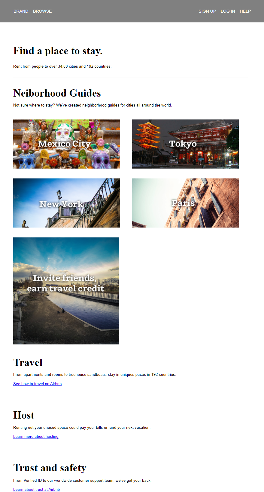
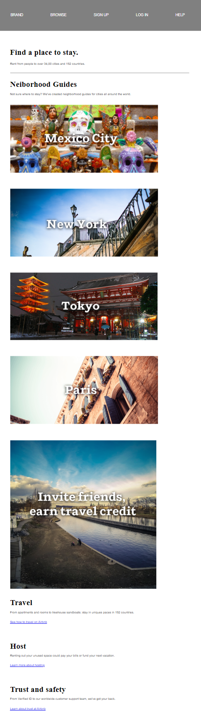

# CSS assignment 01 - Bài tập về nhà CSS 01

**Mục tiêu**: Xây dựng lên trang web đơn giản như demo sau

Với màn hình có độ rộng lớn hơn hoặc bằng 992px:

Với màn hình có độ rộng lớn hơn hoặc bằng 768px và nhỏ hơn 992px:

Với màn hình có độ rộng nhỏ hơn 768px:

**Yêu cầu**: 
- Sử dụng HTML, CSS đã học.

- Chú ý font chữ của web: có thể có nhiều hơn 1 font chữ.

- Responsive như trang web gốc.

**Kết quả cần đạt**: Một trang web với độ khớp (độ chính xác) càng cao càng tốt khi so với bản demo. Yêu cầu độ khớp tối thiểu là 80%.

**Lưu ý**: Ảnh và nội dung văn bản lấy trực tiếp tại file [archives/assignment-01-assets.zip](./archives/assignment-01-assets.zip)