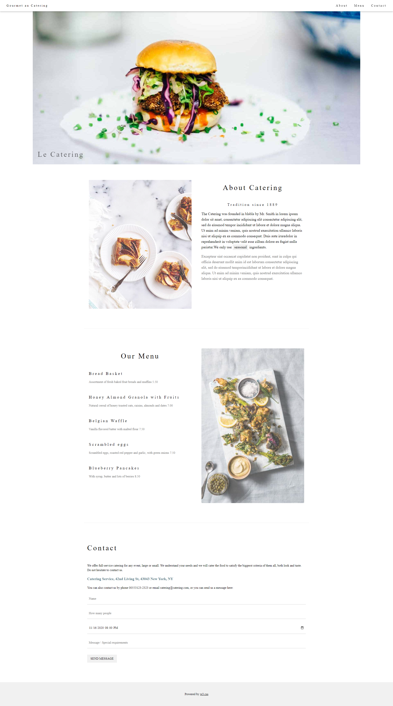

# CSS assignment 02 - Bài tập về nhà CSS 02

**Mục tiêu**: Xây dựng lên trang web đơn giản như [demo sau](https://www.w3schools.com/w3css/tryw3css_templates_gourmet_catering.htm).

**Yêu cầu**: 
- Sử dụng HTML, CSS đã học.

- Có thể bỏ qua các hiệu ứng của trang demo khi loading web và cuộn chuột tới các thành phần, nhưng KHÔNG bỏ qua hiệu ứng khi hover chuột vào các thành phần của web.

- Chú ý font chữ của web: có thể có nhiều hơn 1 font chữ.

- Responsive như trang web gốc.

**Kết quả cần đạt**: Một trang web với độ khớp (độ chính xác) càng cao càng tốt khi so với bản demo. Yêu cầu độ khớp tối thiểu là 80%.

**Lưu ý**: Ảnh và nội dung văn bản lấy trực tiếp trên [web demo](https://www.w3schools.com/w3css/tryw3css_templates_gourmet_catering.htm).

