# **Tìm hiểu về CSS** 
# 1. Định nghĩa
- `CSS` viết tắt của `Cascading Style Sheets`. Nó là một ngôn ngữ được sử dụng để tìm và định dạng lại các phần tử được tạo ra bởi các ngôn ngữ đánh dấu (ví dụ HTML)
- CSS mô tả cách mà các phần tử HTML được hiển thị lên màn hình, giấy báo, hoặc trên những phương tiện khác.
- CSS lưu trữ rất nhiều công việc. Nó có thể điều chỉnh bố cục của nhiều trang web khác nhau cùng 1 lúc.


- CSS được sử dụng để định kiểu style style cho những trang web, bảo gồm thiết kế, bố cục và sự đa dạng trong hiển thị trên những thiết bị và kích thước màn hình khác nhau.

## **Tại sao sử dụng CSS**
- `CSS đã giải quyết được 1 vấn đề lớn`
    - HTML không bao giờ có ý định chứa những thẻ dùng để định dạng cho một trang web.
    - HTML đã tạo ra một mô tả nội dung của một trang web: như tiêu đề, các đoạn văn bản,... Trước khi có CSS, các thuộc tính font, màu sắc, kích thước,... được thêm vào mỗi phần tử của HTML, và được lặp lại trên mọi trang web. Nếu như với một trang web lớn, thì công việc này sẽ trở thành một quá trình rất dài, tốn thời gian và rất khó để lập trình viên theo dõi lại để nâng cấp.
    - Để giải quyết vấn đề này, W3C đã tạo ra CSS. Nhờ CSS mà source code của trang Web sẽ được tổ chức gọn gàng hơn, trật tự hơn. Nội dung trang web sẽ được tách bạch hơn trong việc định dạng hiển thị. Từ đó, quá trình cập nhập nội dung sẽ dễ dàng hơn và có thể hạn chế tối thiểu làm rối cho mã HTML.

- `Tiết kiệm rất nhiều thời gian`
    - Định nghĩa kiểu CSS được lưu trong các tệp CSS bên ngoài (External CSS), vì vậy có thể thay đổi toàn bộ trang web bằng cách thay đổi chỉ một tệp. Sử dụng CSS sẽ giúp chúng ta không cần thực hiện lặp lại các mô tả cho từng thành phần. Từ đó, có thể tiết kiệm được tối đa thời gian làm việc với nó, làm code ngắn lại giúp kiểm soát dễ dàng hơn các lỗi không đáng có.

    - CSS tạo ra nhiều style khác nhau nên có thể được áp dụng với nhiều trang web, từ đó giảm tránh việc lặp lại các định dạng của các trang web giống nhau.

- `Cung cấp thêm các thuộc tính`
    - CSS cung cấp các thuộc tính chi tiết hơn HTML để định nghĩa giao diện của trang web. CSS giúp người dùng nhiều styles trên một trang web HTML nên khả năng điều chỉnh trang trở nên vô hạn.

## **Cách nhúng CSS vào website**
- Như đã được trình bày tại học phần HTML, có 3 phương pháp để nhúng CSS vào một website là `Inline CSS`, `Internal CSS` và `External CSS`. Và phương pháp được `khuyến cáo sử dụng` chính là `External CSS` – Tạo một tập tin kết thúc bằng `.css` riêng và nhúng vào tài liệu HTML thông qua cặp thẻ `<link>`.
# 2. Cú pháp
- Một quy tắc CSS bao gồm một `bộ chọn (selector)` và một `khối khai báo (declaration block)`.
- **Cú pháp của CSS**:
<p align="center">

</p>

Trong đó:
- `Bộ chọn` trỏ tới phần tử HTML mà chúng ta muốn định kiểu style style.
- `Khối khai báo` chứa một hoặc nhiều khai báo `ngăn cách` nhau bởi dấu chấm phẩy (`;`).
- `Mỗi khai báo` bao gồm 1 cặp `tên thuộc tính CSS (property)` và 1 `giá trị (value)` cho nó, chúng được `ngăn cách` bởi dấu hai chấm (`:`).  
- `Khối khai báo` được đặt trong cặp dấu ngoặc nhọn (`{}`).

VD:
```css
p {
  color: red;
  text-align: center;
}
```
- *Giải thích:*

    - `p` là bộ chọn trong CSS (thẻ `<p>` trong HTML).
    - `color` là một thuộc tính CSS, `red` là giá trị của thuộc tính color.
    - `text-algin` là một thuộc tính CSS, `center` là giá trị của thuộc tính text-algin.

## 3. CSS Selectors - Bộ chọn
- `Bộ chọn` được sử dụng để chọn/chỉ ra những phần tử HTML mà chúng ta muốn định kiểu style.
- Chúng ta có thể chia bộ chọn CSS thành 5 loại:
    - `Bộ chọn đơn (Simple selectors)`: chọn những phần tử dựa vào `tên`, `id`, `class` của phần tử đó.
    - `Bộ chọn kết hợp (Combinator selectors)`: chọn những phần tử dựa vào `một mối quan hệ đặc biệt` giữa chúng.
    - `Bộ chọn lớp giả (Pseudo-class selectors)`: chọn những phần tử dựa vào `những trạng thái nhất định`.
    - `Bộ chọn phần tử lớp giả (Pseudo-elements selectors)`: chọn và định kiểu style cho `1 phần của 1 phần tử`. 
    - `Bộ chọn thuộc tính (Attribute selectors)`: chọn những phần tử dựa trên một `thuộc tính và giá trị thuộc tính`.

Đầu tiên, chúng ta sẽ đi tìm hiểu vể bộ chọn CSS cơ bản nhất là bộ chọn đơn (Simple Selectors).

### 3.1. Bộ chọn phần tử CSS
- *Bộ chọn phần tử sẽ chọn những phần tử HTML dựa vào `tên` của phần tử đó.*
### 3.1.1. Bộ chọn CSS Id
- `Bộ chọn id` sử dụng thuộc tính `id` của một phần tử HTML để chọn một phần tử cụ thể trong trang.
- Giá trị `id` là `riêng biệt` trong một trang web, vì vậy bộ chọn `id` được sử dụng để `chọn` và `định kiểu style` cho `một phần tử duy nhất`.
- **Cú pháp**: viết một ký tự dấu thăng (`#`) đầu tiên, theo sau sẽ là `id của phần tử` mà chúng ta chọn định kiểu style.

VD: định kiểu style cho thẻ `<p>` có `id="para1"`
    <p align="center">
    
    </p>

- Nếu muốn định kiểu style cho các phần tử có thuộc tính `id (idChild)` `nằm bên trong` một phần tử chứa thuộc tính `id khác (idParent)`, ta có thể dùng cú pháp bộ chọn `#idParent #idChild {}` (**lưu ý 2 id được viết cách nhau bởi dấu cách**).  
VD:
    <p align="center">
    
    </p>
- Như đã đề cập bên trên, giá trị id là riêng biệt trong 1 trang web. Sau đây, chúng ta sẽ thử 1 ví dụ mà có 2 phần tử (`div` và `p`) đặt `id giống nhau` và thực hiện CSS
    <p align="center">  
    
    </p>

    - Kết quả trình duyệt vẫn hiển thị được, điều này được lý giải bởi trình duyệt hiện tại đủ thông minh để cố gắng hiển thị tất cả các thành phần html và thực hiện css cho nó, nhưng về lý thuyết thì việc cùng `id` sẽ không được phép, nếu cố tình làm vậy sẽ gây lỗi khi thực hiện thao tác với thẻ bằng JS (sẽ được thể hiện trong phần JS).
### 3.1.2. Bộ chọn CSS class
- `Bộ chọn class` chọn những phần tử HTML với một thuộc tính `class` cụ thể.
- Vì tên `class` là `không riêng biệt`, nhiều phần tử HTML có thể được đặt tên class trùng nhau, vì vậy chúng ta `có thể định kiểu style cho 1 hoặc nhiều phần tử HTML theo tên class trong cùng 1 cú pháp`.
- Để chọn và định kiểu style cho những phần tử với một tên `class` cụ thể, chúng ta viết một ký tự `dấu chấm` (`.`) đầu tiên, `theo sau là tên class`.

    VD: định kiểu style cho tất cả các phần tử HTML có tên `class="center"`
    <p align="center">
    
    </p>

- Chúng ta cũng có thể chỉ định chỉ những phần tử HTML đặc biệt mới bị ảnh hưởng bởi tên một class.

    VD: Chỉ những thẻ `<p>` có tên `class="center"` mới được định kiểu style màu chữ là màu xanh da trời. Cú pháp `p.center {}`
    <p align="center">
    
    </p>

- Những phần tử HTML cũng có thể tham chiếu tới nhiều hơn một class.

    VD: Thẻ `<p>` thứ 2 có 2 class `center` và `large` có thể được định kiểu style bằng 1 trong 2 cú pháp bộ chọn : `p.large { }` hoặc `.center.class {}` (với cách này , **lưu ý phải viết 2 liền 2 class**).
    <p align="center">
    
    </p>

- Nếu muốn định kiểu style cho các phần tử có thuộc tính `class (classChild)` `nằm bên trong` một phần tử chứa thuộc tính `class khác (classParent)`, ta có thể dùng cú pháp bộ chọn `.classParent .classChild {}` (**lưu ý 2 class được viết cách nhau bởi dấu cách**).

VD: 
    <p align="center">
    
    </p>

### 3.1.3. Bộ chọn CSS toàn bộ
- `Bộ chọn toàn bộ (*)` được sử dụng để `chọn tất cả` các phần tử HTML có trong trang web.
VD:
    <p align="center">
    
    </p>

### 3.1.4. Bộ chọn CSS gộp nhóm
- `Bộ chọn gộp nhóm` sử dụng để `chọn tất cả` những phần tử HTML có `các định kiểu style giống nhau`.
- VD dưới đây, chúng ta thấy ba thẻ `<h1>`, `<h2>`, `<p>` đều có những định kiểu style giống hệt nhau.
    ```css
    h1 {
    text-align: center;
    color: red;
    }

    h2 {
    text-align: center;
    color: red;
    }

    p {
    text-align: center;
    color: red;
    }
    ```
    - Nếu như viết code như này thì chúng ta thấy nó sẽ rất dài dòng, không tối ưu . Để tối ưu code hơn chúng ta sử dụng bộ chọn gộp nhóm của CSS như sau:
    ```css
    h1, h2, p {
        text-align: center;
        color: red;
    }
    ```

## 4. CSS Comments
- `Chú thích (Comments)` trong CSS được sử dụng để giải thích code, có thể giúp chúng ta khi nhìn lại code dễ hiểu và dễ chỉnh sửa hơn.
- *Chú thích sẽ bị bỏ qua không được hiển thị lên trên trình duyệt.*
- Một chú thích CSS được đặt bên trong cặp thẻ `<style></style>` và `bắt đầu` với `/*` và `kết thúc` bằng `*/`  
VD: 
    <p align="center">
    
    </p>

- Chú thích trong CSS hỗ trợ viết trên nhiều dòng.
    ```css
    /* This is a multi-line
    comment */
    ```

## 5. CSS Colors
- `Màu sắc trong CSS` được chỉ định bằng cách sử dụng `tên màu` hoặc những giá trị của hệ màu `RGB`, `RGBA`, `HEX`, `HSL`...
### 5.1 CSS Colors - Color names
- Một màu sắc có thể được chỉ định bằng cách sử dụng trực tiếp tên của màu đó: green, blue, red, black,... 
- CSS hỗ trợ [140 tên màu tiêu chuẩn.](https://www.w3schools.com/colors/colors_names.asp).   
- Có thể sử dụng thuộc tính `<style>` đặt trong thẻ mở của các HTML element mà bạn muốn thiết lập màu sắc   
VD:  Background Color, Text Color, Border Color   

<p align = "center">

</p>

### 5.2 CSS RGB & RGBA Colors
- `Một hệ màu RGB` là đại diện của 3 tham số màu `RED`, `GREEN`, `BLUE`; giống như `rgb(red, green, blue)`.   
- `Mỗi tham số màu có giá trị từ 0 - 255`. Có nghĩa là sẽ có khoảng 256 x 256 x 256 = 16777216 màu sắc.   
- VD: `rgb(0,0,0): màu đen`; `rgb(255,255,255): màu trắng`; `rgb(255,0,0): màu đỏ`

<p align = "center">

</p>

- `RGBA` là mở rộng của hệ màu RGB với 1 tham số `alpha chỉ độ trong suốt của màu`. *Tham số alpha này có giá trị từ 0.0 - 1.0; giá trị càng nhỏ thì độ trong suốt càng cao, màu sắc càng mờ*

### 5.3 CSS HEX Color
- `Một hệ màu HEX (thập lục phân)` được định nghĩa bằng cách sử dụng các giá trị thập lục phân theo dạng `#rrggbb`, mỗi giá trị `rr`, `gg`, `bb` `có giá trị từ 00 - FF` (tương tự như từ 0 - 255).  
- VD: `#ff0000: màu đỏ; #ffff00: màu vàng, #000000: màu đen` 

    <p align = "center">
    
    </p>
- Tạo ra `khung màu xám` thường được định nghĩa bằng cách `sử dụng các giá trị bằng nhau cho cả 3 tham số màu trên hệ HEX.`  
VD: 
    <p align = "center">
    
    </p>

- **Hệ màu Hex 3 chữ số**
    - Đôi khi chúng ta sẽ nhìn thấy hệ màu hex chỉ có 3 chữ số trong mã nguồn CSS. *Nó là cách viết rút ngọn của các trường hợp đặc biệt trong hệ HEX 6 chữ số.*
    - `Hệ màu 3 số có dạng: #rgb; r,g,b` đại diện cho màu đỏ, xanh lá, xanh dương với `các giá trị nằm trong khoảng từ 0-f`.
    - Hệ màu hex 3 số `chỉ được sử dụng khi mỗi thành phần của (RR, GG, BB) có giá trị giống nhau`. VD: nếu như chúng ta có màu #ff00ff, thì chúng ta có thể viết ngắn gọn thành #f0f; tương tự #22cc33 - #2c3...

## 6. CSS Background
### 6.1. CSS background-color
- Thuộc tính `background-color` định nghĩa màu nền của một phần tử HTML bất kỳ.
- Màu sắc trong CSS có thể được xác định bằng tên màu, giá trị HEX, RGB (đã được trình bày ở phần CSS color).  
VD:
    <p align = "center">
    
    </p>
- **Opacity/Transparency: Độ mờ/độ trong suốt**
    - Thuộc tính `opacity` chỉ định `độ mờ/trong suốt` của một phần tử. Nó `nhận các giá từ 0.0-1.0. Giá trị càng thấp thì độ trong suốt càng cao.`  
    VD: 
    <p align = "center">
    
    </p>

    *Lưu ý:* 
    - Khi sử dụng thuộc tính `opacity` để thêm độ trong suốt tới màu nền của một phần tử, thì tất cả những phần tử con của nó cũng kế thừa cùng độ trong suốt. Điều này làm cho `chữ bên trong phần tử này sẽ trở nên rất khó đọc`.

    - Sử dụng hệ màu `RGBA` để thêm độ trong suốt cho phần tử. `Với cách sử dụng hệ màu RGBA, sẽ thiết lập độ mờ trong suốt cho màu nền của phần tử, còn những phần tử con (chữ) không bị ảnh hưởng`. `Giá trị alpha càng nhỏ, thì độ trong suốt càng cao`.   
    VD: 
        <p align = "center">
        
        </p>

### 6.2. CSS Background Image
- Thuộc tính `background-image` định nghĩa một hình ảnh được sử dụng như hình nền của một phần tử.
- Mặc định, hình ảnh bị lặp lại để bao phủ toàn bộ phần tử.
    <p align = "center">
    
    </p>
- *Lưu ý:* Khi sử dụng hình ảnh làm hình nền, hãy lựa chọn những bức ảnh mà khi hiển thị không gây ảnh hưởng đến nội dung bên trong phần tử đó

### 6.3. CSS Background Image Repeat
### 6.3.1. CSS background-repeat
- Mặc định, thuộc tính `background-image` lặp một hình ảnh cả theo chiều dọc và chiều ngang (để bao phủ toàn bộ phần tử được chỉ định).
    <p align = "center">
    
    </p>

- Nếu như chúng ta muốn thiết lập cho hình ảnh nền được lặp lại chỉ theo 1 chiều dọc hoặc ngang, chúng ta có thể sử dụng thuộc tính `background-repeat`.
VD:
```css
    /* lặp theo chiều ngang */
    body {
        background-image: url("gradient_bg.png");
        background-repeat: repeat-x;
    }

    /* lặp theo chiều dọc */
    body {
        background-image: url("gradient_bg.png");
        background-repeat: repeat-y;
    }
    
```
### 6.3.2. CSS background-repeat: no-repeat
- Chúng ta có thể sử dụng thuộc tính `background-repeat: no-repeat` để hiển thị hình ảnh nền `chỉ một lần mà không bị lặp lại`.  
VD:
    ```css
        body {
            background-image: url("gradient_bg.png");
            background-repeat: no-repeat;
        }
    ```
### 6.3.3. CSS background-position
- Như ví dụ dưới đây, hình nền đã làm cho đoạn chữ trở nên rất khó để đọc
    <p align = "center">
    
    </p>

- Do đó, chúng ta có thể thay đổi vị trí của bức ảnh nền để không làm ảnh hưởng đến đoạn văn bản bằng cách sử dụng thuộc tính `background-position`.  

VD:   
    Đặt vị trí bức ảnh nền tại góc phải bên trên của màn hình hiển thị bằng cách thêm thuộc tính `background-position: right top;`
    <p align = "center">
    
    </p>
### 6.4. Background Attachment
- Thuộc tính `background-attachment` dùng để xác định cách thức mà hình nền sẽ được hiển thị, chỉ định xem liệu hình nền có cuốn đi không hay sẽ nằm ở một vị trí cố định khi ta kéo thanh cuộn (scroll)
- Cách sử dụng thuộc tính `background-attachment`, dùng `cú pháp` như sau:    
        `background-attachment: scroll|local|fixed|initial|inherit;`
    - `sroll`: hình nền sẽ bị cuốn đi khi ta kéo thanh cuộn (chỉ xảy khi hình nền được thiết lập cho phần tử <body>). Còn nếu hình nền được thiết lập cho các phần tử nằm bên trong phần tử <body> thì hình nền sẽ nằm ở 1 vị trí cố định cho dù ta có kéo thanh cuộn.
    - `local`: hình nền sẽ bị cuốn đi khi ta kéo thanh cuộn (hình nền được thiết lập cho bất kỳ một phần tử nào).
    - `fixed`: hình nền sẽ nằm ở một vị trí cố định cho dù ta có kéo thanh cuộn.
    - `initial`: sử dụng giá trị mặc định của nó (mặc định là scroll).
    - `inherit`: kế thừa giá trị thuộc tính background-attachment từ phần tử cha của nó.

### 6.5. CSS Background Shorthand
- Để tối ưu code CSS, chúng ta cũng có thể `định nghĩa tất các các thuộc tính của hình nền (CSS background) vào một thuộc tính đơn`. Điều này được gọi là `một thuộc tính hình nền rút gọn`.
- VD: thay vì phải viết code như dưới đây
    ```css
    body {
    background-color: #ffffff;
    background-image: url("img_tree.png");
    background-repeat: no-repeat;
    background-position: right top;
    }
    ```
    Thì chúng ta có thể rút gọn lại bằng cách sử dụng thuộc tính `background`:
    ```css
    body {
        background: #ffffff url("img_tree.png") no-repeat right top;
    }
    ```
- Khi chúng ta sử dụng thuộc tính rút gọn `background`, thì `những giá trị trong thuộc tính phải được viết theo một thứ tự như sau`:
    - `background-color`
    - `background-image`
    - `background-repeat`
    - `background-attachment`
    - `background-position
`
- Khi liệt kê các giá trị của thuộc tính `background`, `có thể thiếu một trong các giá trị`, điều đó sẽ **không gây ra ảnh hưởng gì miễn là các giá trị còn lại phải được viết theo đúng thứ tự**.

## 7. CSS Borders
- Thuộc tính CSS `border` cho phép chúng ta định nghĩa style, chiều dài, và màu sắc cho đường viền của một phần tử
### 7.1. CSS Border Style
- Thuộc tính `border-style` định nghĩa loại đường viền sẽ được hiển thị bao quanh phần tử
- Thuộc tính `border-style` có các giá trị sau:
    - `dotted`: Xác định một đường viền nét đứt chấm 
    - `dashed`: Xác định đường viền nét đứt dài
    - `solid`: Xác định đường viền nét kéo liền
    - `double`: Xác định đường viền kép
    - `groove`: Xác định đường viền có rãnh 3D. Hiệu ứng phụ thuộc vào giá trị của thuộc tính `border-color`
    - `ridge`: Xác định đường viền 3D ridge. Hiệu ứng phụ thuộc vào giá trị thuộc tính border-color
    - `inset`: Xác định đường viền 3D inset. Hiệu ứng phụ thuộc vào giá trị thuộc tính `border-color`
    - `outset`: Xác định đường viền 3D outset. Hiệu ứng phụ thuộc vào giá trị thuộc tính `border-color`
    - `none`: Xác định không có đường viền
    - `hidden`: Xác định một đường viền ẩn.

    VD:
    <p align = "center">
    
    </p>
 *Lưu ý:* 
 - Thuộc tính `border-style` có thể có `từ 1 đến 4 giá trị, các giá trị theo thứ tự lần lượt là: đường viền trên, viền phải, viền dưới và viền trái`  
    VD:
        <p align = "center">
        
        </p>
- Thuộc tính `border-style` là thuộc tính `quan trọng nhất` của border, **nếu không có thuộc tính này thì những thuộc tính khác (border-color, border-width) của border không có tác dụng gì. Vì vậy, phải luôn định nghĩa thuộc tính border-style trước tiên**

### 7.2. CSS Border Width
- Thuộc tính `border-width` định nghĩa độ dày của 4 đường viền xung quanh một phần tử
- Độ dày của đường viền có thể được thiết lập với một kích thước cụ thể (với đơn vị `px`, `pt`, `cm`,...) hoặc bằng cách sử dụng một trong ba giá trị được xác định sẵn trước là `thin`, `medium`, hoặc `thick`.  
VD:
    <p align = "center">
    
    </p>

- Thuộc tính `border-width` có thể `có từ 1 đến 4 giá trị, các giá trị theo thứ tự lần lượt là: đường viền trên, viền phải, viền dưới và viền trái`.

VD: 
```css
p.three {
  border-style: solid;
  border-width: 25px 10px 4px 35px; /* 25px top, 10px right, 4px bottom and 35px left */
}

/* nếu như chỉ có 3 giá trị */
 p.two {
  border-style: solid;
  border-width: 20px 5px 30px; /* 20px top, 5px on the sides, 30px bottom */
 }

 /* nếu như chỉ có 2 giá trị */
 p.two {
  border-style: solid;
  border-width: 20px 10px; /* 20px top and bottom, 10px on the sides */
}

/* nếu như chỉ có 1 giá trị */
 p.two {
  border-style: solid;
  border-width: 5px; /* 20px top,right, bottom and left  */
 }
```

### 7.3. CSS Border Color
- Thuộc tính `border-color` được sử dụng để thiết lập màu sắc cho 4 đường viền xung quanh của một phần tử.  
VD:
    <p align = "center">
    
    </p>
- Thuộc tính `border-color` cũng có từ 1 đến 4 giá trị quy định màu của các đường viền giống như thuộc tính `border-width`, `border-color`.
 ### 7.4. Thuộc tính CSS Border Shorthand 
 - Để tối ưu code, chúng ta cũng có thể định nghĩa tất cả những thuộc tính riêng của đường viền vào trong cùng một thuộc tính.
 - Thuộc tính `border` là một `thuộc tính viết gọn` của những thuộc tính riêng của đường viền như sau:
    - `border-width`
    - `border-style` (**bắt buộc**)
    - `border-color`

    VD:
        <p align = "center">
        
        </p>

- Chúng ta cũng có thể định nghĩa tất cả các thuộc tính riêng của đường viền chỉ cho 1 cạnh .
VD:
    <p align = "center">
    
    </p>

### 7.5. CSS Rounded Borders
- Thuộc tính `border-radius` được sử dụng để bo tròn góc cho các đường viền của một phần tử.  
VD:
    <p align = "center">
    
    </p>

## 8. CSS Margins
- Thuộc tính `margin` được sử dụng để tạo ra một khoảng cách xung quanh các phần tử, ra phía bên ngoài của bất kỳ đường viền đã được xác định.
    <p align = "center">
    
    </p>
- Với CSS, chúng ta có toàn quyền kiểm soát lề. Có nhiều thuộc tính để thiết lập lề cho mỗi cạnh viền của một phần tử (trên, phải, dưới, trái). 
### 8.1. CSS Margin - Individual Sides
- CSS có những thuộc tính để định nghĩa lề cho mỗi cạnh viền của phần tử:
    - `margin-top`: lề trên
    - `margin-right`: lề phải
    - `margin-bottom`: lề dưới
    - `margin-left`: lề trái
- Tất cả những thuộc tính lề có thể có những giá trị sau:
    - `auto`: trình duyệt tự tính toán lề
    - `length`: định nghĩa một lề được tính bằng `px`, `pt`, `cm`,...
    - `%:` định nghĩa một lề tính bằng % chiều rộng của phần tử đang chứa.
    - `inherit`: định nghĩa lề phải được kế thừa từ phần tử cha

- Giá trị âm cũng được chấp nhận.  
VD: 
    <p align = "center">
    
    </p>

### 8.2. Margin - Shorthand Property
- Để tối ưu code, có thể định nghĩa tất cả các thuộc tính của lề vào trong một thuộc tính.
- Thuộc tính `margin` là một `thuộc tính viết gọn` của những thuộc tính lề riêng sau:
    -` margin-top`: lề trên
    - `margin-right`: lề phải
    - `margin-bottom`: lề dưới
    - `margin-left`: lề trái
- Thuộc tính `margin` khi định nghĩa có thể có từ 1 đến 4 giá trị (lần lượt là lề trên, lề phải, lề dưới, lề trái)  
VD:
    <p align = "center">
    
    </p>

### 8.3. Giá trị `auto`
- Có thể thiết lập thuộc tính `margin` với giá trị `auto` để căn giữa theo chiều ngang của phần tử trong vùng chứa nó.
- Phần tử sẽ chiếm lấy phần chiều rộng mà nó được chỉ định, khoảng trống không gian còn lại sẽ được chia đều thành 2 phần cho lề trái và lề phải.  
VD:
    <p align = "center">
    
    </p>

### 8.4. Giá trị inherit
- Thuộc tính `margin="inherit"` của `phần tử con` sẽ `kế thừa thuộc tính margin được khai báo của phần tử cha`  
VD:
    <p align = "center">
    
    </p>

### 8.5. CSS Margin Collapse: thu gọn lề
- Đôi khi, lề trên và lề dưới của những phần tử được thu gọn lại thành một lề đơn mà khoảng cách sẽ bằng khoảng cách lớn nhất giữa hai lề.
- *Lưu ý:* Thu gọn lề `chỉ xảy ra` đối với `lề trên và lề dưới`, `không xảy ra với lề phải - trái.`

    VD:
        <p align = "center">
        
        </p>
- Trong ví dụ trên, lề dưới của thẻ `<h1>` là 50px, lề trên của thẻ `<h2>` là 20px. Như thế khoảng cách giữa 2 phần tử `<h1>` và `<h2>` theo chiều dọc là 20px + 50px = 70px. Nhưng do tính chất thu gọn của lề thì khoảng cách cuối cùng giữa là thẻ là 50px (50px > 20px).

## 9. CSS Padding 
- Thuộc tính `padding` được sử dụng để tạo một khoảng cách xung quanh nội dung của một phần tử khoảng cách từ nội dung đến phần viền bên trong của đường viền đã được xác định.
    <p align = "center">
    
    </p>
### 9.1. Padding Individual Sides
- Có những thuộc tính để thiết lập `padding` cho mỗi phía của một phần tử (trên, phải, dưới, trái)
    - `padding-top`
    - `padding-right`
    - `padding-bottom`
    - `padding-left`
- `Tất cả` những thuộc tính `padding` đều có những giá trị sau:
    - `length`: định nghĩa một lề được tính bằng `px`, `pt`, `cm`,...
    - `%`: định nghĩa một lề tính bằng % chiều rộng của phần tử đang chứa.
    - `inherit`: định nghĩa lề phải được kế thừa từ phần tử cha

    VD:
    <p align = "center">
    
    </p>

### 9.2. Padding - Shorthand Property
- Để tối ưu code, có thể định nghĩa tất cả các thuộc tính của `padding` vào trong một thuộc tính.
- Thuộc tính `padding` là một thuộc tính viết gọn của những thuộc tính `padding` riêng sau:
    - `padding-top`: lề trên
    - `padding-right`: lề phải
    - `padding-bottom`: lề dưới
    - `padding-left`: lề trái
- Thuộc tính `padding` khi định nghĩa có thể có `từ 1 đến 4 giá trị (lần lượt là padding trên, phải, dưới, trái)`  
VD:
    <p align = "center">
    
    </p>

### 9.3. Padding và chiều rộng phần tử
- Thuộc tính CSS `width` định nghĩa chiều rộng của phần nội dung của phần tử. Phần nội dung là phần bên trong của padding, đường viền và lề của một phần tử.
- *Nếu một phần tử có một chiều rộng được chỉ định trước, sau đó padding được thêm vào phần tử đó thì tổng chiều rộng của phần tử lúc này cũng được tăng lên*. Đây thường là kết quả không mong muốn.  

VD: Ví dụ dưới đây, thẻ `<div>` được chỉ định 1 chiều rộng là 300px, nhưng chiều rộng thực tế của thẻ `<div>` này sẽ là 350px (vì nó cộng thêm 2 phần padding trái và phải 25px nữa)

<p align = "center">

</p>

- `Để cho chiều rộng của phần tử không bị thay đổi` cho dù có thêm `padding` vào đi nữa, chúng ta có thể `sử dụng` thuộc tính `box-sizing`. Điều này làm cho chiều rộng của phần tử không bị thay đổi, nếu `padding tăng` lên thì `không gian nội dung có sẵn sẽ giảm đi`.
    <p align = "center">
    
    </p>

## 10. CSS Height, Width, Max-width
### 10.1 CSS height, width
- Thuộc tính `height` và `width` được sử dụng để thiết lập chiều cao và chiều rộng của một phần tử.
- Các thuộc tính này `không bao gồm paddings, borders hoặc margins`. Nó thiết lập chiều cao, chiều rộng của phần nội dung bên trong padding, border và margin của phần tử.
- Thuộc tính `height` và `width` có những giá trị sau:
    - `auto`: trình duyệt tự tính toán chiều cao, rộng.
    - `length`: định nghĩa chiều cao, rộng được tính bằng `px`, `pt`, `cm`,...
    - `%`: định nghĩa chiều cao, rộng tính bằng % của khối đang chứa.
    - `inherit`: định nghĩa chiều cao, rộng sẽ được kế thừa giá trị từ phần tử cha
    - `initial`: thiết lập chiều cao, rộng theo giá trị mặc định..

    VD: Sử dụng các giá trị khác nhau của `height`, `width`. Thẻ `<div>` có `class="div2"` kế thừa thuộc tính `width` của thẻ `<div>` cha.
    <p align = "center">
    
    </p>

### 10.2. Thiết lập max-width
- Thuộc tính `max-width` được sử dụng để thiết lập chiều rộng tối đa của một phần tử.
- Thuộc tính `max-width` có thể được chỉ định bằng các giá trị chiều dài như: `px`, `cm`, `pt`, `%` hoặc là thiết lập bằng `none` (không có chiều rộng tối đa).
- **Khi cửa sổ trình duyệt có kích thước nhỏ hơn kích thước chiều rộng của một phần tử, thì lúc đó, trình duyệt sẽ thêm một thanh cuộn theo chiều ngang cho trang web.**
- Chúng ta có thể sử dụng thuộc tính `max-width` để giải quyết cho những trường hợp kích thước của sổ trình duyệt nhỏ.

VD:
- Trường hợp, *kích thước cửa sổ trình duyệt nhỏ hơn kích thước phần tử và không sử dụng thuộc tính `max-width`*.
    <p align = "center">
    
    </p>

- Trường hợp, *kích thước cửa sổ trình duyệt nhỏ hơn kích thước phần tử và có sử dụng thuộc tính `max-width`.*
    <p align = "center">
    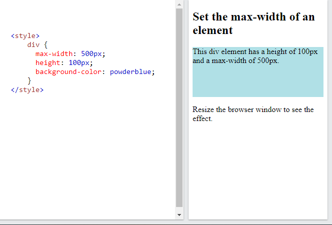
    </p>

*Lưu ý:* Nếu trong một vài trường hợp, mà chúng ta sử dụng cả 2 thuộc tính width và max-width trong cùng 1 phần tử, và giá trị của thuộc tính witdh lớn hơn thì trình duyệt sẽ sử dụng thuộc tính max-width (width sẽ bị bỏ qua).

## 11. CSS Box Model
### 11.1. CSS Box Model
- Trong CSS, thuật ngữ `"box model" (mô hình hộp)` được sử dụng khi nói về thiết kế và bố cục.
- `Mô hình hộp` thực chất là một cái hộp bao bọc xung quanh mỗi phần tử HTML. Nó bao gồm: `margins`, `borders`, `padding` và `nội dung`.
    <p align = "center">
    
    </p>
- Mô hình hộp cho phép chúng ta thêm một đường viền xung quang những phần tử, để xác định khoảng trống giữa những phần tử.

    VD:
        <p align = "center">
        
        </p>

### 11.2. Chiều rộng và chiều cao của một phần tử
- **Khi thiết lập chiều rộng và chiều cao cho một phần tử bằng CSS, chúng ta chỉ thiết lập chiều rộng và chiều cao của phần nội dung**. Còn để `tính toán kích thước đầy đủ` của một phần tử, chúng ta phải `cộng thêm` với phần `margin`, `border` và `padding`.
- Tính `tổng chiều rộng của một phần tử` theo công thức sau:

    `Chiều rộng = width + left padding + right padding + left border + right border + left margin + right margin`
- Tính `tổng chiều cao của một phần tử` theo công thức sau:

    `Chiều cao = height + left padding + right padding + left border + right border + left margin + right margin`

    VD: 

    ```css
        div {
            width: 300px;
            padding: 10px;
            border: 5px solid gray;
            margin: 10px;
        }
    ```
- Với phần khai báo trên, kích thước chiều rộng thực của thẻ <div> sẽ là: 300px + 10px + 10px + 5px + 5px + 10px + 10px = 350px

## 12. CSS Outline
### 12.1. CSS Outline
- Một `outline` `(đường viền bao ngoài)` là một đường được vẽ xung quanh những phần tử, `bên ngoài của đường viền` và làm cho phần tử nổi bật.
    <p align = "center">
    
    </p>

- CSS có những giá trị `outline` sau:
    - `outline-style`
    - `outline-color`
    - `outline-width`
    - `outline-offset`
    - `outline`
- *Lưu ý:*
    - `Outline khác với đường viền`, outline được vẽ bên ngoài đường viền của một phần tử và phải đè lên nội dung khác.
    - `Outline không phải là một phần trong kích thước của phần tử, tổng kích thước của một phần tử không bị ảnh hưởng bởi kích thước của outline`

### 12.2. CSS Outline style
- Thuộc tính `outline-style` định nghĩa kiểu style của `outline`, và có thể có một trong những giá trị sau: 
    - `dotted`: Xác định một đường bao ngoài dấu chấm đứt
    - `dashed`: Xác định đường bao ngoài nét đứt dài
    - `solid`: Xác định một đường bao ngoài nét liền
    - `double`: Xác định đường bao ngoài nét liền kép
    - `groove`: Xác định một đường bao ngoài 3D có rãnh
    - `ridge`: Xác định đường bao ngoài 3D ridge
    - `inset`: Xác định đường bao ngoài 3D inset
    - `outset`: Xác định đường bao ngoài 3D outset
    - `none`: Không có đường bao ngoài
    - `hidden`: Xác định một đường bao ngoài ẩn đi

    VD:
    <p align = "center">
    
    </p>
### 12.3. CSS Outline Color
- Thuộc tính `outline-color` được sử dụng để thiết lập màu sắc cho đường bao ngoài.
- Màu sắc có thể được thiết lập bằng các cách sau:
    - `Xác định bằng tên màu`: như red. green, blue...
    - `Xác định bằng hệ màu HEX`: #ff0000,...
    - `Xác định bằng hệ màu RGB`: rgb(255,0,0)
    - `Xác định bằng hệ màu HSL`: hsl(0,100%,0%)

    VD:
        <p align = "center">
        
        </p>
### 12.4. CSS Outline Width
- Thuộc tính `outline-width` định nghĩa độ rộng của một đường bao ngoài, và có thể có một trong những giá trị sau:
    - `thin` (thường là 1px)
    - `medium` (thường là 3px)
    - `thick` (thường là 5px)
    - Một `kích thước cụ thể` bằng `px`, `pt`, `cm`, `em`,...  

    VD:
        <p align = "center">
        
        </p>

### 12.5. CSS Outline Shorthand
- Thuộc tính `outline` là một `thuộc tính viết gọn` để thiết lập cho những giá trị đường bao ngoài riêng như:
    - `outline-width`
    - `outline-style` (**bắt buộc**)
    - `outline-color`
- Thuộc tính `outline` được định nghĩa từ `1 đến 3 giá trị` được liệt kê bên trên. Và `không quan trọng về mặt thứ tự`.  
VD:
    <p align = "center">
    
    </p>

### 12.6. CSS Outline Offset
- Thuộc tính `outline-offset` thêm khoảng trống giữa đường bao ngoài và đường viền của một phần tử. `Khoảng trống này là trong suốt`.  
VD:
    <p align = "center">
    
    </p>

## 13. CSS Text 
### 13.1. CSS Text Color
- Thuộc tính `color` được sử dụng để thiết lập màu sắc cho văn bản. Nó được định nghĩa bằng các cách sau:
    - `Tên màu`: black, blue, pink...
    - `Một giá trị HEX`: #ff0000,...
    - `Một giá trị RGB`: rgb(0,0,0),...  

VD:

```css
body {
    color: blue;
}

h1 {
    color: green;
}
```
### 13.2. CSS Text Alignment và Text Direction
### 13.2.1. Text Alignment
- Thuộc tính `text-align` được sử dụng để thiết lập vị trí của một văn bản căn theo chiều ngang.
- Một văn bản có thể được `căn trái (left), phải (right), căn giữa (center) hoặc căn đều (justify)`.  
VD:
    <p align = "center">
    
    </p>

### 13.2.2. Text Align Last
- Thuộc tính `text-align-last` định nghĩa cách để căn dòng cuối của một văn bản.
VD:
    <p align = "center">
    
    </p>

### 13.2.3. Text Direction
- Thuộc tính `direction` và `unicode-bidi` có thể được sử dụng để thay đổi hướng văn bản của một phần tử.
VD:
    <p align = "center">
    
    </p>
### 13.2.4. Vertical Alignment
- Thuộc tính `vertical-align` thiết lập căn chỉnh theo chiều dọc cho một phần tử.
- Một số giá trị được dùng cho thuộc tính `vertical-align`:
    - `vertical-align: baseline;` - Đây là dạng cơ bản, mặc định, các thành phần đều nằm theo cùng đường cơ bản (baseline).
    - `vertical-align: sub;` - Phần tử được căn chỉnh với đường cơ sở chỉ số con của phần tử gốc.
    - `vertical-align: super;` - Phần tử được căn chỉnh với đường cơ sở chỉ số trên của phần tử gốc.
    - `vertical-align: top;` - Phần tử được căn chỉnh với đầu của phần tử cao nhất trên dòng.
    - `vertical-align: text-top;` - Phần tử được căn chỉnh theo phần trên cùng cao nhất của text của phần tử bao ngoài.
    - `vertical-align: middle;` - Phần tử sẽ được căn giữa theo phần tử bao ngoài...

    VD:
    <p align = "center">
    
    </p>

### 13.3. CSS Text Decoration
- Để thêm một đường trang trí (decoration line) vào văn bản, ta sử dụng thuộc tính `text-decoration-line`. Chúng ta cũng có thể kết hợp nhiều giá trị cho thuộc tính này. Đường trang trí chủ yếu có các giá trị như:
    - `text-decoration-line: underline;` - đường gạch chân văn bản.
    - `text-decoration-line: overline;` - đường gạch trên đầu văn bản.
    - `text-decoration-line: line-through;` - đường gạch giữa văn bản.
    - `text-decoration-line: none;` - không có đường trang trí văn bản.

    VD:
    <p align = "center">
    
    </p>

- Định nghĩa màu sắc cho đường trang trí: sử dụng thuộc tính `text-decoration-color`. Có thể sử dụng `tên màu, giá trị HEX hoặc RGB`  
VD:
    <p align = "center">
    
    </p>
- Để tạo kiểu style cho đường trang trí, sử dụng thuộc tính `text-decoration-style`  
VD:
    <p align = "center">
    
    </p>
- Để định nghĩa độ dày cho đường trang trí, sử dụng thuộc tính `text-decoration-thickness`. Có thể sử dụng 1 giá trị cụ thể như `px, pt, cm` hoặc sử dụng `%`,...  
VD:
    <p align = "center">
    
    </p>
- Thuộc tính viết tắt `text-decoration`: thuộc tính này viết gọn của các thuộc tính sau:
    - `text-decoration-line (bắt buộc)`
    - `text-decoration-color`
    - `text-decoration-style`
    - `text-decoration-thickness`  
    VD:
    <p align = "center">
    
    </p>

*Chú ý:* Tất cả các liên kết trong HTML mặc định là có đường gạch chân ở dưới. Chúng ta có thể sử dụng thuộc tính `text-decoration` với cú pháp `text-decoration: none;` để `xóa bỏ đường gạch chân` đó đi.  
VD:
    <p align = "center">
    
    </p>

### 13.4. CSS Text Transformation
- Thuộc tính `text-transformation` để sử dụng để định nghĩa những ký tự viết hoa, viết thường, hay viết hoa ký tự đầu tiên của mỗi từ trong văn bản.  
VD:
    <p align = "center">
    
    </p>

### 13.5. CSS Text Spacing
### 13.5.1. Text Indentation
- Thuộc tính `text-indent` được sử dụng để định nghĩa phần thụt lề cho dòng đầu tiên của một văn bản.
VD:
    <p align = "center">
    
    </p>

### 13.5.2. Letter Spacing
- Thuộc tính `letter-spacing` được sử dụng để định nghĩa khoảng cách giữa các ký tự trong một văn bản.
VD:
    <p align = "center">
    
    </p>

### 13.5.3. Line height
- Thuộc tính `line-height` được sử dụng để định nghĩa khoảng cách giữa các dòng.  
VD:
    <p align = "center">
    
    </p>

### 13.5.4. Word Spacing
- Thuộc tính `word-spacing` được sử dụng để định nghĩa khoảng cách giữa các từ trong văn bản.  
VD:
    <p align = "center">
    
    </p>

### 13.5.5. White Space
- Thuộc tính `white-space` chỉ định cách xử lý khoảng trắng bên trong một phần tử.  
VD:
    <p align = "center">
    
    </p>
- Một số giá trị của thuộc tính:
    - `white-space: normal;` - Khoảng trắng sẽ thể hiện bình thường, đây là dạng mặc định.
    - `white-space: nowrap;` - Văn bản sẽ hiển thị trên cùng một hàng, chỉ xuống hàng khi gặp thẻ `<br/>`.
    - `white-space: pre;`	- Khoảng trắng sẽ do trình duyệt điều khiển, văn bản sẽ hiển thị trên cùng một hàng, chỉ ngắt dòng tại đoạn văn bản sử dụng thẻ `<pre>`.
    - `white-space: pre-line;` - Văn bản sẽ tự động bao lại khi cần thiết, và xuống hàng.
### 13.6. CSS Text Shadow
- Thuộc tính `text-shadow` thêm phần bóng đổ cho văn bản.
- Cú pháp:
    ```css
    selector {
        text-shadow: h-offset v-offset blur color; 
    }
    ```
    - Trong đó:
        - `h-offset`: dịch chuyển đổ bóng theo chiều ngang, thiết lập bằng 1 giá trị cụ thể có đơn vị là `px`, `em`
        - `v-offset`: dịch chuyển đổ bóng theo chiều dọc, thiết lập bằng 1 giá trị cụ thể có đơn vị là `px`, `em`
        - `blur`: tạo độ mờ, thiết lập bằng 1 giá trị cụ thể có đơn vị là `px`, `em`
        - `color`: màu sắc cho bóng

VD:
    <p align = "center">
    
    </p>

## 14. CSS Font
### 14.1 Chọn phông chữ
- Việc chọn đúng phông chữ cho trang web là điều rất quan trọng, nó có sự tác động to lớn đến cách người đọc trải nghiệm trên website của chúng ta.
- Sử dụng phông chữ dễ đọc là điều quan trọng. Phông chữ làm tăng giá trị cho văn bản của chúng ta. Điều quan trọng nữa là chọn màu sắc và kích thước văn bản chính xác cho phông chữ.
### 14.2. Bộ phông chữ chung
- Trong CSS, có 5 bộ phông chữ chung như:
    - `Phông chữ Serif`: có một nét nhỏ ở các cạnh của mỗi chữ cái. Chúng tạo ra một cảm giác trang trọng và sang trọng. VD: tên 1 số phông chữ: `Times New Roman, Georgia, Garamond`
    - `Phông chữ Sans-serif`: có đường nét rõ ràng (không kèm theo các nét nhỏ). Chúng tạo ra một cái nhìn hiện đại và tối giản. VD: `Arial, Verdana, Helvetica`.
    - `Phông chữ Monospace`: ở đây tất cả các chữ cái có cùng chiều rộng cố định. Chúng tạo ra một cái nhìn máy móc. VD: `Courier New, Lucida Console, Monaco.` 
    - `Phông chữ Cursive`: bắt chước chữ viết tay của con người. VD: `Brush Script MT, Lucida Handwriting.`
    - `Phông chữ Fantasy`: là phông chữ trang trí/vui tươi. VD: `Copperplate, Papyrus.`

### 14.3. CSS font-family
- Trong CSS, chúng ta sử dụng thuộc tính `font-family` để định nghĩa phông chữ cho một văn bản.  

*Lưu ý:*
- Nếu `tên phông chữ có nhiều hơn 1 từ`, thì phải `đặt tên phông chữ trong dấu nháy kép`, như "Times New Roman"
- Thuộc tính `font-family` nên giữ một số tên font như một hệ thống "dự phòng", để đảm bảo khả năng tương thích tối đa giữa các trình duyệt/hệ điều hành. Bắt đầu với phông chữ chúng ta muốn và kết thúc bằng một họ chung (để cho phép trình duyệt chọn một phông chữ tương tự trong họ chung, nếu không có sẵn các phông chữ khác). Tên phông chữ phải được phân tách bằng dấu phẩy.  
VD:
    <p align = "center">
    
    </p>
### 14.4. CSS Web Safe Fonts
- Phông chữ an toàn trên web (Web safe font) là phông chữ được cài đặt phổ biến trên tất cả các trình duyệt và thiết bị.
- Tuy nhiên, không có những phông chữ an toàn trên web tuyệt đối, luôn có một khả năng là một phông chữ không được tìm thấy hoặc không được cài đặt đúng trên web. Chính vì vậy sử dụng một phông chữ dự phòng (fallback font) là rất quan trọng.
- Điều này có nghĩa là bạn nên thêm một danh sách các "phông chữ dự phòng" tương tự trong thuộc tính `font-family`. Nếu phông chữ đầu tiên không hoạt động, trình duyệt sẽ thử phông chữ tiếp theo và phông chữ tiếp theo, v.v. Luôn kết thúc danh sách bằng họ phông chữ chung.
VD
```css
    font-family: "Times New Roman", Times, serif;
    font-family: Georgia, serif;
    font-family: Garamond, serif;
    font-family: Arial, Helvetica, sans-serif;
    font-family: Tahoma, Verdana, sans-serif
    font-family: "Trebuchet MS", Helvetica, sans-serif
    font-family: Geneva, Verdana, sans-serif
    font-family: "Courier New", Courier, monospace
    font-family: "Brush Script MT", cursive
    font-family: Copperplate, Papyrus, fantasy
```
- Danh sách sau đây là các phông chữ an toàn trên web tốt nhất cho HTML và CSS:
    - Arial (sans-serif)
    - Verdana (sans-serif)
    - Tahoma (sans-serif)
    - Trebuchet MS (sans-serif)
    - Times New Roman (serif)
    - Georgia (serif)
    - Garamond (serif)
    - Courier New (monospace)
    - Brush Script MT (cursive)
### 14.5. CSS Font Style
### 14.5.1. Font style
- Thuộc tính `font-style` chủ yếu được sử dụng để định nghĩa kiểu chữ nghiêng.
- Thuộc tính này có 3 giá trị:
    - `normal`: văn bản được hiển thị 1 cách bình thường.
    - `italic`: văn bản được hiển thị bằng chữ nghiêng.
    - `oblique` : văn bản nghiêng (rất giống với italic, nhưng ít được hỗ trợ)

VD: <p align = "center">
    
    </p>

### 14.5.2. Font weight
- Thuộc tính `font-weight` để thiết lập trọng số trọng lượng của phông chữ.
- Thuộc tính này có 1 số giá trị như:
    - `Các trọng số font-weight từ 100 - 900`
    - `normal`: văn bản được hiển thị bình thường (tương đương với trọng số 400)
    - `bold`: văn bản được in đậm (tương đương với trọng số 700)
    - `lighter`: văn bản được hiển thị với trọng lượng phông chữ tương đối nhẹ hơn một phần tử được kế thừa.
    - `bolder`: văn bản được hiển thị với trọng lượng phông chữ tương đối nặng hơn một phần tử được kế thừa.  
    VD:
    <p align = "center">
    
    </p>
### 14.5.3. Font Variant
- Thuộc tính `font-variant` định nghĩa một văn bản liệu có nên được hiển thị trong một phông chữ in hoa nhỏ không.
- Trong một phông chữ in hoa nhỏ, tất cả các chữ cái viết thường sẽ được chuyển sang chữ in hoa. Tuy nhiên, kích thước chữ hoa đó sẽ có kích thước nhỏ hơn so với phông chữ hoa bình thường.  
VD:
    <p align = "center">
    
    </p>
### 14.6. CSS Font Size
- Thuộc tính `font-size` thiết lập kích thước của văn bản.
- Giá trị của thuộc tính này có thể là một giá trị tương đối hoặc tuyệt đối.
    - Các giá trị tuyệt đối như `small`, `medium`, `large`,... `Cỡ chữ mặc định là 16px (medium). Tương tự có các cỡ: xx-small (9px), x-small (10px), small (13px), medium, large (18px), x-large (24px), xx-large (32px), xxx-large (48px).`
    - `font-size` với cỡ chữ được `chỉ rõ theo đơn vị` như `px, em, cm`,...Cỡ chữ mặc định là `16px = 1em`. Kích thước có thể được đổi từ đơn vị pixels sang em bằng công thức: `pixels/16 = em`.
    - Thiết lập `font-size` bằng `tỷ lệ %`.
    - Thiết lập với 1 giá trị bằng đơn vị `vw` (viewport width - Responsive Font size). Bằng cách đó, kích thước văn bản sẽ tuân theo kích thước của cửa sổ trình duyệt. (`1vw = 1% của kích thước cửa sổ trình duyệt`)  
VD:
    <p align = "center">
    
    </p>

### 14.7. CSS Font Property
- Để tối ưu code, chúng ta cũng có thể định nghĩa tất cả các thuộc tính riêng của phông vào trong một thuộc tính.
- Thuộc tính `font` là thuộc tính viết tắt cho các giá trị sau:
    - `font-style`
    - `font-variant`
    - `font-weight`
    - `font-size/line-height`
    - `font-family`
 Trong đó: `font-size` và `font-family` là `bắt buộc`. Những giá trị còn lại nếu thiếu sẽ được sử dụng bằng các giá trị mặc định.  
 VD:
    <p align = "center">
    
    </p>

## 15. CSS Icons
- Cách đơn giản nhất để thêm một icon (biểu tượng) đến trang web là sử dụng một thư viện biểu tượng, ví dụ như Font Awesome.
- Thêm tên của lớp biểu tượng được chỉ định vào bất kỳ phần tử HTML nội tuyến nào (như `<i>` hoặc `<span>`).
### 15.1. Font Awesome Icons
- Để sử dụng các biểu tượng Font Awesome, hãy truy cập [fontawesome.com](https://fontawesome.com/) , đăng nhập và nhận mã để thêm vào phần `<head>` của trang HTML của chúng ta:
```html
<script src="https://kit.fontawesome.com/yourcode.js" crossorigin="anonymous"></script>
```
VD:
    <p align = "center">
    
    </p>

### 15.2. Bootstrap Icon
- Để sử dụng các biểu tượng Bootstrap, hãy thêm dòng sau vào bên trong phần `<head>` của trang HTML của chúng ta:

```html
<link rel="stylesheet" href="https://maxcdn.bootstrapcdn.com/bootstrap/3.3.7/css/bootstrap.min.css">  
```
VD:
    <p align = "center">
    
    </p>

### 15.3. Google Icon
- Để sử dụng các biểu tượng của Google, hãy thêm dòng sau vào trong phần `<head>` của trang HTML của chúng ta:

```html
<link rel="stylesheet" href="https://fonts.googleapis.com/icon?family=Material+Icons">
```
VD:
    <p align = "center">
    
    </p>

## 16. CSS Links
### 16.1. Styling Links
- Các liên kết có thể được định kiểu style bằng các thuộc tính CSS bất kỳ như `color, font-family`,...
- Hơn nữa, các liên kết có thể định kiểu style phụ thuộc vào trạng thái của nó.
- Có 4 trạng thái liên kết:
    - `a:link` - một liên kết bình thường, chưa được ghé thăm.
    - `a:visited` - một liên kết đã được ghé thăm.
    - `a:hover` - một liên kết khi có chuột di chuyển qua.
    - `a:active` - một liên kết khi được click vào.
VD:

```css
    /* unvisited link */
    a:link {
    color: red;
    }

    /* visited link */
    a:visited {
    color: green;
    }

    /* mouse over link */
    a:hover {
    color: hotpink;
    }

    /* selected link */
    a:active {
    color: blue;
    }
```
- *Lưu ý:* Khi thiết lập style cho liên kết, có 1 số quy tắc sau:  

    - `a:hover phải viết sau a:link và a:visited`
    - `a:active phải viết sau a:hover`

- Sử dụng thuộc tính `text-decoration` để bỏ phần gạch chân của liên kết.
    ```css
    a {
    text-decoration: none;
    }
    ```
### 16.2. Link Buttons
VD:
    <p align = "center">
    
    </p>

## 17. CSS List
- Nếu trong HTML, với danh sách không có thứ tự các điểm đánh dấu mục trong danh sách là các gạch đầu dòng, chấm tròn...; còn với danh sách có thứ tự thì điểm đánh dấu là các chữ số và chữ cái.
- Sử dụng thuộc tính `list-style-type` định nghĩa các kiểu của điểm đánh dấu mục trong danh sách.
- Chúng ta cũng có thể thay đổi các kiểu style cho điểm đánh dấu mục bằng những kiểu khác như hình ảnh, màu sắc, vị trí...
### 17.1. Sử dụng một hình ảnh làm điểm đánh dấu mục.
- Sử dụng thuộc tính `list-style-image` để định nghĩa một hình ảnh như điểm đánh dấu danh mục trong danh sách.
VD: 
    <p align = "center">
    
    </p>

### 17.2. Chỉ định vị trí của điểm đánh dấu
- Thuộc tính `list-style-position` chỉ định vị trí của các điểm đánh dấu mục danh sách (dấu đầu dòng)
- "`list-style-position: outside;`" nghĩa là các dấu đầu dòng sẽ nằm ngoài mục danh sách. Đầu mỗi dòng của một mục danh sách sẽ được căn chỉnh theo chiều dọc. Đây là mặc định.
- "`list-style-position: inside;`" nghĩa là các dấu đầu dòng sẽ nằm bên trong mục danh sách. Vì nó là một phần của mục danh sách, nó sẽ là một phần của văn bản và đẩy văn bản vào.

VD: 
    <p align = "center">
    
    </p>

### 17.3. Bỏ những thiết lập mặc định
- Thuộc tính `list-style-type: none;` cũng có thể được sử dụng để xóa các điểm đánh dấu/dấu đầu dòng. 
- Lưu ý rằng danh sách cũng có `margin` và `padding` mặc định. Để loại bỏ điều này, hãy thêm `margin: 0` và` padding: 0` tới bộ chọn trong css `<ul>` hoặc `<ol>`

VD: 
    <p align = "center">
    
    </p>

### 17.4. List - shorthand property
- Thuộc tính `list-style` là một thuộc tính viết tắt. Nó được sử dụng để đặt tất cả các thuộc tính danh sách trong một khai báo.
- Khi sử dụng `list-style`, thứ tự các giá trị là:
    - `list-style-type`
    - `list-style-position`
    - `list-style-image`
VD:
```css
ul {
  list-style: square inside url("sqpurple.gif");
}
```
*Lưu ý*: Nếu 1 trong những giá trị bị thiếu, thì nó sẽ sử dụng giá trị mặc định của những thuộc tính đó.

- Chúng ta cũng có thể tạo kiểu cho danh sách bằng màu sắc, để làm cho chúng trông thú vị hơn một chút.
VD: 
    <p align = "center">
    
    </p>

## 18. CSS Tables
### 18.1. Table Borders
- Để định nghĩa đường viền của bảng trong CSS, sử dụng thuộc tính `border`.
- Nếu chúng ta muốn một bảng kéo dài ra cả màn hình (full-width), chúng ta thêm thuộc tính width: 100% cho phần tử `<table>`

VD:
    <p align = "center">
    
    </p>
- Collapse Table Borders (thu gọn đường viền bảng): như ví dụ trên chúng ta thấy bảng có 2 đường viền (1 đường của thẻ `<table>`, 1 đường của thẻ `<th>` và `<td>`). Chúng ta có thể thu gọn lại thành một đường đơn bằng cách sử dụng thuộc tính `border-collapse: collapse;`

VD:
    <p align = "center">
    
    </p>

### 18.2. CSS Table Size
### 18.2.1. Table Width & Height
- Chiều rộng và chiều cao của một bảng được định nghĩa bằng thuộc tính `width` và `height`. Có thể định nghĩa với 1 giá trị cụ thể bằng `px,cm,`... hoặc `% theo kích thước của cửa sổ trình duyệt`  
VD:  
    <p align = "center">
    
    </p>
### 18.2.2. CSS Table Alignment
- Căn chỉnh theo chiều ngang: sử dụng thuộc tính `text-align` để thiết lập căn chỉnh theo chiều ngang ( như `trái (left), giữa (center), phải (right)`) cho nội dung của các thẻ `<th>`, `<td>`.
    - Mặc định, nội dung của thẻ `<th>` sẽ được căn giữa, và nội dung của thẻ `<td>` được căn trái.
    VD:
    <p align = "center">
    
    </p>

- Căn chỉnh theo chiều dọc: sử dụng thuộc tính `vertical-align` thiết lập căn chỉnh theo chiều dọc (như `trên (top)`, `giữa (middle), dưới (bottom)`) cho nội dung của thẻ `<th>` hoặc `<td>`.
    - Mặc định, nội dung trong 1 bảng sẽ được căn chỉnh theo chiều dọc là ở `giữa (middle)`.  
    VD:
    <p align = "center">
    
    </p>

### 18.3. CSS Table Style
### 18.3.1. Table Padding
- Để thay đổi khoảng cách giữa đường viền và nội dung trong một bảng, sử dụng thuộc tính `padding` vào thẻ `<th>`, `<td>`  
VD:
    <p align = "center">
    
    </p>
### 18.3.2. Horizontal Dividers
- Thêm thuộc tính `border-bottom` vào thẻ `<th>` và `<td>` để tạo bộ chia ngang cho bảng.  
VD:
    <p align = "center">
    
    </p>

### 18.3.3. Hoverable Table
- Sử dụng bộ chọn `:hover` với thẻ `<tr>` để đánh dấu dòng của bảng khi có chuột di chuyển tới  
VD: khi di chuột tới 1 dòng trong bảng, dòng đó sẽ có màu 
    <p align = "center">
    
    </p>

### 18.3.4. Striped Table
- Đối với bảng sọc vằn, hãy sử dụng bộ chọn `nth-child()` với "`tr:`" và thêm thuộc tính `background-color` cho tất cả các dòng bảng chẵn (hoặc lẻ):  
VD:  
    <p align = "center">
    
    </p>

### 18.3.5. Table Color
- Để thiết lập màu sắc chữ hoặc màu nền cho `<th>` và `<td>`, ta sử dụng thuộc tính `color` và `background-color`
### 18.4. CSS Responsive Table
- Một bảng linh hoạt sẽ hiển thị một thanh cuộn theo chiều ngang nếu màn hình quá nhỏ để hiển thị được đầy đủ nội dung trong bảng.
- Thêm một phần tử vùng chứa (như `<div>`) với `overflow-x: auto` xung quanh phần tử `<table>` để làm cho nó linh hoạt  
VD: 
```html
    <div style="overflow-x: auto;">
    <table>
    ... table content ...
    </table>

    </div>
```
## 19. CSS Layout - the display property
### 19.1. Thuộc tính `display`
- Thuộc tính `display` định nghĩa một phần tử được hiển thị như thế nào.
- Mọi phần tử HTML đều có giá trị hiển thị mặc định tùy thuộc vào loại phần tử đó. Giá trị hiển thị mặc định cho hầu hết các phần tử là `khối (block)` hoặc `nội tuyến (inline)`.

### 19.2. Phần tử mức khối
- Một phần tử cấp khối luôn bắt đầu trên một dòng mới và chiếm toàn bộ chiều rộng của màn hình.
- Những phần tử mức khối là:
```html
    <div>
    <h1> - <h6>
    <p>
    <form>
    <header>
    <footer>
    <section>
```
### 19.3. Phần tử nội tuyến
- Một phần tử nội tuyến không bắt đầu trên một dòng mới và chỉ chiếm  chiều rộng vừa đủ.
- Những phần tử nội tuyến:
```html
    <span>
    <a>
    
```
### 19.4. `Display: none;`
- `display: none;` thường được sử dụng với JavaScript để ẩn và hiển thị các phần tử mà không cần xóa và tạo lại chúng
### 19.5. Ghi đè những giá trị hiển thị mặc định
- Mỗi phần tử có một giá trị 1 hiển thị mặc định. Tuy nhiên, ta có thể ghi đè nó.
- Thay đổi phần tử nội tuyến thành phần tử khối hoặc ngược lại, có thể hữu ích để làm cho trang trông theo một cách cụ thể và vẫn tuân theo các tiêu chuẩn web.

### 19.6. So sánh display:none; và visibility:hidden;
- Cả hai thuộc tính đều được sử dụng để ẩn phần tử đi. Tuy nhiên:
    - `display: none;` - phần tử sẽ bị ẩn, và trang web sẽ được hiển thị như là phần tử không có ở đó.  
    VD: 
    <p align = "center">
    
    </p>

    - `visibility:hidden;` - phần tử cũng bị ẩn, những nó vẫn chiếm 1 khoảng không gian như trước khi bị ẩn, tuy bị ẩn đi nhưng nó vẫn ảnh hưởng đến bộ cụ trang.  
    VD: 
    <p align = "center">
    
    </p>
## 20. CSS Layout - width & max-width
Sử dụng thuộc tính `width`, `max-width` và `margin: auto`
- Đặt chiều rộng của phần tử cấp khối sẽ ngăn nó kéo dài ra các cạnh của vùng chứa nó. Sau đó, ta có thể đặt lề thành tự động, để căn giữa phần tử theo chiều ngang trong vùng chứa của nó. Phần tử sẽ chiếm chiều rộng được chỉ định và không gian còn lại sẽ được chia đều giữa hai lề.

*Lưu ý*: 
- Khi cửa sổ trình duyệt nhỏ hơn chiều rộng của phần tử, trình duyệt sẽ thêm một thanh cuộn ngang vào trang.
- Trong trường hợp đó, sử dụng thuộc tính `max-width` để thay thế, nó sẽ cải thiện được vấn đề với màn hình nhỏ.
VD
- Khi màn hình lớn, các phần tử hiển thị bình thường
    <p align = "center">
    
    </p>
- Khi màn hình nhỏ hơn kích thước phần tử, phần tử `<div class="ex1">` sử dụng thuộc tính `width`, nội dung sẽ **bị che mất, phải kéo thanh cuộn ngang**. Còn phần tử `<div class="ex2">` sử dụng thuộc tính `max-width` vẫn hiển thị đủ nội dung.
    <p align = "center">
    
    </p>

## 21. CSS Layout - The position property
- Thuộc tính `position` chỉ định loại phương pháp định vị được sử dụng cho một phần tử.
- Các phần tử sau đó được định vị bằng cách sử dụng các thuộc tính `top, left, bottom, right`. Tuy nhiên, các thuộc tính này sẽ không hoạt động trừ khi thuộc tính `position` được đặt trước. Chúng cũng hoạt động khác nhau tùy thuộc vào giá trị vị trí.

### 21.1. `position: static;`
- Các phần tử HTML được định vị tĩnh theo mặc định. Các phần tử được định vị tĩnh không bị ảnh hưởng bởi các thuộc tính `top, left, bottom, right`. 
- Một phần tử có `position: static;` không được định vị theo bất kỳ cách đặc biệt nào; nó luôn được định vị theo dòng bình thường của trang:  
VD:
    <p align = "center">
    
    </p>

### 21.2. `position: relative;`
- Một phần tử có `position: relative;` tức là được chỉnh vị trí tương đối liên quan tới vị trí thông thường của nó.
- Việc đặt các thuộc tính `top, left, bottom, right` tới vị trí tương đối của phần tử thì vị trí của phần tử sẽ được căn chỉnh theo vị trí thông thường của nó. Chẳng hạn, `left:20px` sẽ cộng vào vị trí bên trái của phần tử.  
VD:
    <p align = "center">
    
    </p>

### 21.3. `position: fixed;`
- Một phần tử có `position: fixed;` được định vị so với chế độ xem, có nghĩa là nó luôn ở cùng một vị trí ngay cả khi trang được cuộn.
- Các thuộc tính trên cùng, bên phải, bên dưới và bên trái được sử dụng để định vị phần tử.
- Một phần tử cố định không để lại khoảng trống trên trang mà nó thường được đặt.  
VD:
    <p align = "center">
    
    </p>

### 21.4. `position: absolute;`
- Thuộc tính `position: absolute` trong CSS có tác dụng giúp định vị trí tuyệt đối cho thành phần theo thành phần bao ngoài, hoặc ít nhất là theo cửa sổ trình duyệt.  
- Cụ thể hơn, thuộc tính `absolute` xác định định tọa độ của thành phần theo một thẻ cha `relative` (nếu có), Nếu không có thẻ cha thì nó sẽ đi theo body của toàn trang web.   
 VD:
    <p align = "center">
    
    </p>

### 21.5. `position: sticky;`
- Một phần tử có `position: sticky;` được định vị dựa trên vị trí cuộn của người dùng. Một phần tử cố định chuyển đổi giữa `relative` và `fixed`, tùy thuộc vào vị trí cuộn. Nó được định vị tương đối cho đến khi một vị trí bù nhất định được đáp ứng trong khung nhìn - sau đó nó "`stick`" vào vị trí (như vị trí: fixed).

VD: 
- Khi chưa cuộn
    <p align = "center">
    
    </p>
- Khi cuộn
    <p align = "center">
    
    </p>

### 21.6. Định vị văn bản trong một bức ảnh
- VD: Định vị văn bản ở góc trên bên trái của bức ảnh:

```html
<style>
    .container {
        position: relative;
    }

    .topleft {
        position: absolute;
        top: 8px;
        left: 16px;
        font-size: 18px;
    }

    img { 
        width: 100%;
        height: auto;
        opacity: 0.3;
    }
</style>
<h2>Image Text</h2>
<p>Add some text to an image in the top left corner:</p>

<div class="container">
  
  <div class="topleft">Top Left</div>
</div>

</body>
</html>
```
<p align = "center">

</p>

- Tương tự nếu muốn định vị văn bản ở vị trí nào, chúng ta thay đổi thuộc tính `top, left, right, bottom` của phần tử chứa văn bản theo ý muốn là được.

## 22. CSS Layout - Overflow
- Thuộc tính `overflow` chỉ định cắt nội dung hoặc thêm thanh cuộn khi nội dung của một phần tử quá lớn để vừa với khu vực được chỉ định.
- Thuộc tính `overflow` có những giá trị sau:
    - `visible`: Mặc định. Phần nội dung tràn ra không được cắt. Nó hiển thị ra bên ngoài hộp của phần tử.
    - `hidden`: Phần tràn được cắt bớt và phần còn lại của nội dung sẽ không thể nhìn thấy được.
    - `scroll`: Phần tràn được cắt bớt, và một thanh cuộn sẽ được thêm vào để có thể nhìn thấy phần còn lại của nội dung.
    - `auto`: Giống như scroll, những nó chỉ thêm thanh cuộn khi cần thiết.

*Lưu ý:* Thuộc tính `overflow` `chỉ hoạt động với những phần tử khối với một chiều cao được chỉ định.`

VD:
- `overflow: visible;`
    <p align = "center">
    
    </p>

- `overflow: hidden;`
    <p align = "center">
    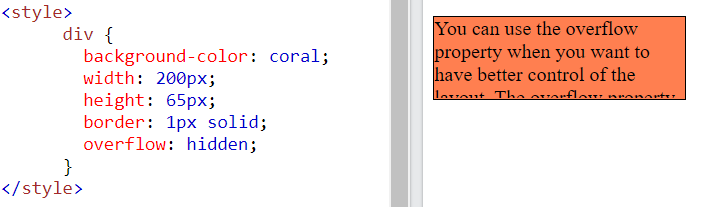
    </p>

- `overflow: scroll;`
    <p align = "center">
    
    </p>

- `overflow: auto;`
    <p align = "center">
    
    </p>

- `overflow-x và overflow-y`
    - Các thuộc tính `overflow-x và overflow-y` chỉ định thay đổi nội dung tràn theo chiều ngang hay chiều dọc (hoặc cả hai) 
    - `overflow-x` chỉ định những việc cần làm với các cạnh trái/phải của nội dung. 
    - `overflow-y` chỉ định những việc cần làm với các cạnh trên/dưới của nội dung.
    <p align = "center">
    
    </p>

## 23. CSS Layout - float và clear
### 23.1. Thuộc tính float
- Thuộc tính `Float` sử dụng để chuyển một phần tử sang góc trái hoặc phải của không gian bao quanh nó, rất cần thiết trong việc định dạng bố cục trang.
- Theo mặc định, tất cả các phần tử HTML là không `float`.

- Thuộc tính `Float` có thể có một trong các giá trị sau:

    - `left`: Cố định phần tử về bên trái.
    - `right`: Cố định phần tử về bên phải.
    - `none`: Nằm tại chính vị trí của nó (trạng thái bình thường).
    - `inherit` (kế thừa): Phần tử kế thừa giá trị từ float cha.

VD:
- `float: right;`
    <p align = "center">
    
    </p>
- `float: left;`
    <p align = "center">
    
    </p>
- `float: none;`
    <p align = "center">
    
    </p>

*Lưu ý:* Khi một thành phần được CSS float là left hoặc right thì tất cả các thẻ cùng cấp phía sau nó sẽ được tràn lên phía trên và lấp đầy chỗ trống của hàng chứa thẻ được CSS float left hoặc right.  
VD:
- Nếu không dùng thuộc tính `float` cho thẻ `<div>`
    <p align = "center">
    
    </p>
- Dùng thuộc tính `float`
    <p align = "center">
    
    </p>

### 23.2. Thuộc tính Clear
- Khi chúng ta sử dụng thuộc tính `float`, chúng ta muốn phần tử tiếp theo ở bên dưới (không phải ở bên trái hay bên phải), thì sử dụng thuộc tính `clear`.
- Thuộc tính `clear` có thể có một trong các giá trị sau:

    - `none`- Phần tử không bị đẩy xuống dưới phần tử nổi bên trái hoặc bên phải. Đây là mặc định
    - `left`- Phần tử được đẩy xuống bên dưới các phần tử nổi bên trái
    - `right`- Phần tử được đẩy xuống bên dưới các phần tử nổi bên phải
    - `both`- Phần tử được đẩy xuống bên dưới cả phần tử nổi bên trái và bên phải
    - `inherit`- Phần tử kế thừa giá trị rõ ràng từ cha của nó

    VD:
    <p align = "center">
    
    </p>
### 23.3. The Clearix Hack
- `Nếu một phần tử được float cao hơn phần tử đang chứa nó`, thì nó sẽ tràn ra ngoài phần tử chứa. Vậy chúng ta có thể thêm một `clearix hack` để giải quyết vấn đề này.  
VD:
    <p align = "center">
    
    </p>
- `Clearfix overflow: auto` được sử dụng rất hiệu quả, tuy nhiên khuyến nghị nên sử dụng Clearfix mới tiện ích và dễ dùng hơn, được sử dụng cho hầu hết các web hiện nay:
```css
.clearfix::after { 
     content: "";  
     clear: both; 
     display: table;
}
```

### 23.4. CSS Layout - Float
### 23.4.1. Bố cục lưới dạng hộp
- Ứng dụng tốt nhất của `float` là tạo bố cục dạng hộp đặt cạnh nhau.  
VD:
    <p align = "center">
    
    </p>
### 23.4.2. Bố cục hình ảnh đặt cạnh nhau
- `Float` bố cục dạng lưới hộp như ví dụ trên cũng có thể được sử dụng để hiển thị các ảnh cạnh nhau.  
VD:
    <p align = "center">
    
    </p>

### 23.4.3 Bố cục box chiều cao bằng nhau
- Trong ví dụ trước, ta đã học cách `float` các box cạnh nhau với chiều rộng bằng nhau. Tuy nhiên, không dễ để tạo ra các box có chiều cao bằng nhau. Cách khắc phục nhanh là đặt chiều cao cố định:  
VD:
    <p align = "center">
    
    </p>

### 23.4.4. Menu điều hướng (Navigation Menu)
- Dùng `float` với các hyperlink để tạo menu nằm ngang trên trang  
VD:
    <p align = "center">
    
    </p>
## 25. CSS Layout - display:inline-block
- So với `display: inline`, sự khác biệt chính là `display: inline-block` cho phép thiết lập chiều rộng và chiều cao trên phần tử.
- Ngoài ra, với `display: inline-block`, `margin/padding trên cùng và dưới cùng` được tôn trọng, nhưng với `display: inline` thì không.
- So với `display: block`, sự khác biệt chính là `display: inline-block` không thêm dấu ngắt dòng sau phần tử, vì vậy phần tử có thể nằm cạnh các phần tử khác.  
VD:
    <p align = "center">
    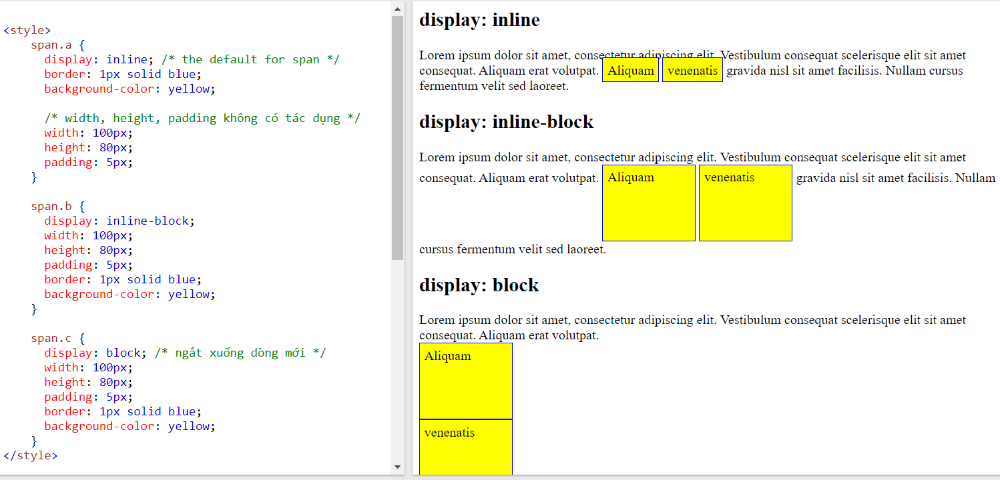
    </p>

- Sử dụng khối nội tuyến để tạo liên kết điều hướng
    - Một cách sử dụng phổ biến `display: inline-block` là hiển thị các mục danh sách theo chiều ngang thay vì chiều dọc. Ví dụ sau tạo liên kết điều hướng ngang:  
    VD:
    <p align = "center">
    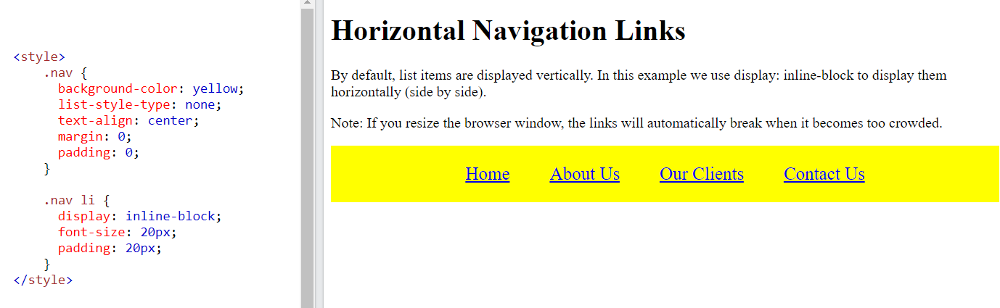
    </p>

## 26. CSS Layout - Horizontal & Vertical Align
### 26.1. Căn giữa cho phần tử - Sử dụng margin:auto
- Trong CSS, để căn giữa một phần tử khối (như `<div>`), ta sử dụng thuộc tính `margin có giá trị là auto` để căn chỉnh phần tử nằm ở giữa so với phần tử cha của nó.

- Phần tử sau khi chiếm không gian nhất định, khoảng trống còn lại sẽ được chia đều cho hai bên lề:  
VD:
    <p align = "center">
    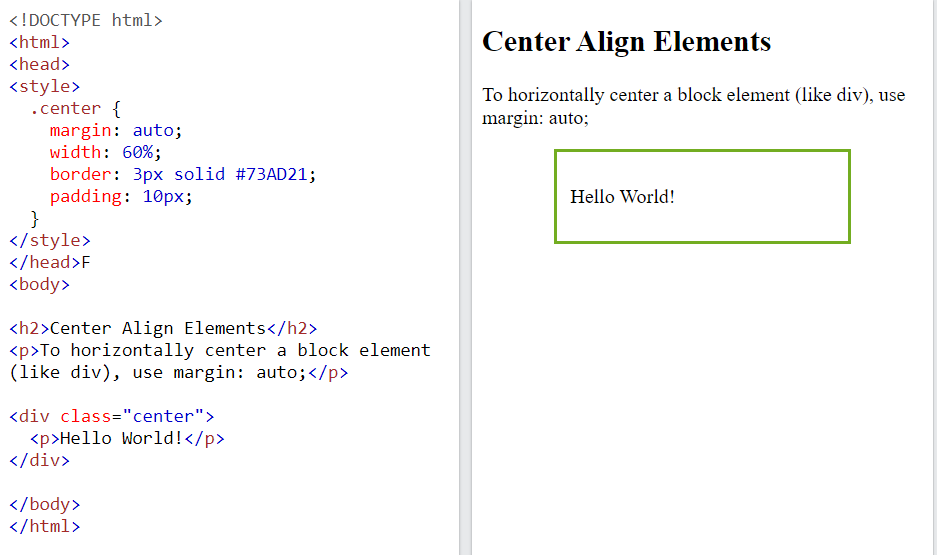
    </p>

*Lưu ý:*

- Căn chỉnh giữa sẽ không tạo ra hiệu ứng nếu không có thuộc tính `width` (hoặc width có giá trị là 100%) vì nó chiếm hết động rộng sẵn có, không thể căn giữa được nữa.
- Thuộc tính `margin: auto` chỉ căn giữa cho phần tử `block` như `<div>, <p>, <h1> đến <h6>, <header>, <footer>, <section>, <nav>... `còn các phần tử `inline` như `<span>, <a>, <strong>, <b>, <i>...` sẽ `không được áp dụng`.
- Có thể ghi đè lại phần tử hiển thị block hay inline bằng cách sử dụng thuộc tính display. Ví dụ: `span { display: block;}`.

### 26.2. Căn giữa Văn bản 
- Để chỉ căn giữa văn bản bên trong một phần tử, hãy sử dụng `text-align: center;`  
VD:
    <p align = "center">
    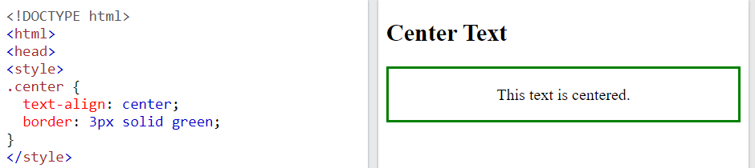
    </p>

### 26.3. Căn giữa hình ảnh
- Để căn giữa một ảnh, đặt `margin-left và margin-right thành auto` và `làm cho hình ảnh trở thành phần tử dạng block.`  
VD:
    <p align = "center">
    
    </p>

### 26.4. Căn trái/phải - Sử dụng position
- Một phương pháp khác để căn chỉnh phần tử là sử dụng `position: absolute`.  
VD:
    <p align = "center">
    
    </p>

### 26.5. Căn trái/phải - Sử dụng float
- Thuộc tính `float` cũng được sử dụng để căn chỉnh phần tử.  
VD:
    <p align = "center">
    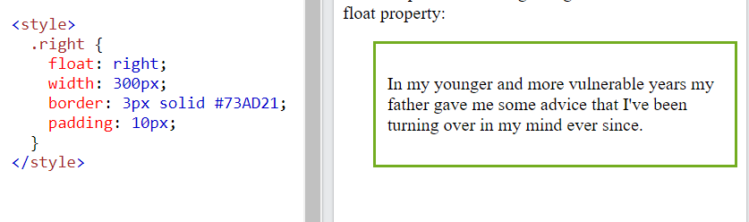
    </p>

### 26.6. Căn giữa theo chiều dọc - Sử dụng padding
- Có nhiều cách để căn giữa một phần tử theo chiều dọc trong CSS. Giải pháp đơn giản nhất đó là sử dụng `padding`.  
VD:
    <p align = "center">
    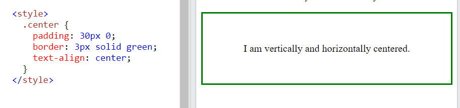
    </p>
### 26.7. Căn giữa theo chiều dọc - Sử dụng line-height
- Cũng có cách khác để căn giữa theo chiều dọc là sử dụng thuộc tính `line-height` với giá trị giống như thuộc tính `height`.  
VD:
    <p align = "center">
    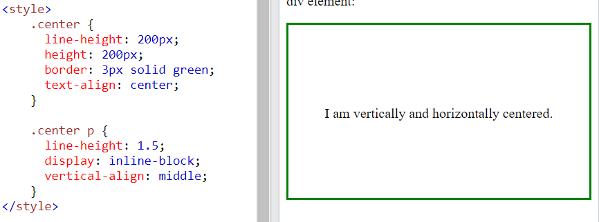
    </p>

### 26.8. Căn giữa theo chiều dọc - Sử dụng position và transform
- Nếu không sử dụng `padding` và `line-height` như trên, có thể dùng cách thứ ba là sử dụng `position` và `transform`:  
VD:
    <p align = "center">
    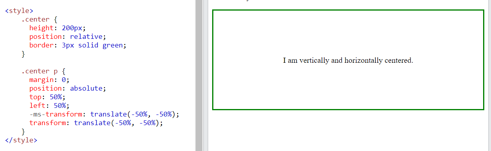
    </p>

### 26.9. Căn giữa theo chiều dọc - Sử dụng Flexbox 
- Cũng có thể sử dụng `flexbox` để căn giữa mọi thứ.   
VD:
    <p align = "center">
    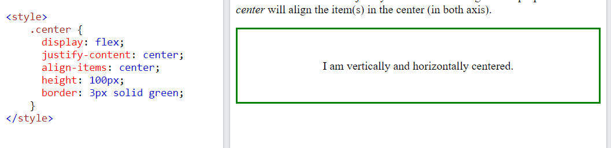
    </p>