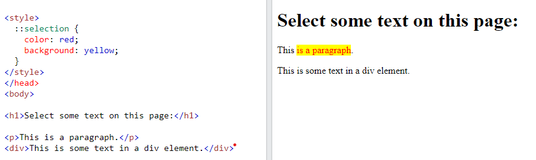
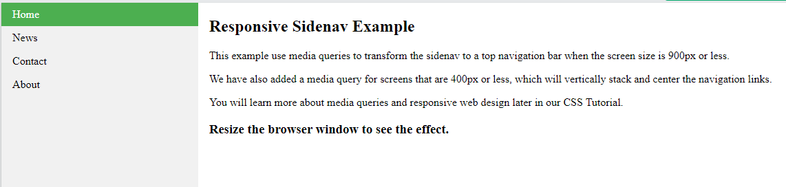
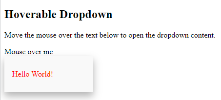
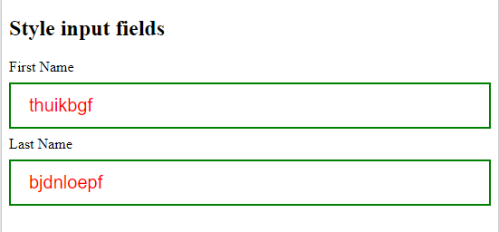
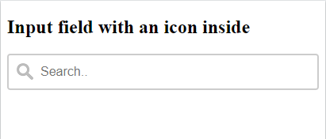
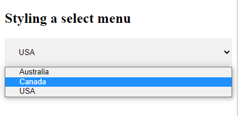
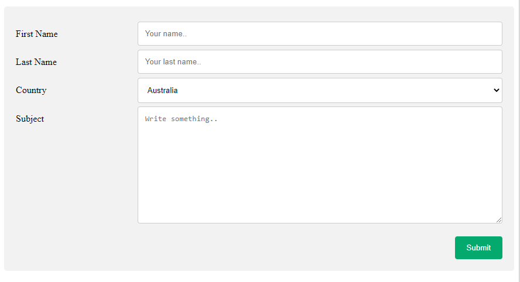
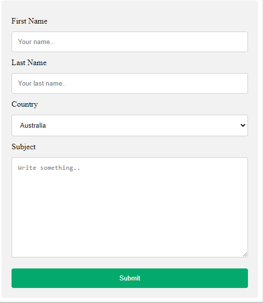
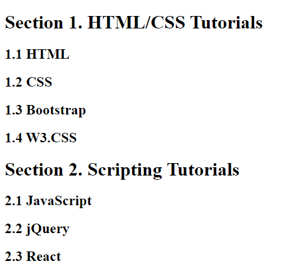
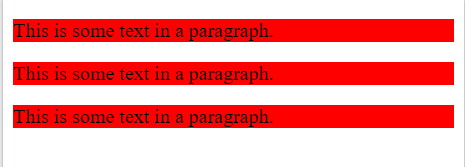

# 1. CSS Combinators
## 1.1. CSS Combinators - Bộ kết hợp CSS
- Bộ chọn CSS có thể chứa nhiều hơn 1 bộ chọn đơn (`selector`). Giữa các bộ chọn đơn, chúng ta có thể bao gồm 1 bộ kết hợp.

- Bộ kết hợp sẽ hiểu đơn giản là  mối quan hệ giữa các bộ chọn đơn.
- Có 4 bộ chọn kết hợp khác nhau trong CSS:
    - `Descendant selector (space)`
    - `Child selector (>)`
    - `Adjacent sibling selector (+)`
    - `General sibling selector (~)`
`
### 1.1.1. Descendant Selector
- Bộ chọn `Descendant Selector` có nghĩa là `chọn` **tất cả** `những thẻ nằm trong một selector nào đó`. Cú pháp sử dụng dấu cách (space) giữa 2 phần tử `Element Element {}`   

    VD: chọn tất cả các thẻ `<p>` nằm trong thẻ `<div>`
    <p align="center">
    
    </p>
### 1.1.2. Child selector (>)
- `Child selector (>)` có ý nghĩa là `chọn` **tất cả** `những thẻ con trực tiếp của một selector` nào đó. Nghĩa là thẻ con nằm trong đúng một cấp so với selector đó.
- Cú pháp : `element > element {}`  
VD: Chọn tất cả thẻ con `<p>` cấp 1 nằm trong thẻ `<div>`
    <p align="center">
    
    </p>

    - Thẻ `<p>` chứa nội dung "Paragraph 3 in the div" không được chọn vì nó là thẻ con cấp 1 của thẻ `<section>` hay gọi là thẻ cháu của thẻ `<div>`

### 1.1.3 Adjacent sibling selector (+)
- `Adjacent sibling selector (+)` có ý nghĩa là `chọn` **một** `thẻ anh/chị/em nằm liền kề ngay sau một selector` nào đó.
- Thẻ anh/chị/em được hiểu là những thẻ có chung một thẻ cha.

- Cú pháp : `element + element {}`  
VD: Chọn thẻ `<p>` đầu tiên nằm ngay sau thẻ `<div>`

<p align="center">

</p>

### 1.1.4. General sibling selector (~)
- `General sibling selector (~)` có ý nghĩa là `chọn` **tất cả** `những thẻ anh/chị/em của 1 selector` nào đó. Tuy nhiên những thẻ này `phải nằm phía sau selector` đó.
- Cú pháp : `element ~ element {}`    
VD: 
    <p align="center">
    
    </p>

# 2. CSS Pseudo-Classes
## 2.1. Pseudo-Classes là gì?
- `Pseudo-class (Một lớp giả)` được sử dụng để xác định trạng thái đặc biệt của một phần tử.
- Ví dụ, nó có thể được sử dụng để:
    - Tạo kiểu cho một phần tử khi người dùng di chuột qua nó.
    - Tạo kiểu cho các liên kết được truy cập và không được truy cập một cách khác nhau...

- Cú pháp:

    ```css
    selector:pseudo-class {
        property: value;
    }
    ```
## 2.2. Anchor Pseudo-classes
- Các liên kết có thể được hiển thị theo các cách khác nhau.  
VD:
    ```css
    /* unvisited link */
    a:link {
    color: red; /*Khi liên kết chưa được truy cập thì có màu đỏ*/
    }

    /* visited link */
    a:visited {
    color: green; /*Khi liên kết được truy cập rồi thì có màu xanh lá*/
    }

    /* mouse over link */
    a:hover {
    color: yellow; /*Khi di chuột qua liên kết thì có màu vàng*/
    }

    /* selected link */
    a:active {
    color: blue; /*Khi liên kết được click thì có màu xanh dương*/
    }
    ```
## 2.3. Pseudo-classes and HTML Classes
- Có thể kết hợp `Pseudo-class` với tên class của HTML.

    VD: Thay đổi màu sắc của thẻ liên kết `<a>` có `class="highlight"` khi di chuột vào liên kết đó.

    ```css
    a.highlight:hover {
    color: #ff0000;
    font-size: 22px;
    } 
    ```

## 2.4. Di chuột qua một phần tử để hiển thị lên một phần tử khác (giống như hiển thị 1 công cụ giải thích)  

VD: khi di chuột vào thẻ `<div>` thì thẻ `<p>` được hiển thị ra
    <p align="center">
    
    </p>
## 2.5. CSS - The :first-child Pseudo-class
- `:first-child pseudo-class` sẽ chọn một phần tử mà phần tử đó là thẻ con đầu tiên của 1 phần tử khác  
- VD:
    - Chọn phần tử `<p>` bất kỳ là phần tử con đầu tiên của 1 phần tử khác.

    <p align="center">
    
    </p>

    - Chỉ có phần tử chứa nội dung "This is p1." và "This is p3." được chọn vì p1 là phần tử con đầu tiên của phần tử `<body>`, p3 là phần tử con đầu tiên của phần tử `<div>`

VD: 
-  Chọn phần tử con `<i>` đầu tiên trong tất cả các phần tử `<p>`

    <p align="center">
    
    </p>

VD:
- Chọn tất cả phần tử con `<i>` nằm trong phần tử `<p>` mà phần tử `<p>` đó lại là phần tử con đầu tiên của một phần tử nào đó.

    <p align="center">
    
    </p>

## 2.6. CSS - The :lang Pseudo-class
- `:lang pseudo-class` cho phép ta xác định các quy tắc đặc biệt cho các ngôn ngữ khác nhau.  
VD:
 `:lang` xác định dấu ngã (~) cho các phần tử `<q>` với `lang = "no"`:

<p align="center">

</p>

## 2.7. CSS :last-child Pseudo-class
- `:last-child`: chọn phần tử là phần tử con cuối cùng trong phần tử cha của nó

    VD:
    ```html
    <style>
        p:last-child {
            color: red;
            font-size: 25px;
        }
    </style>
    <body>
    <div>
        <p>This is p1</p>
        <p>This is p:last-child</p>
    </div>
    <div>
        <p>This is p2</p>
        <p>This is p3</p>
        <p>This is p:last-child</p>
    </div>
    </body>
    ```
    <p align="center">
    
    </p>

## 2.8. CSS :nth-child(n) Pseudo-class
- `nth:child(n)`: chọn phần tử theo thứ tự của nó trong phần tử cha.
- `n` có thể nhận các giá trị như: `1 số nguyên` cụ thể, `even` (chọn các phần tử có thứ tự chẵn) hoặc `odd` (chọn các phần tử có thứ tự lẻ), hoặc 1 công thức (`an+b; a,b là 1 số nguyên; n chạy từ 0,1,2...`)

    VD:
    ```html
    <style>
        p:nth-child(even) {
            color: red;
            font-size: 25px;
        }
    </style>
    <body>
    <div>
        <p>This is p1</p>
        <p>This is p2</p>
        <p>This is p3</p>
        <p>This is p4</p>
    </div>
    <div>
        <p>This is p1</p>
        <p>This is p2</p>
        <p>This is p3</p>
        <p>This is p4</p>
        <p>This is p5</p>
    </div>
    </body>
    ```

<p align="center">

</p>

## 2.9. CSS :nth-last-child(n) Pseudo-class
- `:nth-last-child(n)` chọn mọi phần tử là phần tử con thứ n trong phần tử cha, thứ tự được tính từ phần tử con cuối cùng. `n` có thể là một số, một từ khóa (`even/odd`) hoặc một công thức (`n+1`)

    VD: 
    ```html
    <style>
        p:nth-child(even) {
            color: red;
            font-size: 25px;
        }
    </style>
    <body>
    <div>
        <p>This is p1</p> <!-- Phần tử con thứ 4 -->
        <p>This is p2</p> <!-- Phần tử con thứ 3 -->
        <p>This is p3</p> <!-- Phần tử con thứ 2 -->
        <p>This is p4</p> <!-- Phần tử con thứ 1 -->
    </div>
    <div>
        <p>This is p1</p> <!-- Phần tử con thứ 5 -->
        <p>This is p2</p> <!-- Phần tử con thứ 4 -->
        <p>This is p3</p> <!-- Phần tử con thứ 3 -->
        <p>This is p4</p> <!-- Phần tử con thứ 2 -->
        <p>This is p5</p> <!-- Phần tử con thứ 1 -->
    </div>
    </body>
    ```

<p align="center">

</p>

# 3. CSS Pseudo-elements
- Một CSS `pseudo-element` thường được sử dụng để định kiểu cho các thành phần cụ thể của một phần tử.  
VD: nó có thể được sử dụng để:
    - Định kiểu cho ký tự, dòng hay của một phần tử đầu tiên.
    - Chèn nội dung vào trước hoặc sau một nội dung của một phần tử.

- Cú pháp: 
```css
selector::pseudo-element {
  property: value;
}
```
## 3.1. The ::first-line Pseudo-element
- `::firstline Pseudo-element` được sử dụng để thêm một định kiểu đặc biệt tới dòng đầu tiên của một văn bản.  
VD: định dạng cho dòng đầu tiên của văn bản trong tất cả các thẻ `<p>`
    <p align="center">
    
    </p>

*lưu ý:* `::first-line pseudo-element` chỉ có thể áp dụng cho những phần tử mức khối
- Một số thuộc tính áp dụng cho `::first-line pseudo-element`:
    - Thuộc tính `font`, `color`, `background`
    - `word-spacing`
    - `letter-spacing`
    - `text-decoration`
    - `vertical-align`
    - `text-transform`
    - `line-height`
    - `clear`

**Chú ý ::first-line  với :first-line**
- Hai dấu hai chấm (`::`) được thay thế cho 1 dấu hai chấm (`:`) phía trước một `pseudo-element trong CSS3`. Và điều này là để phân biệt giữa `pseudo-classes là 1 dấu (:)` và `pseudo-elements là 2 dấu (::)`.
- Đối với `CSS2` và `CSS1` thì cú pháp sủ dụng `1 dấu hai chấm (:) được sử dụng cho cả pseudo-classes và pseudo-elements`

## 3.2. The ::first-letter Pseudo-elements
- `::first-letter pseudo-element` được sử dụng để thêm một định kiểu đặc biệt tới ký tự đầu tiên của một văn bản.

VD: định kiểu cho ký tự đầu tiên của văn bản trong tất cả thẻ `<p>`
    <p align="center">
    
    </p>

*Lưu ý:* `::first-letter pseudo-element` chỉ có thể áp dụng cho những phần tử mức khối
- Một số thuộc tính áp dụng cho `::first-letter pseudo-element`:

    - Thuộc tính `font`, `color`, `background`
    - `margin`, `padding`, `border`
    - `text-decoration`
    - `vertical-align` (chỉ có giá trị float là không áp dụng)
    - `text-transform`
    - `line-height`
    - `float`
    - `clear`
## 3.3. Kết hợp Pseudo-elements và HTML Classes
- `Pseudo-elements` có thể được kết hợp với HTML `class` theo cú pháp:
```css
    selector.class::pseudo-element  {
        property: value;
    }
```
VD:
    <p align="center">
    
    </p>

## 3.4. Multiple Pseudo-elemnts
- Một vài `pseudo-elements` cũng có thể được kết hợp với nhau:  

    VD: Kết hợp `::first-letter` và `::first-line` của `pseudo-elements` cho một đoạn văn bản.   

<p align="center">

</p>
    
## 3.5. CSS ::before, ::after Pseudo-element
- `::before`/`::after Pseudo-element` có thể được sử dụng để chèn một số nội dung vào trước/sau nội dung có trong một phần tử.  

- Cú pháp:
    ```css
    selector::before {
        content: "add content";
    }

    selector::after {
        content: "add content";
    }
    ```
VD: 
- Chèn một hình ảnh vào trước nội dung của mỗi thẻ `<h1>`:
    <p align="center">
    
    </p>

- Chèn một hình ảnh vào sau nội dung của mỗi thẻ `<h1>`:
    <p align="center">
    
    </p>

## 3.6. CSS - The ::marker Pseudo-element
- CSS - `::marker Pseudo-element` chọn những điểm đánh dấu của các mục danh sách   
VD:
    <p align="center">
    
    </p>

## 3.6. CSS - The ::selection Pseudo-element
- `::selection Pseudo-element` dùng để định dạng cho những thành phần được người dùng chọn trong một phần tử.
- Những thuộc tính CSS được áp dụng cho `::selection`: `color, background, cursor, outline`.
VD: Những phần nào được chọn sẽ có chữ màu đỏ và màu nền là màu vàng

    <p align="center">
    
    </p>

# 4. CSS Opacity/Transparency
- Thuộc tính `opacity` định nghĩa độ mờ/độ trong suốt của một phần tử.
## 4.1. Transparency Image
- Thuộc tính `opacity` có thể nhận 1 giá trị từ 0.0 - 1.0. Giá trị càng thấp thì càng mờ.  
VD:
    <p align = "center">
    
    </p>

## 4.2. Transparent Hover Effect
- Thuộc tính `opacity` thường được sử dụng với bộ chọn `:hover` để thay đổi độ mờ khi di chuột qua một phần tử.  
VD:
    <p align = "center">
    
    </p>

# 5. CSS Navigation Bar
## 5.1 Demo : Navigation Bar
- Navigation Bar = List of Links ( thanh điều hướng hay danh sách các liên kết)
- Một thanh điều hướng sử dụng những tiêu chuẩn HTML làm một cơ sở.

- Một thanh điều hướng cơ bản là một danh sách của các liên kết, vì vậy  sử dụng các phần tử `<ul>` và `<li>` để tạo danh sách.  
VD:
    ```html
    <ul>
        <li><a href="#home">Home</a></li>
        <li><a href="#news">News</a></li>
        <li><a href="#contact">Contact</a></li>
        <li><a href="#about">About</a></li>
    </ul>
    ```
<p align = "center">

</p>

*Lưu ý*: sử dụng thuộc tính `href="#"` trong thẻ `<a>` cho các liên kết thực nghiệm. Trong một trang web thực, đây sẽ là một URLs.
- Tiếp theo, xóa bỏ phần đánh dấu danh mục, margin, padding trong danh sách:
    - Sử dụng thuộc tính `list-style-type: none;` để xóa điểm đánh dấu

    - Thiết lập `margin: 0`, `padding: 0` để xóa bỏ thiết lập mặc định của trình duyệt.

    ```css
    ul {
        list-style-type: none;
        margin: 0;
        padding: 0;
    }
    ```
## 5.2. CSS Vertical Navigation Bar
- Để tạo một thanh điều hướng theo chiều dọc, chúng ta có thể định kiểu cho những thẻ `<a>` trong danh sách như sau:
    ```css
    li a {
        display: block;
        width: 60px;
        text-decoration: none;
    }
    ```
- Trong đó:
    - `display: block;` - Việc hiển thị các liên kết dưới dạng phần tử khối làm cho toàn bộ khu vực liên kết có thể click được (không chỉ văn bản) và nó cho phép chúng ta chỉ định chiều rộng (và margin, padding, chiều cao,...)

    - `width: 60px;` - định nghĩa chiều rộng cho các liên kết là 60px
    - `text-decoration: none;` - bỏ phần gạch chân dưới liên kết.
- Chúng ta cũng có thể thiết lập chiều rộng cho danh sách qua thẻ `<ul>` và xóa phần thiết lập chiều rộng của thẻ `<a>` đi. Chúng ta cũng sẽ thu được kết quả giống các làm bên trên:

    ```css
    ul {
        list-style-type: none;
        margin: 0;
        padding: 0;
        width: 60px;
    }

    li a {
        display: block;
        text-decoration: none;
    }
    ```
- Qua các bước trên ta sẽ thu được một thanh điều hướng theo chiều dọc đơn giản như sau:
<p align = "center">

</p>

Để cho thanh điều hướng đẹp và bắt mắt, rõ ràng hơn chúng ta sẽ thực hiện thêm định kiểu style cho các phần tử:
- VD: Thêm màu nền cho thanh điều hướng và thay đổi màu nền cho các liên kết khi người dùng di chuột (`:hover`) qua liên kết:
    ```css
    ul {
    list-style-type: none;
    margin: 0;
    padding: 0;
    width: 200px;
    background-color: #f1f1f1;
    }

    li a {
    display: block;
    color: #000;
    padding: 8px 16px;
    text-decoration: none;
    }

    /* Change the link color on hover */
    li a:hover {
    background-color: #555;
    color: white;
    }
    ```
<p align = "center">

</p>

- VD: Thêm một `class="active"` tới liên kết hiện tại để người dùng biết họ đang ở trang web nào. Sau đó định kiểu cho `class` đó.
    ```css
    <style>
    ul {
    list-style-type: none;
    margin: 0;
    padding: 0;
    width: 200px;
    background-color: #f1f1f1;
    }

    li a {
    display: block;
    color: #000;
    padding: 8px 16px;
    text-decoration: none;
    }

    /* khi đang ở trang web nào thì liên kết của trang đó sẽ có màu nền là xanh, màu chữ là màu trắng*/
    li a.active {
    background-color: #04AA6D;
    color: white;
    }

    /* những liên kết còn lại khi di chuột qua sẽ chuyển màu nền sang màu xám, chữ trắng*/
    li a:hover:not(.active) {
    background-color: #555;
    color: white;
    }
    </style>
    </head>
    <body>

    <h2>Vertical Navigation Bar</h2>
    <p>In this example, we create an "active" class with a green background color and a white text. The class is added to the "Home" link.</p>

    <ul>
    <li><a class="active" href="#home">Home</a></li>
    <li><a href="#news">News</a></li>
    <li><a href="#contact">Contact</a></li>
    <li><a href="#about">About</a></li>
    </ul>
    ```
<p align = "center">

</p>

- VD: Center links & thêm border
    - Thêm thuộc tính `text-align:center;` tới thẻ `<li>` hoặc thẻ `<a>` để thiết lập liên kết ở vị trí trung tâm.
    - Thêm thuộc tính border tới thẻ `<ul>` để thêm một đường viền xung quanh của thanh điều hướng. Nếu muốn thêm đường viền bên trong thanh điều hướng, thì thêm một thuộc tính boder-bottom tới tất cả các thẻ `<li>`, ngoại trừ thẻ `<li>` cuối cùng (`:last child`) trong danh sách (vì nếu thêm cả cho thẻ `<li>` cuối cùng thì sẽ có đến 2 đường viền ở dưới cùng: 1 đường của thẻ `<li>`, 1 đường của thẻ `<ul>`)

        ```css
        ul {
            border: 1px solid #555;
        }

        li {
            text-align: center;
            border-bottom: 1px solid #555;
        }

        li:last-child {
            border-bottom: none;
        }
        ```
    <p align = "center">
    
    </p>

- VD: Tạo một thanh điều hướng bên cố định, chiều cao tối đa
    ```css
    ul {
        list-style-type: none;
        margin: 0;
        padding: 0;
        width: 25%;
        background-color: #f1f1f1;
        height: 100%; /* Full height */
        position: fixed; /* Make it stick, even on scroll */
        overflow: auto; /* Enable scrolling if the sidenav has too much content */
    }
    ```
<p align = "center">

</p>

## 5.3. CSS Horizontal Navigation Bar
Có 2 cách để tạo một thanh điều hướng ngang là sử dụng `inline` hoặc `float` cho các danh mục trong danh sách:
- `Inline List Items`: thêm thuộc tính `display: inline;` tới phần tử `<li>`. Mặc định phần tử `<li>` là phần tử khối. Ở đây thuộc tính này sẽ xóa bỏ dấu xuống dòng ở phía trước và sau mỗi danh mục trong danh sách để các danh mục hiển thị trên cùng 1 dòng.

    ```css
    ul {
        list-style-type: none;
        margin: 0;
        padding: 0;
    }
    li {
        display: inline;
    }
    ```
- `Floating List Items`: thêm thuộc tính `float` tới phần tử `<li>`
    ```css
    ul {
        list-style-type: none;
        margin: 0;
        padding: 0;
        overflow: hidden;
        background-color: #dddddd;
    }
    li {
    float: left; /*Sử dụng float để các phần tử khối nổi cạnh nhau, bắt đầu từ bên trái*/
    }

    a {
        display: block;
        padding: 8px;
        text-decoration: none;
    }
    ```
<p align = "center">

</p>

Thực hiện 1 số định kiểu style cho thanh điều hướng ngang để cho nó bắt mắt hơn.
- VD: thêm màu nền, thay đổi màu cho liên kết khi di chuột qua các liên kết, thêm thuộc tính cho liên kết hiện tại biết người dùng đang ở trang web nào tương tự như với thanh điều hướng dọc 
    ```html
    <!DOCTYPE html>
    <html>
    <head>
    <style>
    ul {
    list-style-type: none;
    margin: 0;
    padding: 0;
    overflow: hidden;
    background-color: #333;
    }

    li {
    float: left;
    }

    li a {
    display: block;
    color: white;
    text-align: center;
    padding: 14px 16px;
    text-decoration: none;
    }

    li a:hover:not(.active) {
    background-color: #F00;
    }

    .active {
    background-color: #04AA6D;
    }
    </style>
    </head>
    <body>

    <ul>
    <li><a class="active" href="#home">Home</a></li>
    <li><a href="#news">News</a></li>
    <li><a href="#contact">Contact</a></li>
    <li><a href="#about">About</a></li>
    </ul>

    </body>
    </html>
    ```
    <p align = "center">
    
    </p>

- VD: Thêm thuộc tính float:right; vào thẻ `<li>` để các liên kết được căn hiển thị ở bên phải của trình duyệt
    ```html
    <ul>
        <li><a href="#home">Home</a></li>
        <li><a href="#news">News</a></li>
        <li><a href="#contact">Contact</a></li>
        <li style="float:right"><a class="active" href="#about">About</a></li>
    </ul>
    ```
    <p align = "center">
    
    </p>
- VD: Thêm thuộc tính border-right tới thẻ `<li>` để tạo đường phân chia các liên kết, ngoại trừ thẻ `<li>` cuối cùng (`:last child`) của danh sách.
    ```css
    li {
        border-right: 1px solid #fff;
    }

    li:last-child {
        border-right: none;
    }
    ```
    <p align = "center">
    
    </p>

- VD: Cố định vị trí của thanh điều hướng ở phía trên hoặc dưới của một trang web, kể cả khi người dùng kéo thanh cuộn trang
    ```css
    ul {
        position: fixed;
        top: 0; /* cố định nav bar ở phía trên */
        /* thay top: 0; bằng bottom: 0; nếu muốn cố định nav bar ở phía dưới */
        width: 100%;
    }
    ```
    <p align = "center">
    
    </p>
- VD: Thêm thuộc tính `position: sticky;` tới thẻ `<ul>` để tạo một thanh điều hướng sticky (dính) khi kéo thanh cuộn đi qua vị trí ban đầu của thanh điều hướng, và thêm 1 thuộc tính `top` để sau khi cuộn thanh cuộn trang, thanh điều hướng sẽ nằm ở vị trí nào.
    ```css
    ul {
        position: sticky;
        top: 10px;
    }
    ```
    - Thanh điều hướng khi chưa kéo thanh cuộn
    <p align = "center">
    
    </p>
    - Thanh điều hướng khi kéo thanh cuộn xuống qua vị trí ban đầu của nó

    <p align = "center">
    
    </p>

- VD: Responsive side navbar
    ```html
    <!DOCTYPE html>
    <html>
    <head>
    <meta name="viewport" content="width=device-width, initial-scale=1.0">
    <style>
    body {margin: 0;}

    ul.sidenav {
    list-style-type: none;
    margin: 0;
    padding: 0;
    width: 25%;
    background-color: #f1f1f1;
    position: fixed;
    height: 100%;
    overflow: auto;
    }

    ul.sidenav li a {
    display: block;
    color: #000;
    padding: 8px 16px;
    text-decoration: none;
    }
    
    ul.sidenav li a.active {
    background-color: #4CAF50;
    color: white;
    }

    ul.sidenav li a:hover:not(.active) {
    background-color: #555;
    color: white;
    }

    div.content {
    margin-left: 25%;
    padding: 1px 16px;
    height: 1000px;
    }

    @media screen and (max-width: 900px) {
    ul.sidenav {
        width: 100%;
        height: auto;
        position: relative;
    }
    
    ul.sidenav li a {
        float: left;
        padding: 15px;
    }
    
    div.content {margin-left: 0;}
    }

    @media screen and (max-width: 400px) {
    ul.sidenav li a {
        text-align: center;
        float: none;
    }
    }
    </style>
    </head>
    <body>

    <ul class="sidenav">
    <li><a class="active" href="#home">Home</a></li>
    <li><a href="#news">News</a></li>
    <li><a href="#contact">Contact</a></li>
    <li><a href="#about">About</a></li>
    </ul>

    <div class="content">
    <h2>Responsive Sidenav Example</h2>
    <p>This example use media queries to transform the sidenav to a top navigation bar when the screen size is 900px or less.</p>
    <p>We have also added a media query for screens that are 400px or less, which will vertically stack and center the navigation links.</p>
    <p>You will learn more about media queries and responsive web design later in our CSS Tutorial.</p>
    <h3>Resize the browser window to see the effect.</h3>
    </div>

    </body>
    </html>
    ```
    - Thanh điều hướng ở cửa sổ trình duyệt có kích thước bình thường
    <p align = "center">
    
    </p>
    - Thanh điều hướng ở cửa sổ trình duyệt có kích thước nhỏ hơn hoặc bằng 900px
    <p align = "center">
    
    </p>
    - Thanh điều hướng ở cửa sổ trình duyệt có kích thước nhỏ hơn hoặc bằng 400px
    <p align = "center">
    
    </p>

# 6. CSS Dropdowns
## 6.1. Basic Dropdown
- Tạo một hộp thả xuống sẽ xuất hiện khi người dùng di chuột qua một phần tử.  
VD:
    ```html
    <!DOCTYPE html>
    <html>
    <head>
    <style>
    .dropdown {
        position: relative;
        display: inline-block;
    }

    .dropdown-content {
        display: none;
        position: absolute;
        background-color: #f9f9f9;
        min-width: 100%;
        box-shadow: 0px 8px 16px 0px rgba(0,0,0,0.3);
        padding: 12px 16px;
        z-index: 1;
    }
    .dropdown-content p {
        color: red;
    }

    .dropdown:hover .dropdown-content {
        display: block;
    }
    </style>
    </head>
    <body>

    <h2>Hoverable Dropdown</h2>
    <p>Move the mouse over the text below to open the dropdown content.</p>

    <div class="dropdown">
        <span>Mouse over me</span>
        <div class="dropdown-content">
            <p>Hello World!</p>
        </div>
    </div>

    </body>
    </html>
    ```
*Giải thích:*
- Sử dụng bất kỳ một phần tử để mở một danh sách nội dung thả xuống, ở ví dụ này sử dụng thẻ <span> `<span>Mouse over me</span>`
- Sử dụng thẻ <div> để làm thẻ chứa những nội dung thả xuống, sau đó thêm bất kỳ nội dung nào mà chúng ta muốn
    ```html
        <div class="dropdown-content">
            <p>Hello World!</p>
        </div>
    ```
- Lớp .dropdown sử dụng position:relative; lớp .dropdown-content sử dụng position:absolute, cần thiết khi chúng ta muốn nội dung thả xuống được đặt đúng vị trí ngay dưới phần tử thả xuống
    ```css
    .dropdown {
        position: relative;
    }
    .dropdown-content {
        display: none; /* mặc định nội dung thả xuống sẽ bị ẩn*/
        position: absolute;
        background-color: #f9f9f9;
        min-width: 150px; /* chiều rộng của 1 nội dung thả xuống*/
        box-shadow: 0px 8px 16px 0px rgba(0,0,0,0.3); /*tạo 1 hộp đổ bóng bao quanh của một nôi dung thả xuống*/
        padding: 12px 16px;
    }
    ```
- Sử dụng bộ chọn :hover để hiển thị danh sách nội dung thả xuống khi cu chuột tới phần tử thả xuống.
    ```css
    .dropdown:hover .dropdown-content {
        display: block; /* nội dung được hiển thị dạng block*/
    }
    ```
    <p align = "center">
    
    </p>
## 6.2. Dropdown Menu bên trong một thanh điều hướng
- Ở phần trước đã demo tạo ra một thanh điều hướng cho trang web và tạo một danh sách thả xuống. Sau đây, chúng ta sẽ kết hợp tạo một menu thả xuống bên trong thanh điều hướng cho phép người dùng chọn một lựa chọn từ một danh sách

    ```html
    <style>
    ul {
        list-style-type: none;
        margin: 0;
        padding: 0;
        overflow: hidden;
        background-color: #333;
    }

    li {
        float: left;
    }

    li a, .dropbtn {
        display: inline-block;
        color: white;
        text-align: center;
        padding: 14px 16px;
        text-decoration: none;
    }

    li a:hover, .dropdown:hover .dropbtn {
        background-color: red;
    }

    li.dropdown {
        display: inline-block;
    }

    .dropdown-content {
        display: none;
        position: absolute;
        background-color: #f9f9f9;
        min-width: 160px;
        box-shadow: 0px 8px 16px 0px rgba(0,0,0,0.2);
        z-index: 1; /*kết hợp với position để hiển thị các danh sách thả xuống được hiển thị lần lượt từ trên xuống*/
    }

    .dropdown-content a {
        color: black;
        padding: 12px 16px;
        text-decoration: none;
        display: block;
        text-align: left;
    }

    .dropdown-content a:hover {background-color: #f1f1f1;}

    .dropdown:hover .dropdown-content {
        display: block;
    }
    </style>
    </head>
    <body>

    <ul>
    <li><a href="#home">Home</a></li>
    <li><a href="#news">News</a></li>
    <li class="dropdown">
        <a  class="dropbtn">Dropdown</a>
        <div class="dropdown-content">
        <a href="#">Link 1</a>
        <a href="#">Link 2</a>
        <a href="#">Link 3</a>
        </div>
    </li>
    </ul>

    <h3>Dropdown Menu inside a Navigation Bar</h3>
    <p>Hover over the "Dropdown" link to see the dropdown menu.</p>
    ```
    <p align = "center">
    
    </p>

# 7. CSS Image Gallery
- Sử dụng CSS tạo một trang trưng bày hình ảnh linh hoạt trên các thiết bị khác nhau:
```html
<style>
div.gallery {
  border: 1px solid #ccc;
}

div.gallery:hover {
  border: 1px solid #777; 
}

div.gallery img {
  width: 100%;
  height: auto;
}

div.desc {
  padding: 15px;
  text-align: center;
}

* {
  box-sizing: border-box; /*tất cả phần tử hiển thị như 1 cái hộp, và kích thước luôn cố định, không bị thay đổi  bởi padding trong phần tử*/
}

/* Khi màn hình có kích thước bình thường*/
.responsive {
  padding: 0 6px;
  float: left;
  width: 24.99999%; /* chiều rộng của thẻ div .responsive là 24.9% tức là màn hình chứa tối đa 4 thẻ div (4 bức ảnh) theo chiều ngang */
}

/* Khi màn hình có kích thước nhỏ hơn 700px*/
@media only screen and (max-width: 700px) {
  .responsive {
    width: 49.99999%; /* chiều rộng của thẻ div .responsive là 49.9% tức là màn hình chỉ chứa tối đa 2 thẻ div (2 bức ảnh) theo chiều ngang*/
    margin: 6px 0;
  }
}

/* Khi màn hình có kích thước nhỏ hơn 500px*/
@media only screen and (max-width: 500px) {
  .responsive {
    width: 100%; /* chiều rộng của thẻ div .responsive là 100% tức là màn hình chỉ chứa tối đa 1 thẻ div (1 bức ảnh) theo chiều ngang*/
  }
}

.clearfix:after {
  content: "";
  display: table;
  clear: both;
}
</style>
</head>
<body>

<h2>Responsive Image Gallery</h2>

<h4>Resize the browser window to see the effect.</h4>

<div class="responsive">
  <div class="gallery">
    <a target="_blank" href="img_5terre.jpg">
      
    </a>
    <div class="desc">Add a description of the image here</div>
  </div>
</div>

<div class="responsive">
  <div class="gallery">
    <a target="_blank" href="img_forest.jpg">
      
    </a>
    <div class="desc">Add a description of the image here</div>
  </div>
</div>

<div class="responsive">
  <div class="gallery">
    <a target="_blank" href="img_lights.jpg">
      
    </a>
    <div class="desc">Add a description of the image here</div>
  </div>
</div>

<div class="responsive">
  <div class="gallery">
    <a target="_blank" href="img_mountains.jpg">
      
    </a>
    <div class="desc">Add a description of the image here</div>
  </div>
</div>

<div class="clearfix"></div>

```
- Kết quả:
    - Hình ảnh được trưng bày khi màn hình có kích thước lớn (vd laptop):
    <p align = "center">
    
    </p>
    - Hình ảnh được trưng bày khi màn hình có kích thước nhỏ hơn bằng 700:
    <p align = "center">
    
    </p>
    - Hình ảnh được trưng bày khi màn hình có kích thước nhỏ hơn bằng 500px:

    <p align = "center">
    
    </p>

# 8. CSS Image Sprites
## 8.1. Khái niệm
- `Sprites` là một hình ảnh lớn được tạo ra bằng cách gộp nhiều ảnh nhỏ lại với nhau theo một cách được định trước sao cho có thể tái sử dụng lại từng ảnh nhỏ mà không bị ảnh hưởng bởi các ảnh khác.
- Để hiển thị được một ảnh nhỏ từ Sprite Image, thay vì sử dụng qua thẻ `img` hoặc `background` thông thường thì ta phải sử dụng thuộc `background` kết hợp với thuộc tính `background-position` để xác định vị trí chính xác của bức ảnh cần hiển thị. 
- Sử dụng `image sprites` sẽ giảm thiểu số lượng yêu cầu server và tiết kiệm băng thông.

## 8.2. Hướng dẫn
- CSS `Image Sprite` có hệ trục tọa độ X, Y sao cho `chiều dương của trục X là hướng từ phải sang trái, chiều dương của Y là hướng từ dưới lên`, gốc tọa độ đặt tại gốc trái trên của Image Sprite, cần hiểu rõ điều này để cài đặt đúng tọa độ X, Y của từng phần trong Image Sprite.  
 VD:
    <p align = "center">
    
    </p>
- Ảnh icons.png đã lưu trữ các thành phần được đánh số 1, 2, 3, 4, 5, 6 chính là các ảnh nhỏ chung một `Image Sprite`. Mỗi phần nhỏ của ảnh này có độ rộng `WIDTH: 50px` và chiều cao `HEIGHT: 50px`. Các thông tin như sau sẽ xác định được 1 phần bao gồm `X, Y` là tọa độ bắt đầu của 1 phần và WIDTH, HEIGHT là độ rộng và cao của một phần.
    <p align = "center">
    
    </p>

- Cú pháp để lấy 1 phần trong `image sprite` là:
    ```css
    selector {
        width: value;
        height: value;
        background: url("path to image sprite") <X> <Y>;
    }
    ```
    Trong đó:  
    - `width`, `height` là độ rộng và chiều cao của phần ảnh muốn lấy
    - `url("")`: chứa đường dẫn tới image sprite
    - `X, Y`: lần lượt là tọa độ bắt đầu của phần ảnh muốn lấy

VD: Với ảnh icon.png bên trên, ta muốn lấy ra phần ảnh thứ 2 thì sử dụng cú pháp sau (giả sử phần ảnh thứ 2 được sử dụng cho 1 phần thử có class="part2"):
```css
.part2 {
    width: 50px;
    height: 50px;
    background: url(icon.png) -50px 0;
}
```
## 8.3. Một số ví dụ demo
### 8.3.1. Image Spritesc - Tạo một danh sách điều hướng

```css
<style>
#navlist {
  position: relative;/* đặt là relative để các phần tử bên trong nó có vị trí được định vị tuyệt đối */
}

/*bỏ các thiết lập mặc định cho các liên kết trong danh sách*/
#navlist li {
  margin: 0;
  padding: 0;
  list-style: none;
  position: absolute;
  top: 0;
}

#navlist li, #navlist a {
  height: 44px;  /* chiều cao của tất cả các hình ảnh đều bằng 44px*/
  display: block;
}

#home {
  left: 0px;
  width: 46px;
  background: url('img_navsprites.gif') 0 0;
}

#prev {
  left: 63px;
  width: 43px;
  background: url('img_navsprites.gif') -47px 0;
}

#next {
  left: 129px;
  width: 43px;
  background: url('img_navsprites.gif') -91px 0;
}
</style>
</head>
<body>

<ul id="navlist">
  <li id="home"><a href="default.asp"></a></li>
  <li id="prev"><a href="css_intro.asp"></a></li>
  <li id="next"><a href="css_syntax.asp"></a></li>
</ul>
```
*Giải thích:*
- `Image Sprite` được sử dụng trong ví dụ trên: 
    <p align = "center">
    
    </p>
- 
```css
#home {
  left: 0px; /*định vị ví trí hiển thị của phần ảnh home */
  width: 46px; /* chiều rộng của phần ảnh home*/
  background: url('img_navsprites.gif') 0 0; /*0 0 là vị trí tọa độ X Y của phần ảnh home trên ảnh img_navsprites.gif */
}
```
- Tương tự với phần ảnh prev và next:
```css
#prev {
  left: 63px;/*định vị ví trí hiển thị của phần ảnh prev, 63px được tính từ trái sang phải*/
  width: 43px;
  background: url('img_navsprites.gif') -47px 0; /*-47px 0 là vị trí tọa độ X Y của phần ảnh home trên ảnh img_navsprites.gif.
  47px vì chiều rộng của phần ảnh home đầu tiên là 46px + 1px đường biên chia giữa 2 phần ảnh
  */
}
```

```css
#next {
  left: 129px;/*định vị ví trí hiển thị của phần ảnh prev, 63px được tính từ trái sang phải*/
  width: 43px;
  background: url('img_navsprites.gif') -91px 0; /*-91px 0 là vị trí tọa độ X Y của phần ảnh home trên ảnh img_navsprites.gif.
  91px vì chiều rộng của phần ảnh home đầu tiên là 46px + 1px đường biên chia giữa 2 phần ảnh (home & prev) + 43px (width của ảnh prev) + 1px đường biên chia giữa 2 phần ảnh (next & prev)
  */
}
```
Kết quả:
    <p align = "center">
    
    </p>
 ### 8.3.2. Image Sprites - Hover Effect
 - Tương tự như ví dụ bên trên, chúng ta chỉ cần thêm phần định kiểu bộ chọn :hover để có được hiệu ứng di chuột
    ```css
    #home a:hover {
    background: url('img_navsprites_hover.gif') 0 -45px;
    }

    #prev a:hover {
    background: url('img_navsprites_hover.gif') -47px -45px;
    }

    #next a:hover {
    background: url('img_navsprites_hover.gif') -91px -45px;
    }
    ```
    <p align = "center">
    
    </p>

# 9. CSS Attribute Selectors
## 9.1. CSS [attribute] Selector
- `[attribute] selector` được sử dụng để `chọn những phần tử với một thuộc tính được chỉ định`.  
VD: chọn tất cả thẻ `<a>` có một thuộc tính `target`

    ```html
    <style>
    a[target] {
        background-color: yellow;
    }
    </style>
    <a href="https://www.w3schools.com">w3schools.com</a>
    <a href="http://www.disney.com" target="_blank">disney.com</a>
    <a href="http://www.wikipedia.org" target="_top">wikipedia.org</a>
    ```
    <p align = "center">
    
    </p>

## 9.2. CSS [attribute="value"] Selector
- `[attribute="value"] selector` được sử dụng để `chọn những phần tử với một thuộc tính và giá trị được chỉ định`.  
VD: Chọn tất cả thẻ `<a>` với thuộc tính `target="_blank"`

    ```html
    <style>
    a[target="_blank"] {
        background-color: yellow;
    }
    </style>
    <a href="https://www.w3schools.com">w3schools.com</a>
    <a href="http://www.disney.com" target="_blank">disney.com</a>
    <a href="http://www.wikipedia.org" target="_top">wikipedia.org</a>
    ```
    <p align = "center">
    
    </p>

## 9.3. CSS [attribute~="value"] Selector
- `[attribute~="value"] selector` được sử dụng để `chọn những phần tử với một thuộc tính có giá trị chứa một từ được chỉ định`  
*Lưu ý:* giá trị được chỉ định ở đây là một từ riêng  
VD: Chọn tất cả các phần tử có thuộc tính title chứa một danh sách các từ được phân tách bằng dấu cách, và 1 trong số từ đó là "flower"

    ```html
    <style>
    [title~=flower] {
        border: 2px solid red;
    }
    </style>
    <h2>CSS [attribute~="value"] Selector</h2>
    <p>All images with the title attribute containing the word "flower" get a yellow border.</p>
    
    
    
    ```
    <p align = "center">
    
    </p>

## 9.4. CSS [attribute|="value"] Selector
- CSS `[attribute|="value"] Selector` được sử dụng để `chọn các phần tử có thuộc tính được chỉ định, mà giá trị của nó có thể chính xác là giá trị được chỉ định hoặc giá trị được chỉ định theo sau bởi dấu gạch ngang (-)`.  
VD: 
    ```html
    <style>
    [class|=top] {
    background: yellow;
    }
    </style>
    <h1 class="top-header">Welcome</h1>
    <p class="top-text">Hello world!</p>
    <p class="topcontent">Are you learning CSS?</p>
    ```
    <p align = "center">
    
    </p>
## 9.5. CSS [attribute^="value"] Selector
- `[attribute^="value"] Selector` được sử dụng để `chọn những phần tử với giá trị của thuộc tính bắt đầu bằng giá trị được chỉ định`.  
*Lưu ý:* giá trị được chỉ định ở đây không phải là cả 1 từ.  
VD:
    ```html
    <style>
    [class^="top"] {
        background: yellow;
    }
    <body>
    <h1 class="top-header">Welcome</h1>
    <p class="text_top">Hello world!</p>
    <p class="topcontent">Are you learning CSS?</p>
    ```

<p align = "center">


## 9.6. CSS [attribute$="value"] Selector
- `[attribute$="value"] Selector` được sử dụng để `chọn những phần tử với giá trị của thuộc tính kết thúc bằng giá trị được chỉ định.`  
*Lưu ý:* giá trị được chỉ định ở đây không phải là cả 1 từ.  
VD:
    ```html
    <style> 
        [class$="test"] {
            background: yellow;
        }
    </style>
    <div class="first_test">The first div element.</div>
    <div class="second">The second div element.</div>
    <div class="my-test">The third div element.</div>
    <p class="mytest">This is some text in a paragraph.</p>
    ```
<p align = "center">


## 9.7. CSS [attribute*="value"] Selector
- CSS `[attribute*="value"] Selector` được sử dụng để `chọn những phần tử mà giá trị thuộc tính của nó chứa một giá trị được chỉ định`

*Lưu ý:* giá trị được chỉ định ở đây không phải là cả 1 từ.

VD: Chọn những phần tử có giá trị thuộc tính class chứa `"te"`

```html
<style> 
[class*="te"] {
    background: yellow;
}
</style>
<div class="first_test">The first div element.</div>
<div class="second">The second div element.</div>
<div class="my-test">The third div element.</div>
```
<p align = "center">


## 9.8. Styling Forms
- Các `attribute selector` có thể hữu ích cho việc tạo kiểu cho các biểu mẫu `không có class hoặc ID`:  
VD:
    ```html
    <style>
    input[type=text] {
        width: 150px;
        display: block;
        margin-bottom: 10px;
        background-color: yellow;
    }
    input[type=button] {
        width: 120px;
        margin-left: 35px;
        display: block;
    }
    </style>
    <form name="input" action="" method="get">
        Firstname:<input type="text" value="Peter" size="20">
        Lastname:<input type="text"  value="Griffin" size="20">
        <input type="button" value="Button">
    </form>
    ```

<p align = "center">

</p>

# 10. CSS Forms
## 10.1. Styling Input Fields
- Để định kiểu style cho tất cả các phần tử `<input>` trong biểu mẫu, ta sử dụng cú pháp sau:
    ```css
    input {

    }
    ```
- Nếu như chỉ muốn định kiểu cho một loại input được chỉ định, thì chúng ta có thể sử dụng `attribute selector` (bộ chọn thuộc tính):  
    VD:
    - `input[type=text]`: chỉ chọn những trường nhập text 
    - `input[type=password]`: chỉ chọn những trường nhập password
    - `input[type=button]`: chỉ chọn những trường button...

- Một số định kiểu style cho trường input trong biểu mẫu:
    - `width`: định nghĩa chiều rộng
    - `padding`, `margin`: định nghĩa phần đệm và lề cho input
    - `border`: định nghĩa đường viền cho input
    - `box-sizing: border-box;` - thuộc tính này để đảm bảo rằng padding và border đã được bao gồm trong tổng kích thước chiều rộng và chiều cao của phần tử. 
    - `color`, `background-color`,...  
    VD:
        ```html
        <style> 
        input[type=text] {
            width: 100%;
            padding: 12px 20px;
            margin: 8px 0;
            box-sizing: border-box;
            color: red;
            background-color: white;
            border: 2px solid green;
            font-size: 20px;
        }
        </style>
        <h2>Style input fields</h2>

        <form>
        <label for="fname">First Name</label>
        <input type="text" id="fname" name="fname">
        <label for="lname">Last Name</label>
        <input type="text" id="lname" name="lname">
        </form>
        ```
    <p align = "center">
    
    </p>

    - `Focused Inputs`: 
        - Mặc định, một số trình duyệt sẽ thêm một đường outline màu xanh dương bao xung quanh trường input khi người dùng click vào. Chúng ta có thể xóa bỏ hành vi này bằng cách thêm thuộc tính `outline: none;` vào phần input.
        - Sử dụng bộ chọn `:focus` để định kiểu style cho trường input khi người dùng click vào.
        VD:
        ```html
            <style> 
            input[type=text] {
                width: 100%;
                padding: 12px 20px;
                margin: 8px 0;
                box-sizing: border-box;
                border: 1px solid #555;
                outline: none;
            }

            input[type=text]:focus {
                background-color: lightblue;
                border: 2px solid red;
            }
            </style>
        
            <form>
                <label for="fname">First Name</label>
                <input type="text" id="fname" name="fname" value="John">
                <label for="lname">Last Name</label>
                <input type="text" id="lname" name="lname" value="Doe">
            </form>
        ```
    <p align = "center">
    
    </p>

    - `Input với biểu tượng/hình ảnh`
        - Nếu muốn thêm 1 biểu tượng vào bên trong input, sử dụng thuộc tính `backdround-image` và `background-position` để xác định ảnh và vị trí của nó.  
        VD: 

     ```html
        <style> 
        input[type=text] {
            width: 100%;
            box-sizing: border-box;
            border: 2px solid #ccc;
            border-radius: 4px;
            font-size: 16px;
            background-color: white;
            background-image: url('searchicon.png');
            background-position: 10px 10px; 
            background-repeat: no-repeat;
            padding: 12px 20px 12px 40px;
        }
        </style>
    ```
    <p align = "center">
    
    </p>
## 10.2. Styling Select Menus
VD:  
```html
    <style> 
    select {
        width: 100%;
        padding: 16px 20px;
        border: none;
        border-radius: 4px;
        background-color: #f0f1f1;
    }
    </style>

    <h2>Styling a select menu</h2>

    <form>
        <select id="country" name="country">
            <option value="au">Australia</option>
            <option value="ca">Canada</option>
            <option value="usa">USA</option>
        </select>
    </form>
```
<p align = "center">

</p>

## 10.3. Styling Input Buttons
VD:
```html
<style> 
input[type=button], input[type=submit], input[type=reset] {
  background-color: #04AA6D;
  border: none;
  color: white;
  padding: 16px 32px;
  margin: 4px 2px;
  cursor: pointer;/*khi di chuột vào con trỏ chuột chuyển thành hình bàn tay*/
}
</style>
<input type="button" value="Button">
<input type="reset" value="Reset">
<input type="submit" value="Submit">
```
<p align = "center">

</p>

## 10.4 Responsive Forms
VD:
```html
<style>
* {
  box-sizing: border-box;
}

input[type=text], select, textarea {
  width: 100%;
  padding: 12px;
  border: 1px solid #ccc;
  border-radius: 4px;
  resize: vertical;
}

label {
  padding: 12px 12px 12px 0;
  display: inline-block;
}

input[type=submit] {
  background-color: #04AA6D;
  color: white;
  padding: 12px 20px;
  border: none;
  border-radius: 4px;
  cursor: pointer;
  float: right;
}

input[type=submit]:hover {
  background-color: #45a049;
}

.container {
  border-radius: 5px;
  background-color: #f2f2f2;
  padding: 20px;
}

.col-25 {
  float: left;
  width: 25%;
  margin-top: 6px;
}

.col-75 {
  float: left;
  width: 75%;
  margin-top: 6px;
}

/* Clear floats after the columns */
.row:after {
  content: "";
  display: table;
  clear: both;
}

/* Responsive layout - when the screen is less than 600px wide, make the two columns stack on top of each other instead of next to each other */
@media screen and (max-width: 600px) {
  .col-25, .col-75, input[type=submit] {
    width: 100%;
    margin-top: 0;
  }
}
</style>

<div class="container">
  <form action="/action_page.php">
  <div class="row">
    <div class="col-25">
      <label for="fname">First Name</label>
    </div>
    <div class="col-75">
      <input type="text" id="fname" name="firstname" placeholder="Your name..">
    </div>
  </div>
  <div class="row">
    <div class="col-25">
      <label for="lname">Last Name</label>
    </div>
    <div class="col-75">
      <input type="text" id="lname" name="lastname" placeholder="Your last name..">
    </div>
  </div>
  <div class="row">
    <div class="col-25">
      <label for="country">Country</label>
    </div>
    <div class="col-75">
      <select id="country" name="country">
        <option value="australia">Australia</option>
        <option value="canada">Canada</option>
        <option value="usa">USA</option>
      </select>
    </div>
  </div>
  <div class="row">
    <div class="col-25">
      <label for="subject">Subject</label>
    </div>
    <div class="col-75">
      <textarea id="subject" name="subject" placeholder="Write something.." style="height:200px"></textarea>
    </div>
  </div>
  <br>
  <div class="row">
    <input type="submit" value="Submit">
  </div>
  </form>
</div>
```
*Kết quả:*
- Khi kích thước cửa sổ trình duyệt bình thường, biểu mẫu chia làm 2 cột label và input:
<p align = "center">

</p>

- Khi kích thước cửa sổ trình duyệt nhỏ hơn bằng 600px, 2 cột label và input của biểu mẫu xếp chồng lên nhau, kích thước chiều rộng bằng chiều rộng của màn hình :
<p align = "center">

</p>

# 11. CSS Counters
## 11.1. Tự động tăng số với bộ đếm Counters
- `CSS Counters` như là các biến. Giá trị của các biến này có thể được tăng theo quy tắc CSS.
- `CSS Counter` có những giá trị sau:
    - `counter-reset`: tạo hoặc bắt đầu lại một bộ đệm.
    - `counter-increment`: tăng một giá trị đếm.
    - `content`: Chèn nội dung đã được định trước.
    - `Hàm counter() hoặc counters()` : thêm giá trị của một bộ đếm tới một phần tử

- Để sử dụng CSS counter, trước tiên phải tạo bộ đếm với counter-reset.  
VD: Tạo 1 bộ đếm, tăng giá trị của bộ đếm cho mỗi thẻ `<h2>` và thêm nội dung "`Section <giá trị của bộ đếm>:`" để bắt đầu mỗi thẻ `<h2>`

    ```html
    <style>
    body {
    counter-reset: section;
    }

    h2::before {
    counter-increment: section;
    content: "Section " counter(section) ": ";
    }
    </style>
    <h1>Using CSS Counters</h1>

    <h2>HTML Tutorial</h2>
    <h2>CSS Tutorial</h2>
    <h2>JavaScript Tutorial</h2>
    <h2>Python Tutorial</h2>
    <h2>SQL Tutorial</h2>
    ```
<p align = "center">

</p>

## 11.2. Bộ đếm lồng nhau
- Chúng ta có thể sử dụng các bộ đếm lồng nhau trong cùng một trang.

VD: Tạo một bộ đếm (section) để tăng các giá trị cho thẻ `<h1>` với nội dung "`Section <giá trị của bộ đếm section>.`" và một bộ đếm (subsection) để tăng các giá trị cho thẻ `<h2>` với nội dung "`Section <giá trị của bộ đếm section>.<giá trị của bộ đếm subsection>`"

```html
<style>
body {
  counter-reset: section;
}

h1 {
  counter-reset: subsection;
}

h1::before {
  counter-increment: section;
  content: "Section " counter(section) ". ";
}

h2::before {
  counter-increment: subsection;
  content: counter(section) "." counter(subsection) " ";
}
</style>

<h1>HTML/CSS Tutorials</h1>
<h2>HTML</h2>
<h2>CSS</h2>
<h2>Bootstrap</h2>
<h2>W3.CSS</h2>

<h1>Scripting Tutorials</h1>
<h2>JavaScript</h2>
<h2>jQuery</h2>
<h2>React</h2>
```

<p align = "center">

</p>

## 11.3. Sử dụng bộ đếm counter để đánh chỉ mục cho các danh mục trong danh sách có thứ tự

```html
<style>
ol {
  counter-reset: section;
  list-style-type: none;
}
li{
  color: red;
  font-size: 20px;
}

li::before {
  counter-increment: section;
  content: counters(section,".") " ";
}
</style>
<ol>
  <li>item</li>
  <li>item   
  <ol>
    <li>item</li>
    <li>item</li>
    <li>item
    <ol>
      <li>item</li>
      <li>item</li>
      <li>item</li>
    </ol>
    </li>
    <li>item</li>
  </ol>
  </li>
  <li>item</li>
  <li>item</li>
</ol>
```
<p align = "center">

</p>

# 12. CSS Website Layout
## 12.1. Bố cục trang web
- Một trang web thường được chia thành header, menus, content và footer:
<p align = "center">

</p>

### 12.1.1. Header
- Một `header` thường được đặt ở phía trên đầu của một trang web. Nó thường chứa logo hoặc tên của trang web.  
VD:

```html
<style>
#header{
    margin-left: 50px;
    display: flex;
}

</style>
<div class="header">
    <h1>Slick<label>Red</label></h1>
</div>
```

<p align = "center">

</p>

### 12.1.2. Navigation Bar
```html
<style>
.nav ul{
    background-color: #420000;
    width: 100%;
    overflow: hidden;
    text-align: center;
    padding: 0px;
   
}
.nav ul li{
    float: left;
    height: 50px;
    list-style: none;
    width: 16%;
}
.nav ul li a{
    color: white;
    padding: 12px 15px;
    text-decoration: none;
    display: block;
    font-size: 20px;
    height: 50px;
}
.nav ul li a:hover{
    background-color: orange;
}
</style>

<div class="header">
    <h1>Slick<label>Red</label></h1>
</div>
<div class="nav">
    <ul>
        <li><a href="#">Home</a></li>
        <li><a href="#">About</a></li>
        <li><a href="#">Products</a></li>
        <li><a href="#">Services</a></li>
        <li><a href="#">Design</a></li>
        <li><a href="#">Contact</a></li>
    </ul>
</div>
```
<p align = "center">

</p>

## 12.1.3. Content

```html
<style>
.content{
    background-color: #facfcf;
    display: flex;
    height:60vh;
}

.menu ul{
    width: 150px;
    background-color: brown;
    margin-top: 5px;
    height: 90%;
    padding: 0px;
   
}
.menu ul li{
    list-style: none;  
   
}
.menu ul li a{
    text-decoration: none;
    display: block;
    color: white;
    padding: 10px 10px;
}
.content-right{
    padding-left: 10px;
}
</style>
<div class="content">
    <div class="menu">
        <ul>
            <li><a href="#">Links</a></li>
            <li><a href="#">SEO</a></li>
            <li><a href="#">PHP</a></li>
            <li><a href="#">Ajax</a></li>
            <li><a href="#">JQuery</a></li>
            <li><a href="#">Web design</a></li>
            <li><a href="#">Web programming</a></li>
            <li><a href="#">Content creation</a></li>
            <li><a href="#">Internet marketing</a></li>
            <li><a href="#">xHTML templates</a></li>   
        </ul>
    </div>
    <div class="content-right">
        <h2>You may use this template in any manner you like. All I ask 
            is that you leave the link back to my site at the bottom of the 
            page.</h2>
        <h3>Template Notes</h3>
        <p>Lorem ipsum dolor sit amet, consectetur adipisicing elit, sed do eiusmod tempor incididunt ut labore et dolore magna aliqua. Ut enim ad minim veniam, quis nostrud exercitation ullamco laboris nisi ut aliquip ex ea commodo consequat. Duis aute irure dolor in reprehenderit in voluptate velit esse cillum dolore eu fugiat nulla pariatur. Excepteur sint occaecat cupidatat non proident, sunt in culpa qui officia deserunt mollit anim id est laborum</p>
        <h3>More information</h3>
        <p>Lorem ipsum dolor sit amet, consectetur adipisicing elit, sed do eiusmod tempor incididunt ut labore et dolore magna aliqua. Ut enim ad minim veniam, quis nostrud exercitation ullamco  laboris nisi ut aliquip ex ea commodo consequat. Duis aute irure dolor in reprehenderit in voluptate velit esse cillum dolore eu fugiat nulla pariatur. Excepteur sint occaecat cupidatat non  proident, sunt in culpa qui officia deserunt mollit anim id est laborum.</p>
        <h3>Template Notes</h3>
        <p>Lorem ipsum dolor sit amet, consectetur adipisicing elit, sed do eiusmod tempor incididunt ut labore et dolore magna aliqua. Ut enim ad minim veniam, quis nostrud exercitation ullamco laboris nisi ut aliquip ex ea commodo consequat. Duis aute irure dolor in reprehenderit in  voluptate velit esse cillum dolore eu fugiat nulla pariatur. Excepteur sint occaecat cupidatat non proident, sunt in culpa qui officia deserunt mollit anim id est laborum</p>
    </div>
</div>
```

<p align = "center">

</p>

### 12.1.4. Footer

```html
<style>
.footer{
    margin-top:  20px;
    height: 70px;    
}
.footer ul{
    background-color: #facfcf;
    width: 80%;
    margin-left: 150px;
}
.footer ul li{
    list-style: none;
    float: left;
    width: 20%;
    border-right: 1px solid black;
}
.footer ul li a{
    text-decoration: none;
    color: black;
    display: block;
    text-align: center;
}
</style>

<div class="footer">
    <ul>
        <li><a href="#">florida web design</a></li>
        <li><a href="#">web tutorials</a></li>
        <li><a href="#">html codes</a></li>
        <li><a href="#">free templates</a></li>
    </ul>
</div>
```
<p align = "center">

</p>

# 13. CSS Units
- CSS có một số đơn vị khác nhau sử dụng cho định nghĩa 1 độ dài cho các phần tử
- Một số thuộc tính CSS sử dụng giá trị độ dài như: `width`, `margin`, `padding`, `height`, ...
- Độ dài là một con số được theo sau bởi một đơn vị độ dài như `px`, `cm`, `em`,...

 VD:
 ```css
h1 {
  font-size: 60px;
}

p {
  font-size: 5em;
  line-height: 1cm;
}
 ```
- *Lưu ý:*
    - Số và đơn vị độ dài phải được viết liền, với giá trị 0 thì không cần viết đơn vị theo sau.
    - Trong CSS, độ dài chấp nhận 1 giá trị âm
## Có 2 loại đơn vị độ dài là đơn vị tuyệt đối và tương đối
### a. Đơn vị tuyệt đối:
- `Đơn vị tuyệt đối` sẽ có những giá trị cố định không thay đổi.
- `Đơn vị tuyệt đối` không được khuyến khích sử dụng cho màn hình, vì có rất nhiều các kích thước màn hình khác nhau. Nó chỉ nên dùng cho những trường hợp biết chắc kích thước của giao diện, như xuất ra máy in chẳng hạn.

- Một số đơn vị tuyệt đối được sử dụng trong CSS:
   - `px *`: pixels (1px = 1/96th of 1in)
   - `pt`: points (1pt = 1/72 of 1in)
   - `pc`: picas (1pc = 12 pt)
   - `cm`: centimeters
   - `mm`: millimeters
   - `in`: inches (1in = 96px = 2.54cm)

### b. Đơn vị tương đối - Relative Units
- `Đơn vị tương đối` là đơn vị được tính một cách tương đối so với phần tử cha hoặc các phần tử khác.
- `Đơn vị tương đối` hoạt động tốt hơn cho những thiết bị, những màn hình có kích thước và độ phân giải khác nhau.

- Một số đơn vị tương đối chính được sử dụng trong CSS:
    - `% (percentages)`: Đơn vị tương đối về kích thước của phần tử con so với phần tử cha (parrent). Ví dụ: Nếu phần tử cha có thuộc tính width:500px, phần tử con có thuộc tính width:50% thì có nghĩa là phần tử con có thuộc tính width:250px
    - `em`: Là đơn vị tương đối dựa vào thuộc tính font-size của phần tử cha.  
     Ví dụ: Nếu phần tử cha có thuộc tính font-size:16px, phần tử con có thuộc tính font-size:2em thì có nghĩa là phần tử con có thuộc tính font-size:32px
    - `rem(root em)`: Là đơn vị tương đối dựa vào thuộc tính font-size của phần html (root element).   
    Ví dụ: Nếu phần tử html có thuộc tính font-size:12px phần tử cha có thuộc tính font-size:16px, phần tử con có thuộc tính font-size:2rem thì có nghĩa là phần tử con có thuộc tính font-size:24px; Tức là đơn vị `rem` không phụ thuộc vào phần tử cha.
    - `vw`: 1vw = 1% kích thước của trình duyệt

# 14. CSS Specificity
## 14.1 Khái niệm
- Nếu có hai hoặc nhiều quy tắc CSS được chỉ đến cùng một phần tử, bộ chọn nào với giá trị đặc tính cao hơn thì khai báo định kiểu của nó sẽ được áp dụng vào phần tử HTML đó.
- Mức độ ưu tiên của các đặc tính có tính quyết định xem phần khai báo định kiểu style nào sẽ được áp dùng cho một phần tử.  

VD: Có 3 khai báo định kiểu cho thẻ `<p>`, vì bộ chọn id có mức độ ưu tiên cao hơn nên nó sẽ được áp dụng cho thẻ `<p>` và màu chữ sẽ là màu xanh dương
- 
```html
<style>
    #demo {color: blue;}
    .test {color: green;}
    p {color: red;}
  </style>

<p id="demo" class="test">Hello World!</p>
```
<p align = "center">

</p>

## 14.2. Mức độ ưu tiên của các bộ chọn CSS
- `Inline styles` - VD: `<h1 style="color: pink;">`
- `IDs` - VD: #navbar
- `Classes, pseudo-classes, attribute selectors` - VD: .test, :hover, [href]
- `Elements and pseudo-elements` - VD: h1, ::before
## 14.3. Các tính độ ưu tiên cho các bộ chọn CSS
- `Inline style` luôn có giá trị `ưu tiên cao nhất`, và nhận giá trị là 1000
- `Bộ chọn ID`: có giá trị ưu tiên là 100
- `Classes, pseudo-classes, attribute selectors` có giá trị ưu tiên là 10
- `Elements and pseudo-elements` có giá trị ưu tiên là 1.
- `*` (universal selector): giá trị ưu tiên bằng 0
VD: 
- `p.test`: giá trị ưu tiên= 1 + 10 = 11

- `p#demo`: giá trị ưu tiên= 1 + 100 = 101

- `<p style="color: pink;">`:	giá trị ưu tiên= 1000

- `#demo`: giá trị ưu tiên= 100

- `.test`: giá trị ưu tiên= 10

- `p.test1.test2`: giá trị ưu tiên= 1 + 10 + 10 = 21

- `#navbar p#demo`: giá trị ưu tiên= 100 + 1 + 100 = 201

## 14.4. Một số ví dụ
- Nếu cùng một quy tắc nhưng được viết hai lần trong cùng 1 tệp tin css, thì quy tắc viết sau cùng sẽ được chọn
    VD:
    ```css
    h1 {background-color: yellow;}
    h1 {background-color: red;} /* Được chọn*/
    ```
- Bộ chọn id có độ ưu tiên cao hơn bộ chọn thuộc tính
    VD:
    ```css
    div#a {background-color: green;} /*Được chọn*/
    #a {background-color: yellow;}
    div[id=a] {background-color: blue;}
    ```

# 15. CSS !important Rule

## 15.1. Định nghĩa
- Quy tắc `!important` trong CSS được sử dụng để tăng thêm tầm quan trọng tới một cặp `property/value` hơn bình thường.
- `!important` được sử dụng để thay đổi thứ tự ưu tiên của code CSS, `thuộc tính css được gán important thì nó sẽ có mức ưu tiên cao nhất`, cho dù thành phần đó được định nghĩa inline hay trong file css.

- Nếu sử dụng `!important`, thì nó sẽ ghi đè tất cả các quy tắc định kiểu style trước đó của thuộc tính chỉ định đó trong một phần tử.

- Cách sử dụng `!important`: chỉ cẩn thêm `!important` vào cuối dòng của 1 khai báo định kiểu mà chúng ta muốn. Cú pháp:

    ```css
    selector {
        property: value !important;
    }
    ```

    VD:
    ```html
    <style>
    #myid {
    background-color: blue;
    }

    .myclass {
    background-color: gray;
    }

    p {
    background-color: red !important;
    }
    </style>
    <p>This is some text in a paragraph.</p>
    <p class="myclass">This is some text in a paragraph.</p>
    <p id="myid">This is some text in a paragraph.</p>
    ```
- Trong ví dụ trên, cả 3 thẻ `<p>` đều nhận màu nền là màu đỏ, kể cả bộ chọn Id và bộ chọn Class có độ ưu tiên cao hơn. Quy tắc `!important` đã ghi đè tất cả

Kết quả:
<p align = "center">

</p>

## 15.2. Điểm quan trọng về !important
- Chỉ có 1 cách đề ghi đè 1 quy tắc `!important` là sử dụng một quy tắc `!important` khác thêm vào một khai báo có mức độ ưu tiên tương tự (hoặc cao hơn)
- Tuy nhiên điều này sẽ làm cho mã CSS rắc rối, khó hiểu hơn.

    ```css
    #myid {
    background-color: blue !important;
    }

    .myclass {
    background-color: gray !important;
    }

    p {
    background-color: red !important;
    }
    ```
*Lưu ý:* Chỉ sử dụng `!important` khi thật sự cần.

## 15.3. Một số cách sử dụng !important
- *Cách 1*: Sử dụng !important, nếu phải ghi đè một định kiểu mà không thể ghi đè theo bất kỳ cách nào khác.
- *Cách 2*: Khi muốn tất cả phần tử nào đó trên trang web của mình chỉ có 1 định kiểu như màu nền xám; chữ đỏ; đường viền nét liền, màu đen dày 1px thì ta sử dụng `!important` cho tất cả các thuộc tính định kiểu của phần tử đó.

VD: với phần tử `<button>`  
```css
.button {
    background-color: #8c8c8c !important;
    color: red !important;
    padding: 5px !important;
    border: 1px solid black !important;
}
```