# 1. CSS Rounded Corners
## 1.1. CSS border-radius Property
- Thuộc tính `border-radius` định nghĩa bán kính của các góc của một phần tử.
- Thuộc tính này cho phép chúng ta thực hiện bo góc tròn cho các phần tử:
- VD:
    - Bo góc cho một phần tử với một màu nền được chỉ định.
    - Bo góc cho một phần tử với một đường viền.
    - Bo góc cho một phần tử với một hình ảnh nền.

  ```css
  <style> 
  #rcorners1 {
    border-radius: 25px;
    background: #73AD21;
    padding: 20px; 
    width: 200px;
    height: 50px;  
  }

  #rcorners2 {
    border-radius: 25px;
    border: 2px solid #73AD21;
    padding: 20px; 
    width: 200px;
    height: 50px;  
  }

  #rcorners3 {
    border-radius: 25px;
    background: url(paper.gif);
    background-position: left top;
    background-repeat: repeat;
    padding: 20px; 
    width: 200px;
    height: 50px;  
  }
  </style>
  ```

<p align = "center">

</p>

## 1.2. CSS border-radius - Chỉ định từng góc của một phần tử
- Thuộc tính `border-radius` là một thuộc tính viết gọn cho các giá trị thuộc tính theo thứ tự sau:
    - `border-top-left-radius`
    - `border-top-right-radius`
    - `border-bottom-right-radiu`s
    - `border-bottom-left-radius`  

Do đó, thuộc tính `border-radius` có thể có từ một đến bốn giá trị

  VD:
  ```css
  /* border-radius có 4 giá trị*/
  #rcorners1 {
    border-radius: 15px 50px 30px 5px; /*15px: top-left, 50px: top-right, 30px: bottom-right, 5px: bottom-left corner*/
    background: #73AD21;
    padding: 20px;
    width: 200px;
    height: 150px;
  }

  /* border-radius có 3 giá trị*/
  #rcorners2 {
    border-radius: 15px 50px 30px; /*15px: top-left, 50px: top-right và bottom-left, 30px: bottom-right corner*/
    background: #73AD21;
    padding: 20px;
    width: 200px;
    height: 150px;
  }

  /* border-radius có 2 giá trị*/
  #rcorners3 {
    border-radius: 15px 50px; /*15px: top-left và bottom-right, 50px: top-right và bottom-left corner*/
    background: #73AD21;
    padding: 20px;
    width: 200px;
    height: 150px;
  }

  /* border-radius có 1 giá trị*/
  #rcorners4 {
    border-radius: 15px; /*15px cho cả 4 góc*/
    background: #73AD21;
    padding: 20px;
    width: 200px;
    height: 150px;
  }
  ```

<p align = "center">

</p>

# 2. CSS Border Images
## 2.1. CSS border-image property
- Thuộc tính `border-image` cho phép định nghĩa một hình ảnh được sử dụng để thay thế cho một đường viền bình thường bao quanh một phần tử.
- Thuộc tính `border-image` có các phần:
  1. Xác định tập tin hình ảnh dùng để làm đường viền hình ảnh.
  2. Xác định các 'lát cắt" trong tấm hình.
  3. Xác định độ dày của đường viền hình ảnh.
  4. Xác định khoảng cách đẩy đường viền hình ảnh ra khỏi vị trí ban đầu của nó.
  5. Xác định kiểu lặp lại ở các cạnh của đường viền hình ảnh. ảnh.

- Thuộc tính `border-image` lấy hình ảnh và cắt nó thành 9 phần, giống như hình dưới đây. 

  <p align = "center">
  
  </p>

    - Những lát cắt `1 3 5 7` sẽ được đặt lần lượt vào các góc `top-left, top-right, bottom-right, bottom-left` của đường viền.

    - Những lát cắt `2 4 6 8` sẽ được đặt lần lượt vào các cạnh phía trên, bên phải, phía dưới, bên trái của đường viền.

*Lưu ý:* Để thuộc tính `border-image` hoạt động, thì trong định kiểu phần tử cũng cần phải có thuộc tính `border`.

- Thuộc tính `border-image` là thuộc tính viết tắt cho các thuộc tính sau:
    - `border-image-source`: url('đường dẫn tới ảnh')
    - `border-image-slice`: để xác định các "lát cắt" trong tấm hình
    - `border-image-width`: dùng để thiết lập độ dày đường viền hình ảnh mà không làm thay đổi kích thước của phần tử 
    - `border-image-outset`: để đẩy đường viền hình ảnh ra khỏi vị trí bạn đầu của nó.
    - `border-image-repeat`: để xác định ảnh được lặp lại hay kéo dãn để phù hợp với kích thước của đường viền.

- Cú pháp
  ```css
  selector {
      border-image: source slice/width/outset repeat
  }
  ```

*Lưu ý*: Đối với loại bộ năm giá trị này, ta không nhất thiết phải cung cấp đủ năm giá trị, những giá trị nào thiếu sẽ tự động sử dụng giá trị mặc định của nó


VD:
- Chúng ta sẽ sử dụng hình ảnh sau để làm đường viền (gọi là border.png)
  <p align = "center">
  
  </p>

- Đây là trường hợp các phần ở giữa của bức ảnh được lặp lại để tạo đường viền:
  ```css
  #borderimg {
    border: 10px solid transparent; /*sử dụng transparent để tại sự trong suốt cho đường viền*/
    padding: 15px;
    border-image: url(border.png) 30 round;
  }
  ```

<p align = "center">

</p>

- Đây là trường hợp các phần ở giữa của bức ảnh được kéo dãn để tạo đường viền:
  ```css
  #borderimg {
    border: 10px solid transparent;
    padding: 15px;
    border-image: url(border.png) 30 stretch;
  }
  ```

<p align = "center">

</p>

### 2.1.1. Thuộc tính border-image-slice

- Thông thường, thuộc tính `border-image-slice` sẽ nhận một giá trị gồm bốn số (tương ứng với vị trí của bốn lát cắt)

  - Số thứ nhất sẽ tạo nên lát cắt  màu đỏ (nó là khoảng cách từ cạnh phía trên của tấm hình đến đường màu đỏ)
  - Số thứ hai sẽ tạo nên lát cắt  màu xanh lá (nó là khoảng cách từ cạnh bên phải của tấm hình đến đường màu xanh lá)
  - Số thứ ba sẽ tạo nên lát cắt  màu xanh dương (nó là khoảng cách từ cạnh phía dưới của tấm hình đến đường màu xanh dương)
  - Số thứ tư sẽ tạo nên lát cắt  màu đen (nó là khoảng cách từ cạnh bên trái của tấm hình đến đường màu đen)

  <p align = "center">
  
  </p>


- Ta cũng có thể xác định khoảng cách dựa theo tỷ lệ phần trăm kích thước chiều rộng và chiều cao của tấm hình.
- Cú pháp:
  ```css
  border-image-slice: number|percent;
  ```
VD:
```html
<style type="text/css">
    .div1{
      margin-bottom: 20px;
      padding:30px;
      border: 30px solid transparent;
      border-image-source: url(border.png);
      border-image-slice: 30 30 25% 50;
    }
</style>

<div class="div1">border-image-slice</div>
```
<p align = "center">

</p>


### 2.1.2. Thuộc tính border-image-width
- Mặc định thì độ dày "đường viền hình ảnh" sẽ bằng với độ dày đường viền của phần tử.
- Muốn thay đổi độ dày đường viền hình ảnh này, ta sử dụng thuộc tính `border-image-width`, điều này sẽ không làm thay đổi kích thước của phần tử.
- Thuộc tính này có từ 1 đến 4 giá trị, tương ứng cho các giá trị độ dày của đường viền hình ảnh phía trên, bên phải, phía dưới, bên trái.

Cú pháp
  ```css
  border-image-width: pixel|percent|number|auto;
  ```

VD:
  ```html
  <style type="text/css">
      .div1{
        height: 50px;
        padding:30px;
        border: 30px solid transparent;
        border-image-source: url(border.png);
        border-image-slice: 30 30 25% 50;
        border-image-width:20px 30px 30px 20px;
      }
  </style>
  <div class="div1">border-image-width</div>
  ```
<p align = "center">

</p>

### 2.1.3.Thuộc tính border-image-outset
- Thuộc tính `border-image-outset` dùng để đẩy đường viền hình ảnh ra khỏi vị trí ban đầu của nó
- Thuộc tính `border-image-outset` không làm thay đổi kích thước của phần tử, nó chỉ làm thay đổi chiều rộng và chiều cao của đường viền hình ảnh.
- Cú pháp:
  ```css
  border-image-outset: pixel|number;
  ```
VD:
- Khi không khai báo thuộc tính `border-image-outset` (nhận giá trị mặc định)
<p align = "center">

</p>

- Khi khai báo thuộc tính `border-image-outset`
  ```html
  <style type="text/css">
      div{
          margin:100px;
          width:150px;
          height:150px;
          background-color:#ccc;
          border:20px solid transparent;
          border-image-source:url(border.png);
          border-image-slice:50;
          border-image-outset:50px 50px 30px 55px;
      }
  </style>
  <div>
      <a href="border.png" target="_blank">border-image-outset</a>
  </div>
  ```
<p align = "center">

</p>

### 2.1.4. Thuộc tính border-image-repeat
- Ở phần trên đã trình bày, thuộc tính `border-image-slice` sẽ cắt hình ảnh đường viền thành 9 phần:
  <p align = "center">
  
  </p>
- Thuộc tính `border-image-repeat` dùng để xác định các kiểu lặp của các phần cắt `2, 4, 6, 8`
- Cú pháp:
  ```css
  border-image-repeat: stretch|round|repeat|space;
  ```
- Các giá trị của thuộc tính:
  - `stretch`: Các phần `2 4 6 8` không được lặp lại mà nó chỉ giãn nở ra (hoặc nén ngắn lại) để lập đầy các cạnh của đường viền.
  - `round`:	Các phần `2 4 6 8` sẽ giãn nở ra ở một mức độ vừa phải (hoặc nén ngắn lại) để lập đầy các cạnh của đường viền.Tuy nhiên, các phần `2 4 6 8` sẽ lặp lại nếu kích thước các cạnh của đường viền lớn hơn quá nhiều so với chúng.
  - `repeat`: Các phần `2 4 6 8` sẽ được lặp lại nếu các cạnh của đường viền có kích thước lớn hơn chúng.
    - *Lưu ý*: Các phần `2 4 6 8` chỉ lặp lại một đoạn nào đó ở hai đầu chứ không giãn ra như giá trị `round`.
  - `space`: Các phần `2 6` hiển thị theo đúng tỷ lệ giống tấm hình gốc theo chiều ngang. Các phần `4 8` hiển thị theo đúng tỷ lệ giống tấm hình gốc theo chiều dọc.

    - Các phần `2 4 6 8` sẽ được lặp lại nếu các cạnh của đường viền có kích thước lớn hơn chúng.

    - Tuy nhiên, nếu tổng chiều dài số lần lặp lại của mỗi phần ngắn hơn chiều dài cạnh của nó thì khoảng dài hơn sẽ bị thay bởi những khoảng trắng.

- VD:
  - Hình ảnh được sử dụng để làm đường viền  <p align = "center">

</p>

  - `border-image-repeat: stretch;`

    ```css
    <style type="text/css">
          div{
              border:20px solid transparent;
              width:350px;
              height:150px;
              border-image-source:url(../image/pattern3.png);
              border-image-slice:50 50 50 50;
              border-image-repeat:stretch;
          }
      </style>
    ```
  <p align = "center">
    
    </p>

  - `border-image-repeat: round;`  

    ```css
    <style type="text/css">
          div{
              border:20px solid transparent;
              width:350px;
              height:150px;
              border-image-source:url(../image/pattern3.png);
              border-image-slice:50 50 50 50;
              border-image-repeat:round;
          }
      </style>
    ```
  <p align = "center">
  
  </p>

  - `border-image-repeat: repeat;`

    ```css
    <style type="text/css">
          div{
              border:20px solid transparent;
              width:350px;
              height:150px;
              border-image-source:url(../image/pattern3.png);
              border-image-slice:50 50 50 50;
              border-image-repeat:repeat;
          }
      </style>
    ```
  <p align = "center">
  
  </p>

  - `border-image-repeat: space;`

    ```css
    <style type="text/css">
          div{
              border:20px solid transparent;
              width:350px;
              height:150px;
              border-image-source:url(../image/pattern3.png);
              border-image-slice:50 50 50 50;
              border-image-repeat:space;
          }
      </style>
    ```
  <p align = "center">
  
  </p>

# 3. CSS Background
## 3.1. CSS Multiple Backgrounds images
- CSS cho phép thêm nhiều ảnh nền cho một phần tử thông qua thuộc tính `background-image`.
- Các hình nền khác nhau khi khai báo được ngăn cách bởi dấu phẩy ('`,`'), và `các hình ảnh được xếp chồng lên nhau, hình ảnh được khai báo đầu tiên là hình ảnh được xếp lên trên cùng (tức có thể được hiển thị rõ ràng và đầy đủ nhất)`.
- Cú pháp:
  ```css
  selector {
      background-image: url(ảnh_1), url(ảnh_2);
  }
  ```

VD:
  ```html
  <style> 
  #example1 {
    background-image: url(img_flwr.gif), url(paper.gif);
    background-position: right bottom, left top;
    background-repeat: no-repeat, repeat;
    padding: 15px;
  }
  </style>
  <div id="example1">
    <h1>Lorem Ipsum Dolor</h1>
    <p>Lorem ipsum dolor sit amet, consectetuer adipiscing elit, sed diam nonummy nibh euismod tincidunt ut laoreet dolore magna aliquam erat volutpat.</p>
  </div>
  ```
<p align = "center">

</p>

- Nhiều hình nền có thể được chỉ định bằng cách sử dụng thuộc tính nền riêng lẻ (như ví dụ trên) hoặc thuộc tính viết tắt `background`

VD:
  ```html
  <style> 
  #example1 {
    background: url(img_flwr.gif) right bottom no-repeat, url(paper.gif) left top repeat;
    padding: 15px;
  }
  </style>
  <div id="example1">
    <h1>Lorem Ipsum Dolor</h1>
    <p>Lorem ipsum dolor sit amet, consectetuer adipiscing elit, sed diam nonummy nibh euismod tincidunt ut laoreet dolore magna aliquam erat volutpat.</p>
  </div>
  ```
<p align = "center">

</p>

## 3.2. CSS Background Size
- Thuộc tính `background-size` cho phép định nghĩa kích thước của những hình ảnh nền.
- Kích thước có thể được xác định bằng độ dài (`px, cm, em...`), `%`, hoặc sử dụng một trong hai từ khóa `contain` hoặc `cover`.
- Cú pháp:
  ```css
  selector {
      background-size: giá trị;
  }
  ```
VD: Sử dụng kích thước được xác định bằng độ dài

  ```html
  <style>
  #example1 {
    border: 1px solid black;
    background: url(img_flwr.gif);
    background-size: 100px 80px;
    background-repeat: no-repeat;
    padding: 15px;
  }

  #example2 {
    border: 1px solid black;
    background: url(img_flwr.gif);
    background-repeat: no-repeat;
    padding: 15px;
  }
  </style>
  <p>Resized background-image:</p>
  <div id="example1">
    <h2>Lorem Ipsum Dolor</h2>
    <p>Lorem ipsum dolor sit amet, consectetuer adipiscing elit.</p>
  </div>

  <p>Original size of the background-image:</p>
  <div id="example2">
    <h2>Lorem Ipsum Dolor</h2>
    <p>Ut wisi enim ad minim veniam, quis nostrud exerci tation ullamcorper suscipit lobortis nisl ut aliquip ex ea commodo consequat.</p>
  </div>
  ```

<p align = "center">

</p>

- *Lưu ý:* Nếu thuộc tính `background-size` được định nghĩa chỉ với 1 giá trị như `background-size: 100px;` thì có nghĩa là nó sẽ xác định chiều rộng của hình nền là 100px, chiều cao của hình nền sẽ tự động được chỉnh theo tỷ lệ kích thước ban đầu của hình nền.
### 3.2.1. Thuộc tính `background-size: contain;`
- Từ khóa `contain` Tự chia tỷ lệ tới kích thước nhỏ nhất của chiều rộng hoặc chiều cao để phù hợp với vùng nội dung (ảnh sẽ thu phóng sao toàn bộ ảnh đặt vừa lọt trong vào khu vực nền của phần tử.).

  - Nếu chiều cao nhỏ hơn chiều rộng thì background sẽ chỉnh 100% theo chiều cao, chiều rộng sẽ tự động chỉnh tỷ lệ cho phù hợp (auto).
  - Ngược lại nếu chiều rộng nhỏ hơn chiều cao thì background sẽ chỉnh 100% theo chiều rộng, chiều cao sẽ tự động chỉnh tỷ lệ cho phù hợp (auto).

VD:
```html
<style>
.div1 {
  border: 1px solid black;
  height: 120px;
  width: 150px;
  background: url(img_flwr.gif);
  background-repeat: no-repeat;
  background-size: contain;
}

</style>
<h2>background-size: contain:</h2>
<div class="div1">
<p>Lorem ipsum dolor sit amet.</p>
</div>

<p>Original image:</p>

```
<p align = "center">

</p>

### 3.2.2. Thuộc tính background-size: cover;
- Từ khóa `cover` tự chia tỷ lệ tới kích thước lớn nhất của chiều rộng hoặc chiều cao để phù hợp với vùng nội dung (Ảnh nền sẽ thu/phóng sao cho phủ kín hết toàn bộ nền.).

  - Nếu chiều cao lớn hơn chiều rộng thì background sẽ chỉnh 100% theo chiều cao, chiều rộng sẽ tự động chỉnh tỷ lệ cho phù hợp (auto).
  - Ngược lại nếu chiều rộng lớn hơn chiều cao thì background sẽ chỉnh 100% theo chiều rộng, chiều cao sẽ tự động chỉnh tỷ lệ cho phù hợp (auto)

  ```html
  <style>
  .div1 {
    border: 1px solid black;
    height: 120px;
    width: 150px;
    background: url(img_flwr.gif);
    background-repeat: no-repeat;
    background-size: cover;
  }

  </style>
  <h2>background-size: contain:</h2>
  <div class="div1">
  <p>Lorem ipsum dolor sit amet.</p>
  </div>

  <p>Original image:</p>
  
  ```
<p align = "center">

</p>

## 3.2.3. Định nghĩa nhiều kích thước cho nhiều hình nền
- Thuộc tính `background-size` cũng cho phép định nghĩa nhiều giá trị kích thước cho nhiều hình nền, các giá trị được phân cách bởi dấu phẩy.

VD:
  ```html
  <style> 
  #example1 {
    background: url(img_tree.gif) left top no-repeat, url(img_flwr.gif) right bottom no-repeat, url(paper.gif) left top repeat;
    padding: 15px;
    background-size: 50px, 130px, auto;
  }
  </style>
  <div id="example1">
    <h1>Lorem Ipsum Dolor</h1>
    <p>Lorem ipsum dolor sit amet, consectetuer adipiscing elit, sed diam nonummy nibh euismod tincidunt ut laoreet dolore magna aliquam erat volutpat.</p>
  </div>
  ```
<p align = "center">

</p>

## 3.3. Full Size Background Image
- Nếu như chúng ta muốn có một hình nền trên một trang web mà nó luôn bảo phủ toàn bộ cửa sổ trình duyệt mọi lúc thì sử dụng bộ chọn thẻ `<html>`, và khai báo các giá trị thuộc tính `background` và `background-size` như sau:
  ```css
  html {
    background: url(img_man.jpg) no-repeat center fixed;
    background-size: cover;
  }
  ```
<p align = "center">

</p>

## 3.4. CSS background-origin property
- Thuộc tính `background-origin` xác định vị trí của hình nền
- Thuộc tính này có các giá trị khác nhau như sau:
  - `border-box`: hình nền bắt đầu từ góc trên bên trái của đường viền
  - `padding-box`: (`mặc định`) hình nền bắt đầu từ góc trên bên trái của cạnh padding
  - `content-box`: hình nền bắt đầu từ góc trên bên trái của nội dung.

VD:
- `background-origin: border-box`
  ```html
  <style>
  #example1 {
    border: 10px solid black;
    padding: 35px;
    background: url(img_flwr.gif);
    background-repeat: no-repeat;
    background-origin: border-box;
  }
  </style>
  <div id="example1">
    <h2>Lorem Ipsum Dolor</h2>
    <p>Lorem ipsum dolor sit amet, consectetuer adipiscing elit, sed diam nonummy nibh euismod tincidunt ut laoreet dolore magna aliquam erat volutpat.</p>
  </div>
  ```
<p align = "center">

</p>

- `background-origin: padding-box`
  ```html
  <style>
  #example2 {
    border: 10px solid black;
    padding: 35px;
    background: url(img_flwr.gif);
    background-repeat: no-repeat;
    background-origin: border-box;
  }
  </style>
  <div id="example2">
    <h2>Lorem Ipsum Dolor</h2>
    <p>Lorem ipsum dolor sit amet, consectetuer adipiscing elit, sed diam nonummy nibh euismod tincidunt ut laoreet dolore magna aliquam erat volutpat.</p>
  </div>
  ```
<p align = "center">

</p>

- `background-origin: content-box`
  ```html
  <style>
  #example3 {
    border: 10px solid black;
    padding: 35px;
    background: url(img_flwr.gif);
    background-repeat: no-repeat;
    background-origin: content-box;
  }
  </style>
  <div id="example3">
    <h2>Lorem Ipsum Dolor</h2>
    <p>Lorem ipsum dolor sit amet, consectetuer adipiscing elit, sed diam nonummy nibh euismod tincidunt ut laoreet dolore magna aliquam erat volutpat.</p>
  </div>
  ```
<p align = "center">

</p>

## 3.5. CSS background-clip property
- Thuộc tính `background-clip` chỉ định vùng sơn của nền.
- Thuộc tính này có những giá trị sau:
  - `border-box`: (mặc định) nền được sơn đến mép ngoài của đường viền
  - `padding-box`: nền được sơn vào mép ngoài của padding
  - `content-box`: nền được sơn bên trong hộp nội dung.

VD:
- `background-clip: border-box`
  ```html
  <style>
  #example1 {
    border: 10px dashed black;
    padding: 35px;
    background: yellow;
    background-clip: content-box;
  }
  </style>
  <div id="example1">
    <h2>Lorem Ipsum Dolor</h2>
    <p>Lorem ipsum dolor sit amet, consectetuer adipiscing elit, sed diam nonummy nibh euismod tincidunt ut laoreet dolore magna aliquam erat volutpat.</p>
  </div>
  ```
<p align = "center">

</p>

- `background-origin: padding-box`
  ```html
  <style>
  #example2 {
    border: 10px dashed black;
    padding: 35px;
    background: url(img_flwr.gif);
    background-repeat: no-repeat;
    background-origin: border-box;
  }
  </style>
  <div id="example2">
    <h2>Lorem Ipsum Dolor</h2>
    <p>Lorem ipsum dolor sit amet, consectetuer adipiscing elit, sed diam nonummy nibh euismod tincidunt ut laoreet dolore magna aliquam erat volutpat.</p>
  </div>
  ```
<p align = "center">

</p>

- `background-origin: content-box`
  ```html
  <style>
  #example2 {
    border: 10px dashed black;
    padding: 35px;
    background: url(img_flwr.gif);
    background-repeat: no-repeat;
    background-origin: border-box;
  }
  </style>
  <div id="example2">
    <h2>Lorem Ipsum Dolor</h2>
    <p>Lorem ipsum dolor sit amet, consectetuer adipiscing elit, sed diam nonummy nibh euismod tincidunt ut laoreet dolore magna aliquam erat volutpat.</p>
  </div>
  ```
<p align = "center">

</p>

# 4. CSS Colors
## 4.1. RGBA Colors
- Giá trị màu `RGBA` là một phần mở rộng của giá trị màu `RGB` với một giá trị `alpha` - để định nghĩa độ trong suốt của một màu.
- Một giá trị màu `RGBA` được định nghĩa với: `rgba(red, green, blue, alpha)`. Giá trị `alpha` là một số nằm trong khoảng 0.0 - 1.0. Giá trị càng nhỏ càng trong suốt (mờ)
VD: Cùng là màu đỏ nhưng với các giá trị `alpha` khác nhau
<p align = "center">
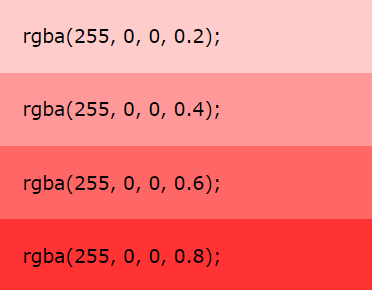
</p>

## 4.2. HSL Colors
- `HSL viết tắt của Hue (màu sắc), Saturation (độ bão hòa), Lightness (độ đậm nhạt).`
- Giá trị màu `HSL` được chỉ định với: `hsl(hue, saturation, lightness)`.
  - `Hue` là một mức độ trên vòng tròn màu (từ 0 - 360).
    - 0 (hoặc 360) là màu đỏ
    - 120: là màu xanh lá
    - 240: là màu xanh dương
  - `Saturation`: là một giá trị %
  - `Lightness` là một giá trị %: 0% là đen, 100% là trắng.

VD: cùng là màu đỏ với các giá trị độ đậm nhạt (`lightness`) khác nhau:
<p align = "center">
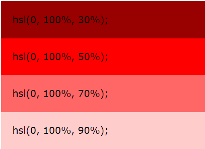
</p>

## 4.3. HSLA Colors
- Giá trị màu `HSLA` là một phần mở rộng của giá trị màu `HSL` với một giá trị alpha - để định nghĩa độ trong suốt của một màu.
- Một giá trị màu RGBA được định nghĩa với: `hsla(hue, saturation, lightness, alpha)`. Giá trị `alpha` là một số nằm trong khoảng 0.0 - 1.0. Giá trị càng nhỏ càng trong suốt (mờ)

VD: Cùng là màu đỏ nhưng với các giá trị độ đậm nhạt và alpha khác nhau
<p align = "center">
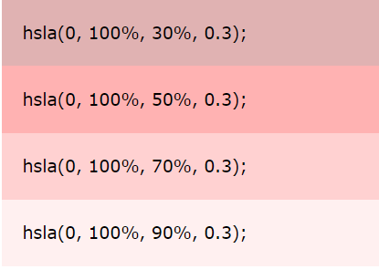
</p>

## 4.4. Opacity
- Thuộc tính `opacity` của CSS đặt độ mờ cho toàn bộ phần tử (cả màu nền và văn bản sẽ là màu đục/trong suốt).
- Giá trị thuộc tính `opacity` phải là một số trong khoảng từ 0.0 - 1.0. Giá trị càng nhỏ càng trong suốt (mờ).

  VD:
  ```css
  <style>
  #p1 {background-color:rgb(255,0,0);opacity:0.6;}
  #p2 {background-color:rgb(0,255,0);opacity:0.6;}
  #p3 {background-color:rgb(0,0,255);opacity:0.6;}
  #p4 {background-color:rgb(192,192,192);opacity:0.6;}
  #p5 {background-color:rgb(255,255,0);opacity:0.6;}
  #p6 {background-color:rgb(255,0,255);opacity:0.6;}
  </style>
  ```
<p align = "center">
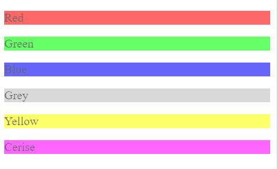
</p>

# 5. CSS Color Keywords

## 5.1. Từ khóa transparent
- Từ khóa `transparent` được sử dụng để làm cho màu trong suốt. Điều này thường được sử dụng để tạo màu nền trong suốt cho một phần tử.  
*Lưu ý:* Từ kháo `transparent` tương đương với giá trị `rgba(0,0,0,0)` tức nó sẽ có màu hoàn toàn trong suốt

  VD:
  ```html
  <style>
  body {
    background-image: url("paper.gif");
  }

  div.ex1 { 
    background-color: lightgreen;
    border: 2px solid black;
    padding: 15px;
  }

  div.ex2 { 
    background-color: transparent;
    border: 2px solid black;
    padding: 15px;
  } 
  </style>
  <div class="ex1">This div has a light green background.</div>
  <br>
  <div class="ex2">This div has a transparent background.</div>
  ```
<p align = "center">
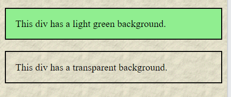
</p>

## 5.2. Từ khóa currentcolor
- Từ khóa `currentcolor` giống như một biến giữ giá trị hiện tại của thuộc tính `color` của một phần tử.
- Từ khóa này có thể có hữu ích nếu chúng ta muốn một màu đặc biệt được duy trì trong một phần tử hoặc một trang web.

  VD: 
  ```html
  <style>
  div {
    color: blue;
    border: 10px solid currentcolor;
    padding: 15px;  
  }
  </style>
  <p>The currentcolor keyword refers to the current value of the color property of an element.</p>

  <div>
  This div element has a blue text color and a blue border.
  </div>
  ```
  Vì giá trị màu hiện tại của thuộc tính `color` đang là màu xanh dương nên màu đường viền của thẻ `<div>` cũng là màu xanh dương.
<p align = "center">
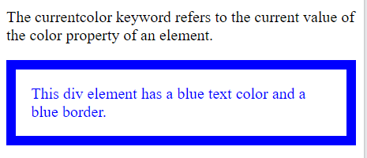
</p>

## 5.3. Từ khóa inherit
- Từ khóa `inherit` định nghĩa rằng một thuộc tính sẽ kế thừa giá trị của nó từ phần tử cha của nó
- Từ khóa `inherit` có thể được sử dụng cho bất kỳ thuộc tính CSS nào và trên bất kỳ phần từ HTML nào  
VD:
  ```html
  <style>
  div {
    border: 2px solid red;
  }

  span {
    border: inherit;
  }
  </style>

  <div>Here, the <span>span element's</span> border settings will be inherited from the parent element.</div>
  <br>
  <div style="border:2px dotted blue;">Here, the <span>span element's</span> border settings will also be inherited from the parent element.</div>
  ```

<p align = "center">
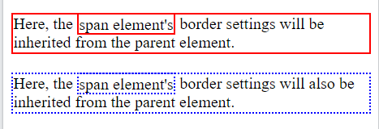
</p>

# 6. CSS Gradients
- CSS `gradient` cho phép chúng ta hiển thị các chuyển tiếp mượt mà giữa hai hoặc nhiều màu được chỉ định.
- CSS định nghĩa 3 loại của `gradients`:
  - `Linear Gradients`
  - `Radial Gradients`
  - `Conic Gradients`

## 6.1. CSS Linear Gradients

### 6.1.1. Cú pháp
- Sử dụng hàm `linear- gradient` để tạo ra đối tượng mày biến đổi liên tục từ màu này sang màu khác với các tham số khác nhau, chuyển đổi từ các hướng khác nhau
- Để tạo ra `linear gradient` chúng ta phải định nghĩa tối thiểu các điểm dừng màu. Điểm dừng màu là màu nằm giữa khoảng màu cần biến đổi liên tục. Chúng ta cũng cần thiết lập một điểm bắt đầu và hướng hoặc góc qua đó màu biến đổi.
- Cú pháp:
  ```css
  background-image: linear-gradient(angle/direction, color1, color2, ...)
  ```

 Trong đó:
 - `direction`: hướng đổ màu. `Linear-gradient` có 4 hướng như sau: 
    - `Từ trên xuống dưới (mặc định)`: **linear-gradient( color1, color2,..)**
    - `Từ dưới lên trên`: **linear-gradient(to top, color1, color2,..)**
    - `Từ trái qua phải`: **linear-gradient(to right, color1, color2,..)**
    - `Từ phải qua trái`: **linear-gradient(to left, color1, color2,..)**

  Ngoài ra cũng có thể xác định hướng bằng cách từ tầm nhìn về các góc (`đường chéo - Diagonal`): vd `từ top left sang bottom right: (linear-gradient(to bottom right, color1, color2,..))`
 - `angle`: có thể thay đổi các hướng đổ màu của gradient bằng cách định nghĩa một góc (angle):
    - `0deg`: tương đương với hướng từ dưới lên trên (`to top`)
    - `180deg`: tương đương với hướng từ trên xuống dưới (`to bottom`)
    - `90deg`: tương đương với hướng từ trái qua phải (`to right`)
    - -`90deg`: tương đương với hướng từ phải sang trái (`to left`)

- `color1, color2`,... là các giá trị màu như red, blue, green,...

VD:
```html
<style>
.ele {
    width: 300px;
    height: 100px;
    margin: 4px;
    color: #FFF;
    display: inline-block;
    text-align: center;
}

.gr-default {
    background-image: linear-gradient(red, blue); /* Hướng mặc định trên xuống dưới */
}
.g-to-right {
    background-image: linear-gradient(to right, red, blue); /* Hướng trái sang phải */
}
.gr-90deg {
    background-image: linear-gradient(-90deg, red, blue);  /* Hướng -90deg phải sang trái */
}
.gr-to-top {
    background-image: linear-gradient(to top, red, blue); /*Hướng lên */
}
.gr-to-top-right {
    background-image: linear-gradient(to top right, red, blue); /*Hướng lên góc trên bên phải */
}
</style>

<div class="ele gr-default">
    Đỏ -> Xanh: Hướng trên xuống
</div> 
<div class="ele g-to-right">
    Đỏ -> Xanh: Hướng trái sang phải
</div> 
<div class="ele gr-90deg">
    Đỏ -> Xanh: Hướng -90 độ (phải sang trái)
</div>  
<div class="ele gr-to-top">
    Đỏ -> Xanh: Hướng (to top)
</div>  
<div class="ele gr-to-top-right">
    Đỏ -> Xanh: hướng góc top right
</div>
```

<p align = "center">
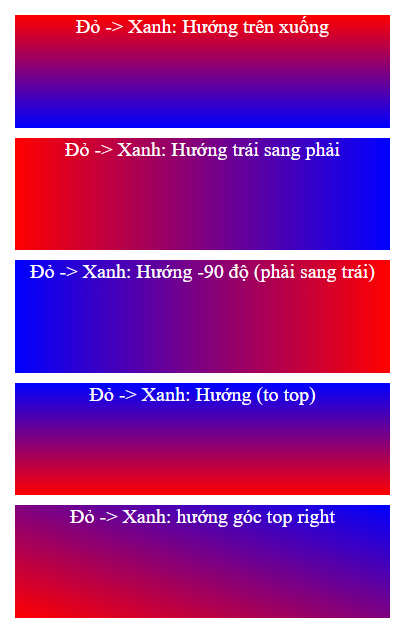
</p>

### 6.1.2. Sử dụng nhiều điểm dừng màu
VD:
  ```html
  <style>
  #grad1 {
    height: 100px;
    background-color: red; /* For browsers that do not support gradients */
    background-image: linear-gradient(to right, red, orange, yellow, green, blue, indigo, violet);
  }
  </style>
  <div id="grad1" style="text-align:center;margin:auto;color:#888888;font-size:40px;font-weight:bold">
  Rainbow Background
  </div>
  ```
<p align = "center">
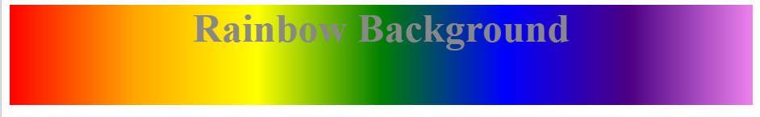
</p>

### 6.1.3. Sử dụng transparency
- CSS `gradients` cũng hỗ trợ độ trong suốt `transparency`, để tạo hiệu ứng làm mờ.
- Để thêm độ trong suốt, chúng ta sử dụng` rgba() để định nghĩa các điểm dừng màu`.

  VD:
  ```html
  <style>
  #grad1 {
    height: 100px;
    background-image: linear-gradient(to right, rgba(255,0,0,0), rgba(255,0,0,1));
  }
  </style>
  <div id="grad1"></div>
  ```
<p align = "center">
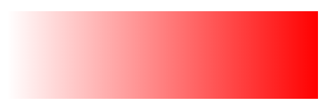
</p>

### 6.1.4. Lặp lại một linear-gradient
- Để lặp lại một `linear-gradient` sử dụng hàm `repeating-linear-gradient()`
- Cú pháp:
  ```css
  background-image: repeating-linear-gradient(direction, color1, color2,...)
  ```
  VD:
  ```html
  <style>
  div {
  margin-bottom: 30px;
  }
  #grad1 {
    height: 100px;
    background-color: red; /* For browsers that do not support gradients */
    background-image: repeating-linear-gradient(red, yellow 10%, green 20%);
  }

  #grad2 {
    height: 100px;
    background-color: red; /* For browsers that do not support gradients */
    background-image: repeating-linear-gradient(45deg,red,yellow 7%,green 10%);
  }
  </style>
  <p>Repeating gradient top to bottom </p>
  <div id="grad1"></div>
  <p>Repeating gradient 45deg (bottom left to top right) </p>
  <div id="grad2"></div>
  ````
<p align = "center">
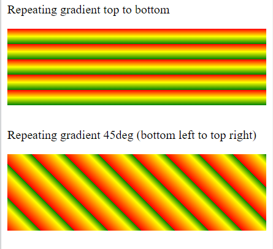
</p>

## 6.2. CSS Radial Gradients
### 6.2.1. Cú pháp
- `Radial Gradient` được định nghĩa bằng tâm của nó.
- Để tạo ra `Radial Gradient` cần định nghĩa `ít nhất` hai điểm dừng màu.
- Cú pháp:
  ```css
  background-image: radial-gradient(shape size at position, start-color, ..., last-color);
  ```
- Trong đó:
  - `shape`: nhận các giá trị như `ellipse` (mặc định), `circle`
  - `size`: nhận các giá trị như: `farthest-corner, closest-corner, farthest-side, closest-side`.
  - `position`: nhận các giá trị `top`, `bottom`, `center` (mặc định), `left`, `right`, hoặc nhận các giá trị cụ thể như `50% 50% là ở tâm, 0% 0% tương đương top left.`
  - `start-color,..., last-color`: là các điểm dừng màu

VD:
- `Shape ellipse` và `shape circle`

  ```html
  <style>
  #grad1 {
    height: 150px;
    width: 200px;
    background-color: red; /* For browsers that do not support gradients */
    background-image: radial-gradient(red, yellow, green);
  }

  #grad2 {
    height: 150px;
    width: 200px;
    background-color: red; /* For browsers that do not support gradients */
    background-image: radial-gradient(circle, red, yellow, green);
  }
  </style>
  <h1>Radial Gradient - Shapes</h1>

  <h2>Ellipse (this is default):</h2>
  <div id="grad1"></div>

  <h2><strong>Circle:</strong></h2>
  <div id="grad2"></div>
  ```
<p align = "center">
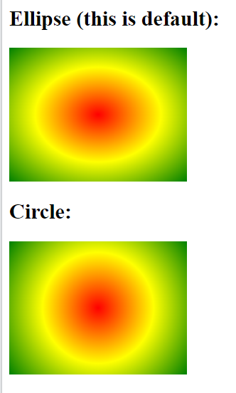
</p>

- Các giá trị của từ khóa `Sizes`:

  ```html
  <style>
  .div1 {
  float: left;
  margin: 15px;
  }
  #grad1 {
    height: 150px;
    width: 150px;
    background-color: red; /* For browsers that do not support gradients */
    background-image: radial-gradient(closest-side at 60% 55%, red, yellow, black);
  }

  #grad2 {
    height: 150px;
    width: 150px;
    background-color: red; /* For browsers that do not support gradients */
    background-image: radial-gradient(farthest-side at 60% 55%, red, yellow, black);
  }

  #grad3 {
    height: 150px;
    width: 150px;
    background-color: red; /* For browsers that do not support gradients */
    background-image: radial-gradient(closest-corner at 60% 55%, red, yellow, black);
  }

  #grad4 {
    height: 150px;
    width: 150px;
    background-color: red; /* For browsers that do not support gradients */
    background-image: radial-gradient(farthest-corner at 60% 55%, red, yellow, black);
  }
  </style>
  <h1>Radial Gradients - Different size keywords</h1>

  <div class="div1">
    <h2>closest-side:</h2>
    <div id="grad1"></div>
  </div>
  <div class="div1">
    <h2>farthest-side:</h2>
    <div id="grad2"></div>
  </div>
  <div class="div1">
    <h2>closest-corner:</h2>
    <div id="grad3"></div>
  </div>
  <div class="div1">
    <h2>farthest-corner (default):</h2>
    <div id="grad4"></div>
  </div>
  ```
<p align = "center">
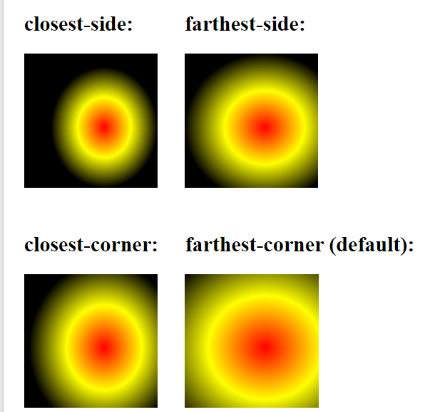


### 6.2.2. Repeating a radial-gradient
- Sử dụng hàm `repeating-radial-gradient()` để lặp lại một `radial gradients`

  VD:
  ```html
  <style>
  #grad1 {
    height: 150px;
    width: 200px;
    background-color: red; /* For browsers that do not support gradients */
    background-image: repeating-radial-gradient(red, yellow 10%, green 15%);
  }
  </style>
  <h1>Repeating Radial Gradient</h1>

  <div id="grad1"></div>
  ```
<p align = "center">
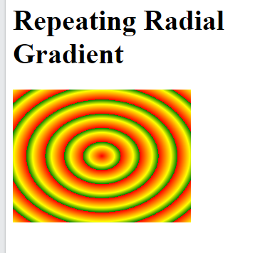

## 6.3. CSS Conic Gradients
### 6.3.1. Cú pháp
- Một `Gradient conic` là một `gradient` với các chuyển đổi màu được quay xung quanh một điểm trung tâm. Để tạo một `gradient conic`, phải xác định `ít nhất` hai màu.
- Cú pháp:
  ```css
  background-image: conic-gradient([from angle] [at position,] color [degree], color [degree], ...);
  ```
- Mặc định, `angle là 0deg` và `position là center`.
- Nếu `degree` không được xác định, thì các màu sẽ được trải đều xung quanh điểm chính giữa.

VD:
- Một `conic gradient` với các điểm màu:
  ```html
  <style>
  #grad1 {
    height: 200px;
    width: 200px;
    background-color: red; /* For browsers that do not support gradients */
    background-image: conic-gradient(red, yellow, green);
  }
  </style>
  <h1>Conic Gradient - Three Colors</h1>
  <div id="grad1"></div>
  ```
<p align = "center">
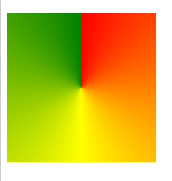

- Một `conic gradient` với các điểm màu và một mức độ cho mỗi màu:
  ```html
  <style>
  #grad1 {
    height: 200px;
    width: 200px;
    background-color: red; /* For browsers that do not support gradients */
    background-image: conic-gradient(red 45deg, yellow 90deg, green 210deg);
  }
  </style>
  <h1>Conic Gradient - Three Colors</h1>
  <div id="grad1"></div>
  ```
<p align = "center">
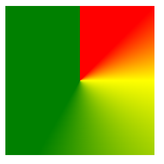

### 6.3.2. Tạo một biểu đồ tròn
- Thêm thuộc tính `border-radius: 50%;` để tạo một `conic gradient` giống như một hình tròn.

  VD:
  ```html
  <style>
  #grad1 {
    height: 200px;
    width: 200px;
    background-color: red; /* For browsers that do not support gradients */
    background-image: conic-gradient(red, yellow, green, blue, black);
    border-radius: 50%;
  }
  </style>
  <h1>Conic Gradient - Pie Chart</h1>
  <div id="grad1"></div>
  ```
<p align = "center">
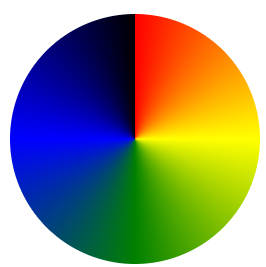
</p>

### 6.3.3. Conic gradient với [from angle]
- `[From angle]` chỉ định một góc mà toàn bộ `gradient conic` sẽ được xoay.

  VD:
  ```html
  <style>
  #grad {
    height: 150px;
    width: 150px;
    background-color: red; /* For browsers that do not support gradients */
    background-image: conic-gradient(red, yellow, green);
    border-radius: 50%;
  }
  #grad1 {
    height: 150px;
    width: 150px;
    background-color: red; /* For browsers that do not support gradients */
    background-image: conic-gradient(from 90deg, red, yellow, green);
    border-radius: 50%;
  }
  </style>
  <h2>Conic Gradient - With a from angle default (0deg)</h2>
  <div id="grad"></div>
  <h2>Conic Gradient - With a from angle</h2>
  <div id="grad1"></div>
  ```
<p align = "center">
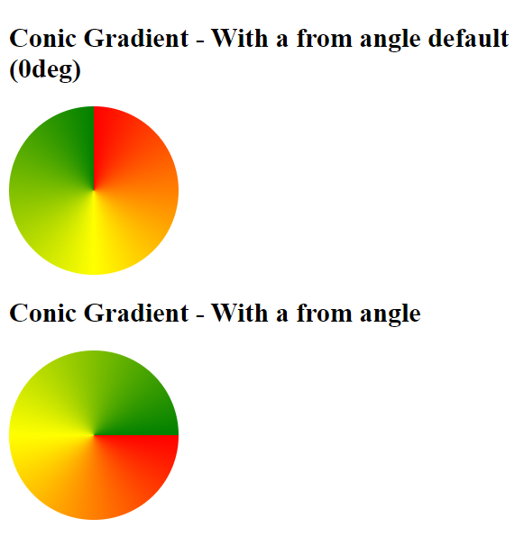
</p>

### 6.3.4. Conic Gradient với vị trí trung tâm được chỉ định 
- `[At position]` chỉ định tâm của `gradient conic`.

  VD:
  ```html
  <style>
  #grad {
    height: 150px;
    width: 150px;
    background-color: red; /* For browsers that do not support gradients */
    background-image: conic-gradient(red, yellow, green);
    border-radius: 50%;
  }
  #grad1 {
    height: 150px;
    width: 150px;
    background-color: red; /* For browsers that do not support gradients */
    background-image: conic-gradient(at 60% 45%, red, yellow, green);
    border-radius: 50%;
  }
  </style>
  <h2>Conic Gradient - With a position default (center 50% 50%) </h2>
  <div id="grad"></div>
  <h2>Conic Gradient - With a specified center position</h2>
  <div id="grad1"></div>
  ```
<p align = "center">
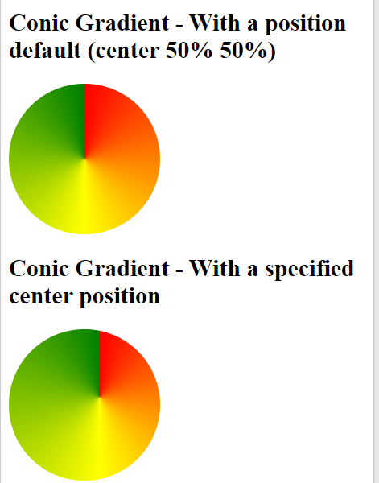
</p>

### 6.3.5. Reppeating a Gradient Conic 
- Hàm `repeat-conic-gradient()` được sử dụng để lặp lại các `conic gradient`:  
VD:
  ```html
  <style>
  #grad1 {
    height: 200px;
    width: 200px;
    background-color: red; /* For browsers that do not support gradients */
    background-image: repeating-conic-gradient(red 10%, yellow 20%);
    border-radius: 50%;
  }
  </style>
  <h1>Repeating a Conic Gradient</h1>

  <div id="grad1"></div>
  ```
<p align = "center">
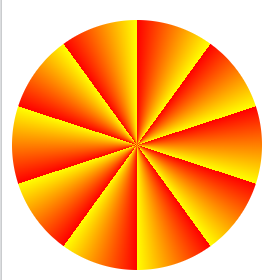
</p>

# 7. CSS Shadow Effects
- Với CSS chúng ta có thể thêm phần đổ bóng cho văn bản và cho những phần tử
## 7.1. CSS Text Shadow
### 7.1.1. Cú pháp
 - Thuộc tính `text-shadow` được sử dụng để áp dụng đổ bóng cho văn bản
 - Cú pháp:
  ```css
  selector {
    text-shadow: h-offset v-offset blur color; 
      }
  ```
  - Trong đó:
      - `h-offset`: dịch chuyển đổ bóng theo chiều ngang, thiết lập bằng 1 giá trị cụ thể có đơn vị là `px`, `em`
      - `v-offset`: dịch chuyển đổ bóng theo chiều dọc, thiết lập bằng 1 giá trị cụ thể có đơn vị là `px`, `em`
      - `blur`: tạo độ mờ, thiết lập bằng 1 giá trị cụ thể có đơn vị là `px`, `em`
      - `color`: màu sắc cho bóng

    VD:
    <p align = "center">
    
    </p>

### 7.1.2. Multiple Shadows
- Để thêm nhiều phần đổ bóng cho văn bản, có thể thêm danh sách các bóng được phân tách bằng dấu phẩy.

  VD:
  ```html
  <style>
  h1 {
    text-shadow: 0 0 3px #FF0000, 0 0 5px #0000FF;
  }
  </style>
  <h1>Text-shadow with red and blue neon glow!</h1>
  ```
<p align = "center">
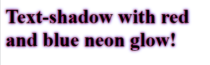
</p>

### 7.1.3. Border around text
- Thuộc tính `text-shadow` cũng có thể sử dụng để tạo một đường viền xung quanh các ký tự trong văn bản (không có bóng).

  VD:
  ```html
  <style>
  h1 {
    color: coral;
    text-shadow: -1px 0 black, 0 1px black, 1px 0 black, 0 -1px black;
  }
  </style>
  <h1>Border around text!</h1>
  ```
<p align = "center">
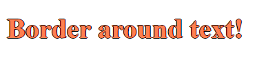
</p>

## 7.2. Box shadow
- Thuộc tính `box-shadow` được sử dụng để áp dụng một hoặc nhiều phần đổ bóng cho một phần tử.
### 7.2.1. Cú pháp:

  ```css
  selector {
    box-shadow: h-offset v-offset blur spread-radius color inset; 
      }
  ```
  - Trong đó:
      - `h-offset`: dịch chuyển đổ bóng theo chiều ngang, thiết lập bằng 1 giá trị cụ thể có đơn vị là `px`, `em`
      - `v-offset`: dịch chuyển đổ bóng theo chiều dọc, thiết lập bằng 1 giá trị cụ thể có đơn vị là `px`, `em`
      - `blur`: tạo độ mờ, thiết lập bằng 1 giá trị cụ thể có đơn vị là `px`, `em`
      - `spread-radius`: bán kính mở rộng
      - `color`: màu sắc cho bóng
      - `inset`: bóng sẽ đổ bên trong box

    VD:
    ```html
    <style> 
    div {
      width: 300px;
      height: 100px;
      padding: 15px;
      background-color: coral;
      box-shadow: 10px 10px 5px lightblue;
    }
    </style>
    <h1>The box-shadow Property</h1>
    <div>A div element with a 5px blurred, lightblue box-shadow.</div>
    ```
<p align = "center">
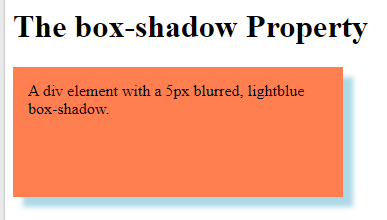
</p>

### 7.2.2. Thiết lập bán kính mở rộng của bóng đổ
- Thêm tham số `spread` vào thuộc tính `box-shadow` định nghĩa bán kính mở rộng cho bóng đổ. Một giá trị dương sẽ làm tăng kích thước của phần bóng, giá trị âm sẽ làm giảm kích thước của bóng.
VD:
  ```html
  <style> 
  div {
    width: 300px;
    height: 100px;
    padding: 15px;
    background-color: coral;
    box-shadow: 10px 10px 5px 12px lightblue;
  }
  </style>

  <div>A div element with a blurred, lightblue box-shadow, with a spread radius of 12px.</div>
  ```
<p align = "center">
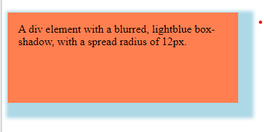
</p>

### 7.2.3. Thiết lập tham số inset
- Để phần bóng đổ vào bên trong sử dụng thêm tham số `inset`
  ```html
  <style> 
  div {
    width: 300px;
    height: 100px;
    padding: 15px;
    background-color: coral;
    box-shadow: 10px 10px 5px lightblue inset;
  }
  </style>
  <div>A div element with a blurred, lightblue, inset box-shadow.</div>
  ```
<p align = "center">
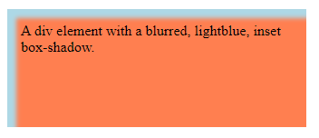
</p>

### 7.2.4. Thêm nhiều phần đổ bóng
- Một phần tử có thể có nhiều phần đổ bóng, các phần khai báo bóng được cách nhau bởi dấu phẩy.
  VD:
  ```html
  <style> 
  #example1 {
    width: 300px;
    border: 1px solid;
    padding: 10px;
    box-shadow: 5px 5px blue, 10px 10px red, 15px 15px green;
    margin: 20px;
  }

  </style>
  <div id="example1">
    <h2>Multiple shadows</h2>
    <p>box-shadow: 5px 5px blue, 10px 10px red, 15px 15px green:</p>
  </div>
  ```
<p align = "center">
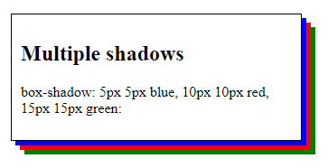
</p>

## 7.3. Cards
- Chúng ta cũng có thể sử dụng thuộc tính `box-shadow` để tạo các thẻ card

  VD:
  ```html
  <style>
  div.card {
    width: 250px;
    box-shadow: 0 4px 8px 0 rgba(0, 0, 0, 0.2), 0 6px 20px 0 rgba(0, 0, 0, 0.19);
    text-align: center;
  }

  div.header {
    background-color: #4CAF50;
    color: white;
    padding: 10px;
    font-size: 40px;
  }

  div.container {
    padding: 10px;
  }
  </style>
  <div class="card">
    <div class="header">
      <h1>1</h1>
    </div>

    <div class="container">
      <p>January 1, 2021</p>
    </div>
  </div>
  ```
<p align = "center">
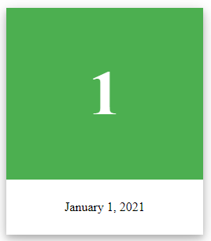
</p>

# 8. CSS Text Effects
## 8.1. CSS Text Overflow
- Thuộc tính `text-overflow` được sử dụng để chỉ định cách mà một nội dung khi bị tràn ra mà không được hiển thị trên trình duyệt nó sẽ có dấu hiệu như thế nào để người dùng biết.
- Nó có thể được cắt bớt (clip) hoặc được thay bằng dấu chấm lửng (ellipsis `...`)

  VD:
  ```html
  <style> 
  p.test1 {
    white-space: nowrap; 
    width: 200px; 
    border: 1px solid #000000;
    overflow: hidden;
    text-overflow: clip;
  }

  p.test2 {
    white-space: nowrap; 
    width: 200px; 
    border: 1px solid #000000;
    overflow: hidden;
    text-overflow: ellipsis;
  }
  </style>
  <h2>text-overflow: clip:</h2>
  <p class="test1">This is some long text that will not fit in the box</p>

  <h2>text-overflow: ellipsis:</h2>
  <p class="test2">This is some long text that will not fit in the box</p>
  ```
<p align = "center">
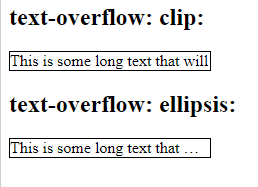
</p>

## 8.2. CSS Word Wrapping
- Thuộc tính `word-wrap: break-word;` cho phép những từ dài có thể được tách ra và ngắt xuống
một dòng mới.  
VD:
  ```html
  <style> 
  p.test {
    width: 11em; 
    border: 1px solid #000000;
  }
  p.test1 {
    width: 11em; 
    border: 1px solid red;
    word-wrap: break-word;
  }
  </style>
  </head>
  <body>

  <h1>There is no word-wrap Property</h1>
  <p class="test">This paragraph contains a very long word: thisisaveryveryveryveryveryverylongword. The long word will break and wrap to the next line.</p>

  <h1>The word-wrap Property</h1>
  <p class="test1">This paragraph contains a very long word: thisisaveryveryveryveryveryverylongword. The long word will break and wrap to the next line.</p>
  ```
<p align = "center">
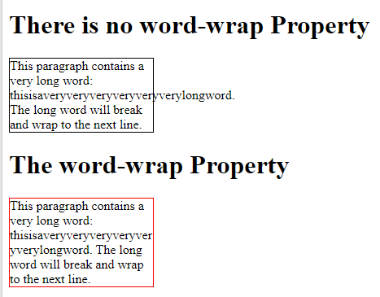
</p>

## 8.3. CSS Word Breaking
- Thuộc tính `word-break` định nghĩa những nguyên tắc xuống dòng.
  - `word-break: keep-all;` định nghĩa ngắt dòng ở dấu gạch nối (`-`)
  - `word-break: break-all;` định nghĩa ngắt dòng ở bất kỳ ký tự nào

  VD:
  ```html
  <style> 
  p.test1 {
    width: 140px; 
    border: 1px solid #000000;
    word-break: keep-all;
  }

  p.test2 {
    width: 140px; 
    border: 1px solid #000000;
    word-break: break-all;
  }
  </style>
  <h2>word-break: keep-all</h2>
  <p class="test1">This paragraph contains some text. This line will-break-at-hyphens.</p>
  <h2>word-break: break-all</h2>
  <p class="test2">This paragraph contains some text. The lines will break at any character.</p>
  ```
<p align = "center">
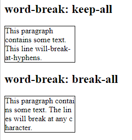
</p>

## 8.4. CSS Writing Mode
- Thuộc tính `writing-mode` chỉ định những dòng văn bản được đặt bố cục theo chiều ngang hay chiều dọc.
  - `writing-mode: horizontal-tb;`bố cục dòng văn bản theo chiều ngang
  - `writing-mode: vertical-rl;` bố cục dòng văn bản theo chiều dọc

  VD:
  ```html
  <style> 
  p.test1 {
    writing-mode: horizontal-tb; 
  }

  span.test2 {
    writing-mode: vertical-rl; 
  }

  </style>
  <p class="test1">Some text with default writing-mode.</p>

  <p>Some text with a span element with a <span class="test2">vertical-rl</span> writing-mode.</p>
  ```
<p align = "center">
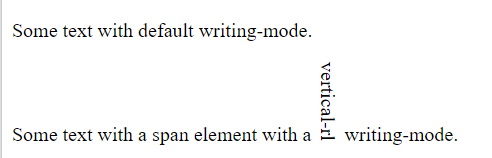
</p>

# 9. CSS Web Fonts
## 9.1. CSS @font-face Rule
- Các phông chữ web cho phép những người thiết kế trang web sử dụng các phông chữ mà không được cài đặt trên máy tính của người dùng.
- Khi chúng ta đã tìm được phông chữ mà chúng ta muốn sử dụng, chỉ cần đưa tệp tin phông chữ vào máy chủ web của mình và nó sẽ tự động được tải xuống khi người dùng cần sử dụng.
- Các phông chữ của riêng bạn được xác định trong quy tắc CSS `@font-face`

## 9.2. Các định dạng phông chữ khác nhau
- `TrueType Fonts (TTF)`: đây là một phông chữ tiêu chuẩn được phát triển vào cuối những năm 1980 bởi Apple và Microsoft. TrueType là định dạng phông chữ phổ biến nhất cho cả hệ điều hành MacOs và Microsoft Windows.
- `OpenType Fonts (OTF)`: OpenType là một định dạng cho các phông chữ máy tính có thể mở rộng. Nó được xây dựng trên TrueType và là thương hiệu đã đăng ký của Microsoft. Ngày nay phông chữ OpenType được sử dụng phổ biến trên các nền tảng máy tính lớn.
- `Web Open Font Format (WOFF)`: WOFF là một định dạng phông chữ để sử dụng trong các trang web. Nó được phát triển vào năm 2009 và hiện là một Khuyến nghị của W3C. WOFF về cơ bản là OpenType hoặc TrueType với tính năng nén và siêu dữ liệu bổ sung. Mục tiêu là hỗ trợ phân phối phông chữ từ máy chủ đến máy khách qua mạng có hạn chế về băng thông.
- `SVG Fonts/Shape`: Phông chữ SVG cho phép SVG được sử dụng làm glyphs khi hiển thị văn bản. Đặc tả SVG 1.1 xác định mô-đun phông chữ cho phép tạo phông chữ trong tài liệu SVG. Chúng ta cũng có thể áp dụng CSS cho tài liệu SVG và quy tắc `@font-face` có thể được áp dụng cho văn bản trong tài liệu SVG.
- `Embedded OpenType Fonts (EOT)`: Phông chữ EOT là một dạng phông chữ OpenType nhỏ gọn được Microsoft thiết kế để sử dụng làm phông chữ nhúng trên các trang web.

## 9.3. Cách sử dụng phông chữ mà chúng ta muốn
- Theo quy tắc `@font-face`, đầu tiên định nghĩa một tên cho phông chữ và sau đó trỏ tới tệp tin phông chữ.

  *Lưu ý*: luôn sử dụng ký tự viết thường cho địa chỉ url của phông chữ.
- Để sử dụng phông chữ cho một phần tử HTML, tham chiếu tên của phông chữ thông qua thuộc tính `font-family`

  VD:
  ```html
  <style> 
  @font-face {
    font-family: myFirstFont;
    src: url(sansation_light.woff);
  }
  * {
    font-family: myFirstFont;
  }
  </style>
  <h1>The @font-face Rule</h1>
  <div>
  With CSS, websites can use fonts other than the pre-selected "web-safe" fonts.
  </div>
  ```
<p align = "center">
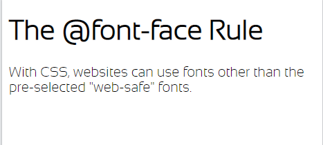
</p>

# 10. CSS 2D Transforms
- Các phép biến đổi CSS cho phép chúng ta di chuyển, xoay, chia tỷ lệ và làm nghiêng các phần tử.

## 10.1. Các phương thức biến đổi của CSS 2D
### 10.1.1. Phương thức translate()
- Phương thức `translate()` di chuyển một phần tử ra khỏi vị trí ban đầu của nó (dựa theo các tham số được cho bởi trục X và Y)
- Cú pháp:
  ```css
  selector {
    transform: translate(X, Y); 
  }
  ```
  VD: di chuyển phần tử `<div>` sang phải 50px, xuống dưới 100px

  ```html
  <style> 
  div {
    width: 300px;
    height: 100px;
    background-color: yellow;
    border: 1px solid black;
    transform: translate(50px,100px);
  }
  </style>
  <p>The translate() method moves an element from its current position:</p>
  <div>
  This div element is moved 50 pixels to the right, and 100 pixels down from its current position.
  </div>
  ```
<p align = "center">
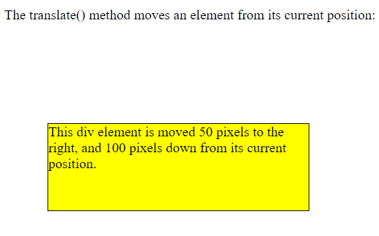
</p>

### 10.1.2. Phương thức rotate()
- Phương thức `rotate()` quay một phần tử theo chiều kim đồng hồ hoặc ngược chiều kim đồng hồ theo một góc độ nhất định.
- Sử dụng một góc với giá trị dương để xoay phần tử theo chiều kim đồng hồ, giá trị âm để xoay chiều ngược kim đồng hồ.

  VD:
  ```html
  <style>
  div {
    width: 300px;
    height: 100px;
    background-color: yellow;
    border: 1px solid black;
  }

  div#myDiv {
    transform: rotate(20deg);
  }
  </style>

  <div>
  This a normal div element.
  </div>

  <div id="myDiv">
  This div element is rotated clockwise 20 degrees.
  </div>
  ```
<p align = "center">
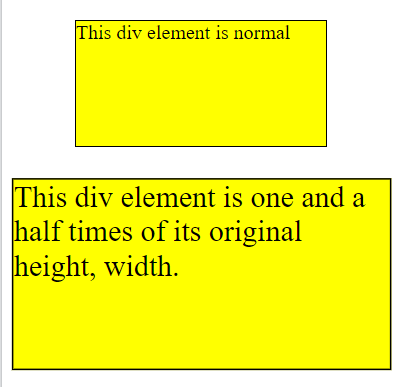
</p>

### 10.1.2. Phương thức scale()
- Phương thức `scale()`dùng để tăng hoặc giảm kích thước của một phần tử (theo tham số của chiều rộng và chiều cao)

  ```html
  <style>
  div {
    margin: 50px;
    width: 200px;
    height: 100px;
    background-color: yellow;
    border: 1px solid black;
  }
  .c1 {
    transform: scale(1.5, 1.5);
  }
  </style>
  <div >
  This div element is normal
  </div>
  <div class="c1">
  This div element is half of its original height.
  </div>
  ```
<p align = "center">

</p>

### 10.1.3. Phương thức scaleX()
- Phương thức `scaleX()` tăng hoặc giảm chiều rộng của một phần tử. 
  ```html
    <style>
    div {
      margin: 50px;
      width: 200px;
      height: 100px;
      background-color: yellow;
      border: 1px solid black;
    }
    .c1 {
      transform: scaleX(0.5);
    }
    </style>
    <div >
    This div element is normal
    </div>
    <div class="c1">
    This div element is half of its original width.
    </div>
    ```
<p align = "center">
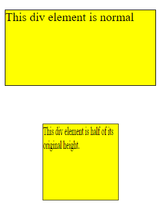
</p>

### 10.1.4. Phương thức scaleY()
- Phương thức `scaleY()` tăng hoặc giảm chiều cao của một phần tử. 
  ```html
  <style>
  div {
    margin: 50px;
    width: 200px;
    height: 100px;
    background-color: yellow;
    border: 1px solid black;
  }
  .c1 {
    transform: scaleY(0.5);
  }
  </style>
  <div >
  This div element is normal
  </div>
  <div class="c1">
  This div element is half of its original height.
  </div>
  ```
<p align = "center">
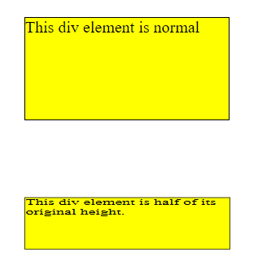
</p>

### 10.1.5. Phương thức skewX()
- Phương thức `skewX()` nghiêng một phần tử dọc theo trục X một góc cho trước
  ```html
  <style>
  div {
    width: 300px;
    height: 100px;
    background-color: yellow;
    border: 1px solid black;
  }

  div#myDiv {
    transform: skewX(20deg);
  }
  </style>
  <div>
  This a normal div element.
  </div>

  <div id="myDiv">
  This div element is skewed 20 degrees along the X-axis.
  </div>
  ```
<p align = "center">
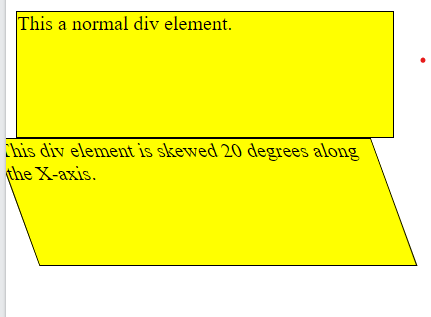
</p>

### 10.1.6. Phương thức skewY()
- Phương thức `skewY()` nghiêng một phần tử dọc theo trục Y một góc cho trước.

  ```html
  <style>
  div {
    width: 300px;
    height: 100px;
    background-color: yellow;
    border: 1px solid black;
  }

  div#myDiv {
    transform: skewY(20deg);
  }
  </style>
  <div>
  This a normal div element.
  </div>

  <div id="myDiv">
  This div element is skewed 20 degrees along the Y-axis.
  </div>
  ```
<p align = "center">
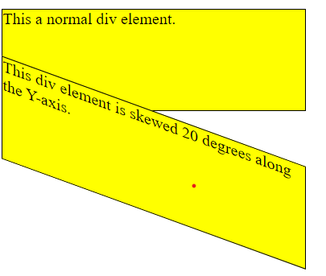
</p>


### 10.1.7. Phương thức skew()
- Phương thức `skew()` nghiêng một phần tử dọc theo trục X và trục Y một góc cho trước

  ```html
  <style>
  div {
    width: 300px;
    height: 100px;
    background-color: yellow;
    border: 1px solid black;
  }

  div#myDiv {
    transform: skew(20deg, 10deg);
  }
  </style>
  <div>
  This a normal div element.
  </div>

  <div id="myDiv">
  This div element is skewed 20 degrees along the X-axis, 10 degrees along the Y-axis..
  </div>
  ```
<p align = "center">
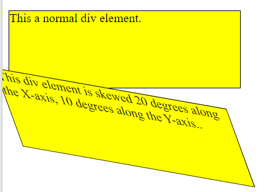
</p>

### 10.1.5. Phương thức matrix()
- Phương thức `matrix()` kết hợp tất cả các phương thức chuyển đổi 2D thành một.
- Cú pháp:
  ```css
    transform: matrix(scaleX(), skewY(), skewX(), scaleY(), translateX(), translateY())
  ```
  VD:
  ```html
  <style>
  div {
    width: 300px;
    height: 100px;
    background-color: yellow;
    border: 1px solid black;
  }

  div#myDiv1 {
    transform: matrix(1, -0.3, 0, 1, 0, 0);
  }

  div#myDiv2 {
    transform: matrix(1, 0, 0.5, 1, 150, 0);
  }
  </style>ds into one.</p>

  <div>
  This a normal div element.
  </div>

  <div id="myDiv1">
  Using the matrix() method.
  </div>

  <div id="myDiv2">
  Another use of the matrix() method.
  </div>
  ```
<p align = "center">
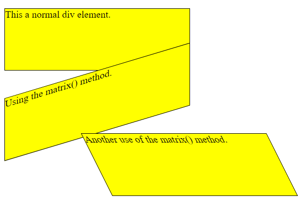
</p>

# 11. CSS 3D Transforms
- Sử dụng thuộc tính `transform` để sử dụng các phương thức chuyển đổi 3D
## 11.1. Các phương thức chuyển đổi 3D CSS
### 11.1.1. Phương thức rotateX()
- Phương thức `rotateX()` xoay một phần tử quanh trục X ở 1 góc độ nhất định.

  VD
  ```html
  <style>
  div {
    width: 300px;
    height: 100px;
    background-color: yellow;
    border: 1px solid black;
  }

  #myDiv {
    transform: rotateX(120deg);
  }
  </style>
  <div>
  This a normal div element.
  </div>

  <div id="myDiv">
  This div element is rotated 120 degrees.
  </div>
  ```
<p align = "center">
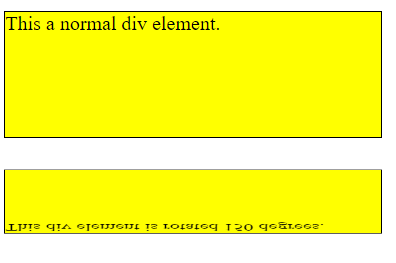
</p>

### 11.1.2. Phương thức rotateY()
- Phương thức `rotateY()` xoay một phần tử quanh trục Y ở 1 góc độ nhất định.

  VD
  ```html
  <style>
  div {
    width: 300px;
    height: 100px;
    background-color: yellow;
    border: 1px solid black;
  }

  #myDiv {
    transform: rotateY(150deg);
  }
  </style>
  <div>
  This a normal div element.
  </div>

  <div id="myDiv">
  This div element is rotated 150 degrees.
  </div>
  ```
<p align = "center">
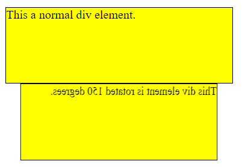
</p>

### 11.1.3. Phương thức rotateZ()
- Phương thức `rotateZ()` xoay một phần tử quanh trục Z ở 1 góc độ nhất định.

  VD
  ```html
  <style>
  div {
    width: 300px;
    height: 100px;
    background-color: yellow;
    border: 1px solid black;
  }

  #myDiv {
    transform: rotateZ(150deg);
  }
  </style>
  <div>
  This a normal div element.
  </div>

  <div id="myDiv">
  This div element is rotated 150 degrees.
  </div>
  ```
<p align = "center">
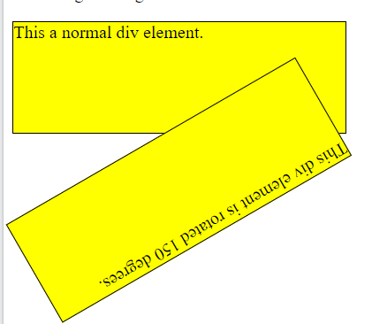
</p>

# 12. CSS Transitions
## 12.1. Đặc điểm
- Chuyển đổi CSS (`transition`) cho phép chúng ta thay đổi các giá trị thuộc tính một cách suôn sẻ, trong một khoảng thời gian nhất định
## 12.2. Các sử dụng CSS transition
- Để tạo một hiệu ứng chuyển đổi, chúng ta phải định nghĩa 2 điều:
  - Thuộc tính CSS muốn thêm một hiệu ứng.
  - Thời gian của hiệu ứng

  ```css
  selector {
    transition: property duration;
  }
- Nếu như chúng ta không khai báo thành phần thời gian (`duration`) thì sẽ không có hiệu ứng, bởi vì giá trị mặc định của nó là `0s` 

  VD:
  ```html
  <style> 
  div {
    width: 100px;
    height: 100px;
    background: red;
    transition: width 2s;
  }

  div:hover {
    width: 300px; /*Khi di chuột vào thì có hiệu ứng tăng kích thước phần tử div */
  }
  </style>
  <div></div>
  ```
## 12.3. Thay đổi 1 số giá trị thuộc tính
- VD: Thêm hiệu ứng cho cả thuộc tính `width` và `height` với thời gian xảy ra hiệu ứng chuyển đổi là `2s` cho `width`, thời gian xảy ra hiệu ứng chuyển đổi là `4s` cho `height`

  ```html
  <style> 
  div {
    width: 100px;
    height: 100px;
    background: red;
    transition: width 2s, height 4s;
  }

  div:hover {
    width: 300px;
    height: 300px;
  }
  </style>

  <div></div>
  ```

## 12.4. Định nghĩa đường cong tốc độ của sự chuyển đổi
- Thuộc tính `transition-timing-function` xác định đường cong tốc độ của hiệu ứng chuyển tiếp.
- Thuộc tính `transition-timing-function` có các giá trị sau:
  - `ease`: định nghĩa một hiệu ứng chuyển đổi với lúc bắt đầu chậm, sau đó nhanh và kết thúc lại chậm (đây là giá trị mặc định).
  - `linear`: định nghĩa một hiệu ứng chuyển đổi với tốc độ như nhau từ lúc bắt đầu đến khi kết thúc.
  - `ease-in`: định nghĩa một hiệu ứng chuyển đổi với bắt đầu chậm
  - `ease-out`: định nghĩa một hiệu ứng chuyển đổi với kết thúc chậm
  - `ease-in-out`: định nghĩa một hiệu ứng chuyển đổi với bắt đầu và kết thúc chậm
  - `cubic-bezier(n,n,n,n)`: cho phép bạn tự định nghĩa những giá trị của riêng mình trong 1 hàm `cubic-bezier`

  VD:

  ```html
  <style> 
  div {
    width: 100px;
    height: 100px;
    background: red;
    transition: width 2s;
  }

  #div1 {transition-timing-function: linear;}
  #div2 {transition-timing-function: ease;}
  #div3 {transition-timing-function: ease-in;}
  #div4 {transition-timing-function: ease-out;}
  #div5 {transition-timing-function: ease-in-out;}

  div:hover {
    width: 300px;
  }
  </style>
  <div id="div1">linear</div><br>
  <div id="div2">ease</div><br>
  <div id="div3">ease-in</div><br>
  <div id="div4">ease-out</div><br>
  <div id="div5">ease-in-out</div><br>
  ```
## 12.5. Độ trễ hiệu ứng chuyển tiếp
- Sử dụng thuộc tính `transition-delay` định nghĩa 1 độ trễ (bằng giây) cho hiệu ứng chuyển tiếp.

  VD:
  ```html
  <style> 
  div {
    width: 100px;
    height: 100px;
    background: red;
    transition: width 3s;
    transition-delay: 1s; /*dừng 1s trước khi hiệu ứng bắt đầu*/
  }

  div:hover {
    width: 300px;
  }
  </style>
  <div></div>
  ```

## 12.6. Transition + Transformation

  VD:
  ```html
  <style> 
  div {
    width: 100px;
    height: 100px;
    background: red;
    transition: width 2s, height 2s, transform 2s;
  }

  div:hover {
    width: 300px;
    height: 300px;
    transform: rotate(180deg);
  }
  </style>
  <div></div>
  ```
## 12.7. Một vài ví dụ
- Những thuộc tính của `transition` có thể được định nghĩa lần lượt từng bước một, vd:

  ```css
  div {
    transition-property: width;
    transition-duration: 2s;
    transition-timing-function: linear;
    transition-delay: 1s;
  }
  ```
- Hoặc sử dụng thuộc tính viết gọn của `transition`:

  ```css
  div {
    transition: width 2s linear 1s;
  }
  ```

# 13. CSS Animations
- CSS cho phép hoạt ảnh của những phần tử HTML mà không sử dụng JavaScript hoặc Flash
## 13.1. Định nghĩa
- Một hoạt ảnh là để cho một phần tử thay đổi dần dần từ một kiểu này sang một kiểu khác.
- Chúng ta có thể thay đổi bao nhiêu thuộc tính CSS, thay đổi bao nhiêu lần mà chúng ta muốn.
- Để sử dụng `CSS animation`, đầu tiên phải định nghĩa một số `keyframes` cho hoạt ảnh.
- Các keyframe giữ các kiểu mà phần tử sẽ có vào những thời điểm nhất định.
## 13.2. Nguyên tắc @keyframes
- Khi định kiểu CSS vào bên trong nguyên tắc `@keyframes`, hoạt ảnh sẽ thay đổi dần dần từ kiểu style hiện tại sang một kiểu mới vào những thời điểm nhất định.
- Cú pháp:
  ```css
  @keyframes nameAnimation {
    from {current style}
    to {new style}
  }
  ```
- Để cho một hoạt ảnh hoạt động, chúng ta phải liên kết hoạt ảnh với một phần tử.

  ```css
  selector {
    animation-name: nameAnimation;
    animation-duration: duration;
  }
  ```
*Lưu ý:* Thuộc tính `animation-duration` định nghĩa một hoạt ảnh sẽ mất thời gian bao lâu để hoàn thiện. `Nếu như thuộc tính này không được khai báo thì sẽ không có hoạt ảnh xảy ra, vì giá trị mặc định của nó là 0s` 

  VD: Hoạt ảnh kéo dài trong 4s, và chuyển màu nền của thẻ `<div>` từ màu đỏ sang màu vàng. Sau khi hoạt ảnh kết thúc, màu nền của thẻ `<div>` trở về màu đỏ
  ```html
    <style>
  /* The animation code */
  @keyframes example {
    from {background-color: red;}
    to {background-color: yellow;}
  }

  /* The element to apply the animation to */
  div {
    width: 100px;
    height: 100px;
    background-color: red;
    animation-name: example;
    animation-duration: 4s;
  }
  </style>
  <div></div>
  ```
- Ở ví dụ trên, sử dụng từ khóa `from` và `to` để chỉ định khi nào thì kiểu style sẽ thay đổi. Ngoài ra, chúng ta cũng có thể sử dụng phần trăm `(%)` để chỉ định. Bằng cách này, chúng ta có thể thêm nhiều kiểu thay đổi mà mình muốn.

  VD:
  ```html
  <style>
  /* The animation code */
  @keyframes example {
    0%   {background-color: red;}
    25%  {background-color: yellow;}
    50%  {background-color: blue;}
    100% {background-color: green;}
  }

  /* The element to apply the animation to */
  div {
    width: 100px;
    height: 100px;
    background-color: red;
    animation-name: example;
    animation-duration: 4s;
  }
  </style>
  <div></div>
  ```

## 13.3. Độ trễ một hoạt ảnh
- Thuộc tính `animation-delay` được sử dụng để chỉ định một độ trễ trước khi bắt đầu một hoạt ảnh.

  VD sau bị trễ 2s trước khi bắt đầu một hoạt ảnh
  ```html
  <style>
  div {
    width: 100px;
    height: 100px;
    position: relative;
    background-color: red;
    animation-name: example;
    animation-duration: 4s;
    animation-delay: 2s;
  }
  @keyframes example {
    0%   {background-color:red; left:0px; top:0px;}
    25%  {background-color:yellow; left:200px; top:0px;}
    50%  {background-color:blue; left:200px; top:200px;}
    75%  {background-color:green; left:0px; top:200px;}
    100% {background-color:red; left:0px; top:0px;}
  }
  </style>
  <div></div>
  ```
- Thuộc tính `animation-delay` có thể nhận giá trị âm. Nếu sử dụng giá trị âm, hoạt ảnh sẽ bắt đầu như thế nó đã thay đổi được N giây rồi.

  VD:
  ```html
  <style>
  div {
    width: 100px;
    height: 100px;
    position: relative;
    background-color: red;
    animation-name: example;
    animation-duration: 4s;
    animation-delay: -2s;
  }
  @keyframes example {
    0%   {background-color:red; left:0px; top:0px;}
    25%  {background-color:yellow; left:200px; top:0px;}
    50%  {background-color:blue; left:200px; top:200px;}
    75%  {background-color:green; left:0px; top:200px;}
    100% {background-color:red; left:0px; top:0px;}
  }
  </style>
  <div></div>
  ```
## 13.4. Thiết lập số lần mà một hoạt ảnh hoạt động
- Sử dụng thuộc tính `animation-iteration-count` để chỉ định số lần một hoạt ảnh hoạt động.

  VD:
  ```html
  <style>
  div {
    width: 100px;
    height: 100px;
    position: relative;
    background-color: red;
    animation-name: example;
    animation-duration: 4s;
    animation-delay: 2s;
    animation-iteration-count: 3; /*hoạt ảnh hoạt động 3 lần*/
  }
  @keyframes example {
    0%   {background-color:red; left:0px; top:0px;}
    25%  {background-color:yellow; left:200px; top:0px;}
    50%  {background-color:blue; left:200px; top:200px;}
    75%  {background-color:green; left:0px; top:200px;}
    100% {background-color:red; left:0px; top:0px;}
  }
  </style>
  <div></div>
  ```
- Nếu muốn hoạt ảnh hoạt động liên tục thì có thể thiết lập giá trị `infinite` cho thuộc tính `animation-iteration-count`

## 13.5. Thay đổi hướng di chuyển của hoạt ảnh
- Sử dụng thuộc tính `animation-direction` để chỉ định một hoạt ảnh di chuyển theo hướng tiến lên (`forwards`), ngược lại (`backwards`) hay là theo một chu kỳ thay thế.
- Thuộc tính `animation-direction` có những giá trị sau:
  - `normal`: hoạt ảnh di chuyển như bình thường (theo hướng tiến lên - `forwards`). Đây là mặc định
  - `reverse`: hoạt ảnh di chuyển theo hướng ngược về sau (`backwards`).
  - `alternate`: hoạt ảnh lần đầu tiên di chuyển tiến, sau đó chạy ngược lại
  - `alternate-reverse`: hoạt ảnh lần đầu tiên di chuyển ngược về sau, sau đó lại di chuyển tiến lên

  VD:
  ```html
  <style>
  div {
    width: 100px;
    height: 100px;
    position: relative;
    background-color: red;
    animation-name: example;
    animation-duration: 4s;
    animation-iteration-count: 2;
    animation-direction: alternate;
  }
  @keyframes example {
    0%   {background-color:red; left:0px; top:0px;}
    25%  {background-color:yellow; left:200px; top:0px;}
    50%  {background-color:blue; left:200px; top:200px;}
    75%  {background-color:green; left:0px; top:200px;}
    100% {background-color:red; left:0px; top:0px;}
  }
  </style>
  <div></div>
  ```

## 13.6. Xác định đường cong tốc độ của hoạt ảnh
- Sử dụng thuộc tính `animation-timing-function` để xác định đường cong tốc độ của hoạt ảnh
- Thuộc tính này có những giá trị sau:
  - `ease`: chỉ định một hoạt ảnh bắt đầu di chuyển chậm, sau đó thì nhanh, và khi kết thúc lại chậm.
  - `linear`: chỉ định một hoạt ảnh di chuyển với tốc độ như nhau từ lúc bắt đầu đến khi kết thúc.
  - `ease-in`: chỉ định một hoạt ảnh bắt đầu di chuyển chậm
  - `ease-out`: chỉ định một hoạt ảnh di chuyển chậm khi kết thúc.
  - `ease-in-out`: chỉ định một hoạt ảnh di chuyển chậm khi bắt đầu và khi kết thúc
  - `cubic-bezier(n,n,n,n)`: để cho chúng ta tự chỉ định những giá trị của riêng mình trong một hàm `cubic-bezier`.  

  VD:
  ```html
  <style> 
  div {
    width: 100px;
    height: 50px;
    background-color: red;
    font-weight: bold;
    position: relative;
    animation: mymove 5s infinite;
  }

  #div1 {animation-timing-function: linear;}
  #div2 {animation-timing-function: ease;}
  #div3 {animation-timing-function: ease-in;}
  #div4 {animation-timing-function: ease-out;}
  #div5 {animation-timing-function: ease-in-out;}

  @keyframes mymove {
    from {left: 0px;}
    to {left: 300px;}
  }
  </style>

  <div id="div1">linear</div>
  <div id="div2">ease</div>
  <div id="div3">ease-in</div>
  <div id="div4">ease-out</div>
  <div id="div5">ease-in-out</div>
  ```
## 13.7. Chỉ định chế độ fill-mode cho một hoạt ảnh
- Thuộc tính `animation-fill-mode` chỉ định một kiểu cho phần tử đích khi mà hoạt ảnh đang không hoạt động (trước khi nó bắt đầu, sau khi nó kết thúc hoặc cả hai)
- Thuộc tính này có những giá trị sau:
  - `none`: giá trị mặc định, hoạt ảnh sẽ không áp dụng bất kỳ một định kiểu nào cho phần tử trước hoặc sau khi nó hoạt động.
  - `forwards`: phần tử sẽ giữ lại giá trị định kiểu mà được thiết lập cho keyframe cuối cùng (phụ thuộc vào `animation-direction` và `animation-iteration-count`)
  - `backwards`: phần tử sẽ lấy giá trị định kiểu mà được thiết lập cho keyframe đầu tiên (phụ thuộc vào `animation-direction`) và sẽ giữ giá trị này trong giai đoạn animation-delay`
  - `both`: Hoạt ảnh sẽ theo dõi những nguyên tắc cho cả `forwards` và `backwards`, mở rộng những thuộc tính `animation` cho cả hướng di chuyển

VD:
- `animation-fill-mode: forwards;`
  ```html
  <style> 
  div {
    width: 100px;
    height: 100px;
    background: red;
    position: relative;
    animation-name: example;
    animation-duration: 3s;  
    animation-fill-mode: forwards;
  }

  @keyframes example {
    from {top: 0px;}
    to {top: 200px; background-color: blue;}
  }
  </style>
  <div></div>
  ```

- `animation-fill-mode: backwards;`
  ```html
  <style> 
  div {
    width: 100px;
    height: 100px;
    background: red;
    position: relative;
    animation-name: example;
    animation-duration: 3s; 
    animation-delay: 2s; 
    animation-fill-mode: backwards;
  }

  @keyframes example {
    from {top: 0px;}
    to {top: 200px; background-color: blue;}
  }
  </style>
  <div></div>
  ```
## 13.8. Thuộc tính viết gọn của animation
- Chúng ta có thể liệt kê lần lượt các thuộc tính có trong `animation` để định kiểu như sau:
  ```css
  div {
    animation-name: example;
    animation-duration: 5s;
    animation-timing-function: linear;
    animation-delay: 2s;
    animation-iteration-count: infinite;
    animation-direction: alternate;
  }
  ```
- Hoặc có thể sử dụng thuộc tính viết gọn `animation` bằng cách:
  ```css
  div {
    animation: example 5s linear 2s infinite alternate;
  }
  ```