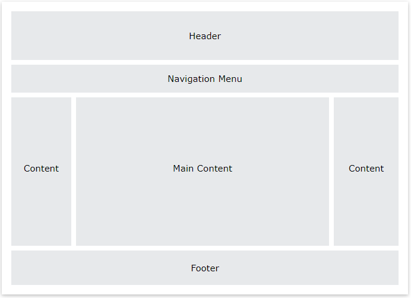

# 0. Content
1. CSS Forms
2. CSS Counters
3. CSS Website Layout
4. CSS Units
5. CSS Specificity
6. CSS !important Rule
7. CSS Rounded Corners
8. CSS Border Images
9. CSS Background

# 1. CSS Forms
## 1.1. Styling Input Fields
- Để định kiểu style cho tất cả các phần tử `<input>` trong biểu mẫu, ta sử dụng cú pháp sau:
    ```css
    input {

    }
    ```
- Nếu như chỉ muốn định kiểu cho một loại input được chỉ định, thì chúng ta có thể sử dụng `attribute selector` (bộ chọn thuộc tính):  
    VD:
    - `input[type=text]`: chỉ chọn những trường nhập text 
    - `input[type=password]`: chỉ chọn những trường nhập password
    - `input[type=button]`: chỉ chọn những trường button...

- Một số định kiểu style cho trường input trong biểu mẫu:
    - `width`: định nghĩa chiều rộng
    - `padding`, `margin`: định nghĩa phần đệm và lề cho input
    - `border`: định nghĩa đường viền cho input
    - `box-sizing: border-box;` - thuộc tính này để đảm bảo rằng padding và border đã được bao gồm trong tổng kích thước chiều rộng và chiều cao của phần tử. 
    - `color`, `background-color`,...  
    VD:
        ```html
        <style> 
        input[type=text] {
            width: 100%;
            padding: 12px 20px;
            margin: 8px 0;
            box-sizing: border-box;
            color: red;
            background-color: white;
            border: 2px solid green;
            font-size: 20px;
        }
        </style>
        <h2>Style input fields</h2>

        <form>
        <label for="fname">First Name</label>
        <input type="text" id="fname" name="fname">
        <label for="lname">Last Name</label>
        <input type="text" id="lname" name="lname">
        </form>
        ```
    <p align = "center">
    
    </p>

    - `Focused Inputs`: 
        - Mặc định, một số trình duyệt sẽ thêm một đường outline màu xanh dương bao xung quanh trường input khi người dùng click vào. Chúng ta có thể xóa bỏ hành vi này bằng cách thêm thuộc tính `outline: none;` vào phần input.
        - Sử dụng bộ chọn `:focus` để định kiểu style cho trường input khi người dùng click vào.
        VD:
        ```html
            <style> 
            input[type=text] {
                width: 100%;
                padding: 12px 20px;
                margin: 8px 0;
                box-sizing: border-box;
                border: 1px solid #555;
                outline: none;
            }

            input[type=text]:focus {
                background-color: lightblue;
                border: 2px solid red;
            }
            </style>
        
            <form>
                <label for="fname">First Name</label>
                <input type="text" id="fname" name="fname" value="John">
                <label for="lname">Last Name</label>
                <input type="text" id="lname" name="lname" value="Doe">
            </form>
        ```
    <p align = "center">
    
    </p>

    - `Input với biểu tượng/hình ảnh`
        - Nếu muốn thêm 1 biểu tượng vào bên trong input, sử dụng thuộc tính `backdround-image` và `background-position` để xác định ảnh và vị trí của nó.  
        VD: 

     ```html
        <style> 
        input[type=text] {
            width: 100%;
            box-sizing: border-box;
            border: 2px solid #ccc;
            border-radius: 4px;
            font-size: 16px;
            background-color: white;
            background-image: url('searchicon.png');
            background-position: 10px 10px; 
            background-repeat: no-repeat;
            padding: 12px 20px 12px 40px;
        }
        </style>
    ```
    <p align = "center">
    
    </p>
## 1.2. Styling Select Menus
VD:  
```html
    <style> 
    select {
        width: 100%;
        padding: 16px 20px;
        border: none;
        border-radius: 4px;
        background-color: #f0f1f1;
    }
    </style>

    <h2>Styling a select menu</h2>

    <form>
        <select id="country" name="country">
            <option value="au">Australia</option>
            <option value="ca">Canada</option>
            <option value="usa">USA</option>
        </select>
    </form>
```
<p align = "center">

</p>

## 1.3. Styling Input Buttons
VD:
```html
<style> 
input[type=button], input[type=submit], input[type=reset] {
  background-color: #04AA6D;
  border: none;
  color: white;
  padding: 16px 32px;
  margin: 4px 2px;
  cursor: pointer;/*khi di chuột vào con trỏ chuột chuyển thành hình bàn tay*/
}
</style>
<input type="button" value="Button">
<input type="reset" value="Reset">
<input type="submit" value="Submit">
```
<p align = "center">

</p>

## 1.4 Responsive Forms
VD:
```html
<style>
* {
  box-sizing: border-box;
}

input[type=text], select, textarea {
  width: 100%;
  padding: 12px;
  border: 1px solid #ccc;
  border-radius: 4px;
  resize: vertical;
}

label {
  padding: 12px 12px 12px 0;
  display: inline-block;
}

input[type=submit] {
  background-color: #04AA6D;
  color: white;
  padding: 12px 20px;
  border: none;
  border-radius: 4px;
  cursor: pointer;
  float: right;
}

input[type=submit]:hover {
  background-color: #45a049;
}

.container {
  border-radius: 5px;
  background-color: #f2f2f2;
  padding: 20px;
}

.col-25 {
  float: left;
  width: 25%;
  margin-top: 6px;
}

.col-75 {
  float: left;
  width: 75%;
  margin-top: 6px;
}

/* Clear floats after the columns */
.row:after {
  content: "";
  display: table;
  clear: both;
}

/* Responsive layout - when the screen is less than 600px wide, make the two columns stack on top of each other instead of next to each other */
@media screen and (max-width: 600px) {
  .col-25, .col-75, input[type=submit] {
    width: 100%;
    margin-top: 0;
  }
}
</style>

<div class="container">
  <form action="/action_page.php">
  <div class="row">
    <div class="col-25">
      <label for="fname">First Name</label>
    </div>
    <div class="col-75">
      <input type="text" id="fname" name="firstname" placeholder="Your name..">
    </div>
  </div>
  <div class="row">
    <div class="col-25">
      <label for="lname">Last Name</label>
    </div>
    <div class="col-75">
      <input type="text" id="lname" name="lastname" placeholder="Your last name..">
    </div>
  </div>
  <div class="row">
    <div class="col-25">
      <label for="country">Country</label>
    </div>
    <div class="col-75">
      <select id="country" name="country">
        <option value="australia">Australia</option>
        <option value="canada">Canada</option>
        <option value="usa">USA</option>
      </select>
    </div>
  </div>
  <div class="row">
    <div class="col-25">
      <label for="subject">Subject</label>
    </div>
    <div class="col-75">
      <textarea id="subject" name="subject" placeholder="Write something.." style="height:200px"></textarea>
    </div>
  </div>
  <br>
  <div class="row">
    <input type="submit" value="Submit">
  </div>
  </form>
</div>
```
*Kết quả:*
- Khi kích thước cửa sổ trình duyệt bình thường, biểu mẫu chia làm 2 cột label và input:
<p align = "center">

</p>

- Khi kích thước cửa sổ trình duyệt nhỏ hơn bằng 600px, 2 cột label và input của biểu mẫu xếp chồng lên nhau, kích thước chiều rộng bằng chiều rộng của màn hình :
<p align = "center">

</p>

# 2. CSS Counters
## 2.1. Tự động tăng số với bộ đếm Counters
- `CSS Counters` như là các biến. Giá trị của các biến này có thể được tăng theo quy tắc CSS.
- `CSS Counter` có những giá trị sau:
    - `counter-reset`: tạo hoặc bắt đầu lại một bộ đệm.
    - `counter-increment`: tăng một giá trị đếm.
    - `content`: Chèn nội dung đã được định trước.
    - `Hàm counter() hoặc counters()` : thêm giá trị của một bộ đếm tới một phần tử

- Để sử dụng CSS counter, trước tiên phải tạo bộ đếm với counter-reset.  
VD: Tạo 1 bộ đếm, tăng giá trị của bộ đếm cho mỗi thẻ `<h2>` và thêm nội dung "`Section <giá trị của bộ đếm>:`" để bắt đầu mỗi thẻ `<h2>`

    ```html
    <style>
    body {
    counter-reset: section;
    }

    h2::before {
    counter-increment: section;
    content: "Section " counter(section) ": ";
    }
    </style>
    <h1>Using CSS Counters</h1>

    <h2>HTML Tutorial</h2>
    <h2>CSS Tutorial</h2>
    <h2>JavaScript Tutorial</h2>
    <h2>Python Tutorial</h2>
    <h2>SQL Tutorial</h2>
    ```
<p align = "center">

</p>

## 2.2. Bộ đếm lồng nhau
- Chúng ta có thể sử dụng các bộ đếm lồng nhau trong cùng một trang.

VD: Tạo một bộ đếm (section) để tăng các giá trị cho thẻ `<h1>` với nội dung "`Section <giá trị của bộ đếm section>.`" và một bộ đếm (subsection) để tăng các giá trị cho thẻ `<h2>` với nội dung "`Section <giá trị của bộ đếm section>.<giá trị của bộ đếm subsection>`"

```html
<style>
body {
  counter-reset: section;
}

h1 {
  counter-reset: subsection;
}

h1::before {
  counter-increment: section;
  content: "Section " counter(section) ". ";
}

h2::before {
  counter-increment: subsection;
  content: counter(section) "." counter(subsection) " ";
}
</style>

<h1>HTML/CSS Tutorials</h1>
<h2>HTML</h2>
<h2>CSS</h2>
<h2>Bootstrap</h2>
<h2>W3.CSS</h2>

<h1>Scripting Tutorials</h1>
<h2>JavaScript</h2>
<h2>jQuery</h2>
<h2>React</h2>
```

<p align = "center">

</p>

## 2.3. Sử dụng bộ đếm counter để đánh chỉ mục cho các danh mục trong danh sách có thứ tự

```html
<style>
ol {
  counter-reset: section;
  list-style-type: none;
}
li{
  color: red;
  font-size: 20px;
}

li::before {
  counter-increment: section;
  content: counters(section,".") " ";
}
</style>
<ol>
  <li>item</li>
  <li>item   
  <ol>
    <li>item</li>
    <li>item</li>
    <li>item
    <ol>
      <li>item</li>
      <li>item</li>
      <li>item</li>
    </ol>
    </li>
    <li>item</li>
  </ol>
  </li>
  <li>item</li>
  <li>item</li>
</ol>
```
<p align = "center">

</p>

# 3. CSS Website Layout
## 3.1. Bố cục trang web
- Một trang web thường được chia thành header, menus, content và footer:
<p align = "center">

</p>

### 3.1.1. Header
- Một `header` thường được đặt ở phía trên đầu của một trang web. Nó thường chứa logo hoặc tên của trang web.  
VD:

```html
<style>
#header{
    margin-left: 50px;
    display: flex;
}

</style>
<div class="header">
    <h1>Slick<label>Red</label></h1>
</div>
```

<p align = "center">

</p>

### 3.1.2. Navigation Bar
```html
<style>
.nav ul{
    background-color: #420000;
    width: 100%;
    overflow: hidden;
    text-align: center;
    padding: 0px;
   
}
.nav ul li{
    float: left;
    height: 50px;
    list-style: none;
    width: 16%;
}
.nav ul li a{
    color: white;
    padding: 12px 15px;
    text-decoration: none;
    display: block;
    font-size: 20px;
    height: 50px;
}
.nav ul li a:hover{
    background-color: orange;
}
</style>

<div class="header">
    <h1>Slick<label>Red</label></h1>
</div>
<div class="nav">
    <ul>
        <li><a href="#">Home</a></li>
        <li><a href="#">About</a></li>
        <li><a href="#">Products</a></li>
        <li><a href="#">Services</a></li>
        <li><a href="#">Design</a></li>
        <li><a href="#">Contact</a></li>
    </ul>
</div>
```
<p align = "center">

</p>

### 3.1.3. Content

```html
<style>
.content{
    background-color: #facfcf;
    display: flex;
    height:60vh;
}

.menu ul{
    width: 150px;
    background-color: brown;
    margin-top: 5px;
    height: 90%;
    padding: 0px;
   
}
.menu ul li{
    list-style: none;  
   
}
.menu ul li a{
    text-decoration: none;
    display: block;
    color: white;
    padding: 10px 10px;
}
.content-right{
    padding-left: 10px;
}
</style>
<div class="content">
    <div class="menu">
        <ul>
            <li><a href="#">Links</a></li>
            <li><a href="#">SEO</a></li>
            <li><a href="#">PHP</a></li>
            <li><a href="#">Ajax</a></li>
            <li><a href="#">JQuery</a></li>
            <li><a href="#">Web design</a></li>
            <li><a href="#">Web programming</a></li>
            <li><a href="#">Content creation</a></li>
            <li><a href="#">Internet marketing</a></li>
            <li><a href="#">xHTML templates</a></li>   
        </ul>
    </div>
    <div class="content-right">
        <h2>You may use this template in any manner you like. All I ask 
            is that you leave the link back to my site at the bottom of the 
            page.</h2>
        <h3>Template Notes</h3>
        <p>Lorem ipsum dolor sit amet, consectetur adipisicing elit, sed do eiusmod tempor incididunt ut labore et dolore magna aliqua. Ut enim ad minim veniam, quis nostrud exercitation ullamco laboris nisi ut aliquip ex ea commodo consequat. Duis aute irure dolor in reprehenderit in voluptate velit esse cillum dolore eu fugiat nulla pariatur. Excepteur sint occaecat cupidatat non proident, sunt in culpa qui officia deserunt mollit anim id est laborum</p>
        <h3>More information</h3>
        <p>Lorem ipsum dolor sit amet, consectetur adipisicing elit, sed do eiusmod tempor incididunt ut labore et dolore magna aliqua. Ut enim ad minim veniam, quis nostrud exercitation ullamco  laboris nisi ut aliquip ex ea commodo consequat. Duis aute irure dolor in reprehenderit in voluptate velit esse cillum dolore eu fugiat nulla pariatur. Excepteur sint occaecat cupidatat non  proident, sunt in culpa qui officia deserunt mollit anim id est laborum.</p>
        <h3>Template Notes</h3>
        <p>Lorem ipsum dolor sit amet, consectetur adipisicing elit, sed do eiusmod tempor incididunt ut labore et dolore magna aliqua. Ut enim ad minim veniam, quis nostrud exercitation ullamco laboris nisi ut aliquip ex ea commodo consequat. Duis aute irure dolor in reprehenderit in  voluptate velit esse cillum dolore eu fugiat nulla pariatur. Excepteur sint occaecat cupidatat non proident, sunt in culpa qui officia deserunt mollit anim id est laborum</p>
    </div>
</div>
```

<p align = "center">

</p>

### 3.1.4. Footer

```html
<style>
.footer{
    margin-top:  20px;
    height: 70px;    
}
.footer ul{
    background-color: #facfcf;
    width: 80%;
    margin-left: 150px;
}
.footer ul li{
    list-style: none;
    float: left;
    width: 20%;
    border-right: 1px solid black;
}
.footer ul li a{
    text-decoration: none;
    color: black;
    display: block;
    text-align: center;
}
</style>

<div class="footer">
    <ul>
        <li><a href="#">florida web design</a></li>
        <li><a href="#">web tutorials</a></li>
        <li><a href="#">html codes</a></li>
        <li><a href="#">free templates</a></li>
    </ul>
</div>
```
<p align = "center">

</p>

# 4. CSS Units
- CSS có một số đơn vị khác nhau sử dụng cho định nghĩa 1 độ dài cho các phần tử
- Một số thuộc tính CSS sử dụng giá trị độ dài như: `width`, `margin`, `padding`, `height`, ...
- Độ dài là một con số được theo sau bởi một đơn vị độ dài như `px`, `cm`, `em`,...

 VD:
 ```css
h1 {
  font-size: 60px;
}

p {
  font-size: 5em;
  line-height: 1cm;
}
 ```
- *Lưu ý:*
    - Số và đơn vị độ dài phải được viết liền, với giá trị 0 thì không cần viết đơn vị theo sau.
    - Trong CSS, độ dài chấp nhận 1 giá trị âm
## Có 2 loại đơn vị độ dài là đơn vị tuyệt đối và tương đối
### a. Đơn vị tuyệt đối:
- `Đơn vị tuyệt đối` sẽ có những giá trị cố định không thay đổi.
- `Đơn vị tuyệt đối` không được khuyến khích sử dụng cho màn hình, vì có rất nhiều các kích thước màn hình khác nhau. Nó chỉ nên dùng cho những trường hợp biết chắc kích thước của giao diện, như xuất ra máy in chẳng hạn.

- Một số đơn vị tuyệt đối được sử dụng trong CSS:
   - `px *`: pixels (1px = 1/96th of 1in)
   - `pt`: points (1pt = 1/72 of 1in)
   - `pc`: picas (1pc = 12 pt)
   - `cm`: centimeters
   - `mm`: millimeters
   - `in`: inches (1in = 96px = 2.54cm)

### b. Đơn vị tương đối - Relative Units
- `Đơn vị tương đối` là đơn vị được tính một cách tương đối so với phần tử cha hoặc các phần tử khác.
- `Đơn vị tương đối` hoạt động tốt hơn cho những thiết bị, những màn hình có kích thước và độ phân giải khác nhau.

- Một số đơn vị tương đối chính được sử dụng trong CSS:
    - `% (percentages)`: Đơn vị tương đối về kích thước của phần tử con so với phần tử cha (parrent). Ví dụ: Nếu phần tử cha có thuộc tính width:500px, phần tử con có thuộc tính width:50% thì có nghĩa là phần tử con có thuộc tính width:250px
    - `em`: Là đơn vị tương đối dựa vào thuộc tính font-size của phần tử cha.  
     Ví dụ: Nếu phần tử cha có thuộc tính font-size:16px, phần tử con có thuộc tính font-size:2em thì có nghĩa là phần tử con có thuộc tính font-size:32px
    - `rem(root em)`: Là đơn vị tương đối dựa vào thuộc tính font-size của phần html (root element).   
    Ví dụ: Nếu phần tử html có thuộc tính font-size:12px phần tử cha có thuộc tính font-size:16px, phần tử con có thuộc tính font-size:2rem thì có nghĩa là phần tử con có thuộc tính font-size:24px; Tức là đơn vị `rem` không phụ thuộc vào phần tử cha.
    - `vw`: 1vw = 1% kích thước của trình duyệt

# 5. CSS Specificity
## 5.1 Khái niệm
- Nếu có hai hoặc nhiều quy tắc CSS được chỉ đến cùng một phần tử, bộ chọn nào với giá trị đặc tính cao hơn thì khai báo định kiểu của nó sẽ được áp dụng vào phần tử HTML đó.
- Mức độ ưu tiên của các đặc tính có tính quyết định xem phần khai báo định kiểu style nào sẽ được áp dùng cho một phần tử.    

VD: Có 3 khai báo định kiểu cho thẻ `<p>`, vì bộ chọn id có mức độ ưu tiên cao hơn nên nó sẽ được áp dụng cho thẻ `<p>` và màu chữ sẽ là màu xanh dương
  ```html
  <style>
      #demo {color: blue;}
      .test {color: green;}
      p {color: red;}
    </style>

  <p id="demo" class="test">Hello World!</p>
  ```
<p align = "center">

</p>

## 5.2. Mức độ ưu tiên của các bộ chọn CSS
- `Inline styles` - VD: `<h1 style="color: pink;">`
- `IDs` - VD: #navbar
- `Classes, pseudo-classes, attribute selectors` - VD: .test, :hover, [href]
- `Elements and pseudo-elements` - VD: h1, ::before
## 5.3. Các tính độ ưu tiên cho các bộ chọn CSS
- `Inline style` luôn có giá trị `ưu tiên cao nhất`, và nhận giá trị là 1000
- `Bộ chọn ID`: có giá trị ưu tiên là 100
- `Classes, pseudo-classes, attribute selectors` có giá trị ưu tiên là 10
- `Elements and pseudo-elements` có giá trị ưu tiên là 1.
- `*` (universal selector): giá trị ưu tiên bằng 0
VD: 
- `p.test`: giá trị ưu tiên= 1 + 10 = 11

- `p#demo`: giá trị ưu tiên= 1 + 100 = 101

- `<p style="color: pink;">`:	giá trị ưu tiên= 1000

- `#demo`: giá trị ưu tiên= 100

- `.test`: giá trị ưu tiên= 10

- `p.test1.test2`: giá trị ưu tiên= 1 + 10 + 10 = 21

- `#navbar p#demo`: giá trị ưu tiên= 100 + 1 + 100 = 201

## 5.4. Một số ví dụ
- Nếu cùng một quy tắc nhưng được viết hai lần trong cùng 1 tệp tin css, thì quy tắc viết sau cùng sẽ được chọn
    VD:
    ```css
    h1 {background-color: yellow;}
    h1 {background-color: red;} /* Được chọn*/
    ```
- Bộ chọn id có độ ưu tiên cao hơn bộ chọn thuộc tính
    VD:
    ```css
    div#a {background-color: green;} /*Được chọn*/
    #a {background-color: yellow;}
    div[id=a] {background-color: blue;}
    ```

# 6. CSS !important Rule

## 6.1. Định nghĩa
- Quy tắc `!important` trong CSS được sử dụng để tăng thêm tầm quan trọng tới một cặp `property/value` hơn bình thường.
- `!important` được sử dụng để thay đổi thứ tự ưu tiên của code CSS, `thuộc tính css được gán important thì nó sẽ có mức ưu tiên cao nhất`, cho dù thành phần đó được định nghĩa inline hay trong file css.

- Nếu sử dụng `!important`, thì nó sẽ ghi đè tất cả các quy tắc định kiểu style trước đó của thuộc tính chỉ định đó trong một phần tử.

- Cách sử dụng `!important`: chỉ cẩn thêm `!important` vào cuối dòng của 1 khai báo định kiểu mà chúng ta muốn. Cú pháp:

    ```css
    selector {
        property: value !important;
    }
    ```

    VD:
    ```html
    <style>
    #myid {
    background-color: blue;
    }

    .myclass {
    background-color: gray;
    }

    p {
    background-color: red !important;
    }
    </style>
    <p>This is some text in a paragraph.</p>
    <p class="myclass">This is some text in a paragraph.</p>
    <p id="myid">This is some text in a paragraph.</p>
    ```
- Trong ví dụ trên, cả 3 thẻ `<p>` đều nhận màu nền là màu đỏ, kể cả bộ chọn Id và bộ chọn Class có độ ưu tiên cao hơn. Quy tắc `!important` đã ghi đè tất cả

Kết quả:
<p align = "center">

</p>

## 6.2. Điểm quan trọng về !important
- Chỉ có 1 cách đề ghi đè 1 quy tắc `!important` là sử dụng một quy tắc `!important` khác thêm vào một khai báo có mức độ ưu tiên tương tự (hoặc cao hơn)
- Tuy nhiên điều này sẽ làm cho mã CSS rắc rối, khó hiểu hơn.

    ```css
    #myid {
    background-color: blue !important;
    }

    .myclass {
    background-color: gray !important;
    }

    p {
    background-color: red !important;
    }
    ```
*Lưu ý:* Chỉ sử dụng `!important` khi thật sự cần.

## 6.3. Một số cách sử dụng !important
- *Cách 1*: Sử dụng !important, nếu phải ghi đè một định kiểu mà không thể ghi đè theo bất kỳ cách nào khác.
- *Cách 2*: Khi muốn tất cả phần tử nào đó trên trang web của mình chỉ có 1 định kiểu như màu nền xám; chữ đỏ; đường viền nét liền, màu đen dày 1px thì ta sử dụng `!important` cho tất cả các thuộc tính định kiểu của phần tử đó.

VD: với phần tử `<button>`  
```css
.button {
    background-color: #8c8c8c !important;
    color: red !important;
    padding: 5px !important;
    border: 1px solid black !important;
}
```

# 7. CSS Rounded Corners
## 7.1. CSS border-radius Property
- Thuộc tính `border-radius` định nghĩa bán kính của các góc của một phần tử.
- Thuộc tính này cho phép chúng ta thực hiện bo góc tròn cho các phần tử:
- VD:
    - Bo góc cho một phần tử với một màu nền được chỉ định.
    - Bo góc cho một phần tử với một đường viền.
    - Bo góc cho một phần tử với một hình ảnh nền.

  ```css
  <style> 
  #rcorners1 {
    border-radius: 25px;
    background: #73AD21;
    padding: 20px; 
    width: 200px;
    height: 50px;  
  }

  #rcorners2 {
    border-radius: 25px;
    border: 2px solid #73AD21;
    padding: 20px; 
    width: 200px;
    height: 50px;  
  }

  #rcorners3 {
    border-radius: 25px;
    background: url(paper.gif);
    background-position: left top;
    background-repeat: repeat;
    padding: 20px; 
    width: 200px;
    height: 50px;  
  }
  </style>
  ```

<p align = "center">

</p>

## 7.2. CSS border-radius - Chỉ định từng góc của một phần tử
- Thuộc tính `border-radius` là một thuộc tính viết gọn cho các giá trị thuộc tính theo thứ tự sau:
    - `border-top-left-radius`
    - `border-top-right-radius`
    - `border-bottom-right-radiu`s
    - `border-bottom-left-radius`  

Do đó, thuộc tính `border-radius` có thể có từ một đến bốn giá trị

  VD:
  ```css
  /* border-radius có 4 giá trị*/
  #rcorners1 {
    border-radius: 15px 50px 30px 5px; /*15px: top-left, 50px: top-right, 30px: bottom-right, 5px: bottom-left corner*/
    background: #73AD21;
    padding: 20px;
    width: 200px;
    height: 150px;
  }

  /* border-radius có 3 giá trị*/
  #rcorners2 {
    border-radius: 15px 50px 30px; /*15px: top-left, 50px: top-right và bottom-left, 30px: bottom-right corner*/
    background: #73AD21;
    padding: 20px;
    width: 200px;
    height: 150px;
  }

  /* border-radius có 2 giá trị*/
  #rcorners3 {
    border-radius: 15px 50px; /*15px: top-left và bottom-right, 50px: top-right và bottom-left corner*/
    background: #73AD21;
    padding: 20px;
    width: 200px;
    height: 150px;
  }

  /* border-radius có 1 giá trị*/
  #rcorners4 {
    border-radius: 15px; /*15px cho cả 4 góc*/
    background: #73AD21;
    padding: 20px;
    width: 200px;
    height: 150px;
  }
  ```

<p align = "center">

</p>

# 8. CSS Border Images
## 8.1. CSS border-image property
- Thuộc tính `border-image` cho phép định nghĩa một hình ảnh được sử dụng để thay thế cho một đường viền bình thường bao quanh một phần tử.
- Thuộc tính `border-image` có các phần:
  1. Xác định tập tin hình ảnh dùng để làm đường viền hình ảnh.
  2. Xác định các `lát cắt` trong tấm hình.
  3. Xác định độ dày của đường viền hình ảnh.
  4. Xác định khoảng cách đẩy đường viền hình ảnh ra khỏi vị trí ban đầu của nó.
  5. Xác định kiểu lặp lại ở các cạnh của đường viền hình ảnh. ảnh.

- Thuộc tính `border-image` lấy hình ảnh và cắt nó thành 9 phần, giống như hình dưới đây. 

  <p align = "center">
  
  </p>

    - Những lát cắt `1 3 5 7` sẽ được đặt lần lượt vào các góc `top-left, top-right, bottom-right, bottom-left` của đường viền.

    - Những lát cắt `2 4 6 8` sẽ được đặt lần lượt vào các cạnh phía trên, bên phải, phía dưới, bên trái của đường viền.

*Lưu ý:* Để thuộc tính `border-image` hoạt động, thì trong định kiểu style của phần tử cũng cần phải có thuộc tính `border`.

- Thuộc tính `border-image` là thuộc tính viết tắt cho các thuộc tính sau:
    - `border-image-source`: url('đường dẫn tới ảnh')
    - `border-image-slice`: để xác định các "lát cắt" trong tấm hình
    - `border-image-width`: dùng để thiết lập độ dày đường viền hình ảnh mà không làm thay đổi kích thước của phần tử 
    - `border-image-outset`: để đẩy đường viền hình ảnh ra khỏi vị trí bạn đầu của nó.
    - `border-image-repeat`: để xác định ảnh được lặp lại hay kéo dãn để phù hợp với kích thước của đường viền.

- Cú pháp
  ```css
  selector {
      border-image: source slice/width/outset repeat
  }
  ```

*Lưu ý*: Đối với loại bộ năm giá trị này, ta không nhất thiết phải cung cấp đủ năm giá trị, những giá trị nào thiếu sẽ tự động sử dụng giá trị mặc định của nó


VD:
- Chúng ta sẽ sử dụng hình ảnh sau để làm đường viền (gọi là border.png)
  <p align = "center">
  
  </p>

- Đây là trường hợp các phần ở giữa của bức ảnh được lặp lại để tạo đường viền:
  ```css
  #borderimg {
    border: 10px solid transparent; /*sử dụng transparent để tại sự trong suốt cho đường viền*/
    padding: 15px;
    border-image: url(border.png) 30 round;
  }
  ```

<p align = "center">

</p>

- Đây là trường hợp các phần ở giữa của bức ảnh được kéo dãn để tạo đường viền:
  ```css
  #borderimg {
    border: 10px solid transparent;
    padding: 15px;
    border-image: url(border.png) 30 stretch;
  }
  ```

<p align = "center">

</p>

### 8.1.1. Thuộc tính border-image-slice

- Thông thường, thuộc tính `border-image-slice` sẽ nhận một giá trị gồm bốn số (tương ứng với vị trí của bốn lát cắt)

  - Số thứ nhất sẽ tạo nên lát cắt  màu đỏ (nó là khoảng cách từ cạnh phía trên của tấm hình đến đường màu đỏ)
  - Số thứ hai sẽ tạo nên lát cắt  màu xanh lá (nó là khoảng cách từ cạnh bên phải của tấm hình đến đường màu xanh lá)
  - Số thứ ba sẽ tạo nên lát cắt  màu xanh dương (nó là khoảng cách từ cạnh phía dưới của tấm hình đến đường màu xanh dương)
  - Số thứ tư sẽ tạo nên lát cắt  màu đen (nó là khoảng cách từ cạnh bên trái của tấm hình đến đường màu đen)

  <p align = "center">
  
  </p>


- Ta cũng có thể xác định khoảng cách dựa theo tỷ lệ phần trăm kích thước chiều rộng và chiều cao của tấm hình.
- Cú pháp:
  ```css
  border-image-slice: number|percent;
  ```
VD:
```html
<style type="text/css">
    .div1{
      margin-bottom: 20px;
      padding:30px;
      border: 30px solid transparent;
      border-image-source: url(border.png);
      border-image-slice: 30 30 25% 50;
    }
</style>

<div class="div1">border-image-slice</div>
```
<p align = "center">

</p>


### 8.1.2. Thuộc tính border-image-width
- Mặc định thì độ dày "đường viền hình ảnh" sẽ bằng với độ dày đường viền của phần tử.
- Muốn thay đổi độ dày đường viền hình ảnh này, ta sử dụng thuộc tính `border-image-width`, điều này sẽ không làm thay đổi kích thước của phần tử.
- Thuộc tính này có từ 1 đến 4 giá trị, tương ứng cho các giá trị độ dày của đường viền hình ảnh phía trên, bên phải, phía dưới, bên trái.

Cú pháp
  ```css
  border-image-width: pixel|percent|number|auto;
  ```

VD:
  ```html
  <style type="text/css">
      .div1{
        height: 50px;
        padding:30px;
        border: 30px solid transparent;
        border-image-source: url(border.png);
        border-image-slice: 30 30 25% 50;
        border-image-width:20px 30px 30px 20px;
      }
  </style>
  <div class="div1">border-image-width</div>
  ```
<p align = "center">

</p>

### 8.1.3.Thuộc tính border-image-outset
- Thuộc tính `border-image-outset` dùng để đẩy đường viền hình ảnh ra khỏi vị trí ban đầu của nó
- Thuộc tính `border-image-outset` không làm thay đổi kích thước của phần tử, nó chỉ làm thay đổi chiều rộng và chiều cao của đường viền hình ảnh.
- Cú pháp:
  ```css
  border-image-outset: pixel|number;
  ```
VD:
- Khi không khai báo thuộc tính `border-image-outset` (nhận giá trị mặc định)
<p align = "center">

</p>

- Khi khai báo thuộc tính `border-image-outset`
  ```html
  <style type="text/css">
      div{
          margin:100px;
          width:150px;
          height:150px;
          background-color:#ccc;
          border:20px solid transparent;
          border-image-source:url(border.png);
          border-image-slice:50;
          border-image-outset:50px 50px 30px 55px;
      }
  </style>
  <div>
      <a href="border.png" target="_blank">border-image-outset</a>
  </div>
  ```
<p align = "center">

</p>

### 8.1.4. Thuộc tính border-image-repeat
- Ở phần trên đã trình bày, thuộc tính `border-image-slice` sẽ cắt hình ảnh đường viền thành 9 phần:
  <p align = "center">
  
  </p>
- Thuộc tính `border-image-repeat` dùng để xác định các kiểu lặp của các phần cắt `2, 4, 6, 8`
- Cú pháp:
  ```css
  border-image-repeat: stretch|round|repeat|space;
  ```
- Các giá trị của thuộc tính:
  - `stretch`: Các phần `2 4 6 8` không được lặp lại mà nó chỉ giãn nở ra (hoặc nén ngắn lại) để lập đầy các cạnh của đường viền.
  - `round`:	Các phần `2 4 6 8` sẽ giãn nở ra ở một mức độ vừa phải (hoặc nén ngắn lại) để lập đầy các cạnh của đường viền.Tuy nhiên, các phần `2 4 6 8` sẽ lặp lại nếu kích thước các cạnh của đường viền lớn hơn quá nhiều so với chúng.
  - `repeat`: Các phần `2 4 6 8` sẽ được lặp lại nếu các cạnh của đường viền có kích thước lớn hơn chúng.
    - *Lưu ý*: Các phần `2 4 6 8` chỉ lặp lại một đoạn nào đó ở hai đầu chứ không giãn ra như giá trị `round`.
  - `space`: Các phần `2 6` hiển thị theo đúng tỷ lệ giống tấm hình gốc theo chiều ngang. Các phần `4 8` hiển thị theo đúng tỷ lệ giống tấm hình gốc theo chiều dọc.

    - Các phần `2 4 6 8` sẽ được lặp lại nếu các cạnh của đường viền có kích thước lớn hơn chúng.

    - Tuy nhiên, nếu tổng chiều dài số lần lặp lại của mỗi phần ngắn hơn chiều dài cạnh của nó thì khoảng dài hơn sẽ bị thay bởi những khoảng trắng.

- VD:
  - Hình ảnh được sử dụng để làm đường viền  <p align = "center">

</p>

  - `border-image-repeat: stretch;`

    ```css
    <style type="text/css">
          div{
              border:20px solid transparent;
              width:350px;
              height:150px;
              border-image-source:url(../image/pattern3.png);
              border-image-slice:50 50 50 50;
              border-image-repeat:stretch;
          }
      </style>
    ```
  <p align = "center">
    
    </p>

  - `border-image-repeat: round;`  

    ```css
    <style type="text/css">
          div{
              border:20px solid transparent;
              width:350px;
              height:150px;
              border-image-source:url(../image/pattern3.png);
              border-image-slice:50 50 50 50;
              border-image-repeat:round;
          }
      </style>
    ```
  <p align = "center">
  
  </p>

  - `border-image-repeat: repeat;`

    ```css
    <style type="text/css">
          div{
              border:20px solid transparent;
              width:350px;
              height:150px;
              border-image-source:url(../image/pattern3.png);
              border-image-slice:50 50 50 50;
              border-image-repeat:repeat;
          }
      </style>
    ```
  <p align = "center">
  
  </p>

  - `border-image-repeat: space;`

    ```css
    <style type="text/css">
          div{
              border:20px solid transparent;
              width:350px;
              height:150px;
              border-image-source:url(../image/pattern3.png);
              border-image-slice:50 50 50 50;
              border-image-repeat:space;
          }
      </style>
    ```
  <p align = "center">
  
  </p>

# 9. CSS Background
## 9.1. CSS Multiple Backgrounds images
- CSS cho phép thêm nhiều ảnh nền cho một phần tử thông qua thuộc tính `background-image`.
- Các hình nền khác nhau khi khai báo được ngăn cách bởi dấu phẩy ('`,`'), và `các hình ảnh được xếp chồng lên nhau, hình ảnh được khai báo đầu tiên là hình ảnh được xếp lên trên cùng (tức có thể được hiển thị rõ ràng và đầy đủ nhất)`.
- Cú pháp:
  ```css
  selector {
      background-image: url(ảnh_1), url(ảnh_2);
  }
  ```

VD:
  ```html
  <style> 
  #example1 {
    background-image: url(img_flwr.gif), url(paper.gif);
    background-position: right bottom, left top;
    background-repeat: no-repeat, repeat;
    padding: 15px;
  }
  </style>
  <div id="example1">
    <h1>Lorem Ipsum Dolor</h1>
    <p>Lorem ipsum dolor sit amet, consectetuer adipiscing elit, sed diam nonummy nibh euismod tincidunt ut laoreet dolore magna aliquam erat volutpat.</p>
  </div>
  ```
<p align = "center">

</p>

- Nhiều hình nền có thể được chỉ định bằng cách sử dụng thuộc tính nền riêng lẻ (như ví dụ trên) hoặc thuộc tính viết tắt `background`

VD:
  ```html
  <style> 
  #example1 {
    background: url(img_flwr.gif) right bottom no-repeat, url(paper.gif) left top repeat;
    padding: 15px;
  }
  </style>
  <div id="example1">
    <h1>Lorem Ipsum Dolor</h1>
    <p>Lorem ipsum dolor sit amet, consectetuer adipiscing elit, sed diam nonummy nibh euismod tincidunt ut laoreet dolore magna aliquam erat volutpat.</p>
  </div>
  ```
<p align = "center">

</p>

## 9.2. CSS Background Size
- Thuộc tính `background-size` cho phép định nghĩa kích thước của những hình ảnh nền.
- Kích thước có thể được xác định bằng độ dài (`px, cm, em...`), `%`, hoặc sử dụng một trong hai từ khóa `contain` hoặc `cover`.
- Cú pháp:
  ```css
  selector {
      background-size: giá trị;
  }
  ```
VD: Sử dụng kích thước được xác định bằng độ dài

  ```html
  <style>
  #example1 {
    border: 1px solid black;
    background: url(img_flwr.gif);
    background-size: 100px 80px;
    background-repeat: no-repeat;
    padding: 15px;
  }

  #example2 {
    border: 1px solid black;
    background: url(img_flwr.gif);
    background-repeat: no-repeat;
    padding: 15px;
  }
  </style>
  <p>Resized background-image:</p>
  <div id="example1">
    <h2>Lorem Ipsum Dolor</h2>
    <p>Lorem ipsum dolor sit amet, consectetuer adipiscing elit.</p>
  </div>

  <p>Original size of the background-image:</p>
  <div id="example2">
    <h2>Lorem Ipsum Dolor</h2>
    <p>Ut wisi enim ad minim veniam, quis nostrud exerci tation ullamcorper suscipit lobortis nisl ut aliquip ex ea commodo consequat.</p>
  </div>
  ```

<p align = "center">

</p>

- *Lưu ý:* Nếu thuộc tính `background-size` được định nghĩa chỉ với 1 giá trị như `background-size: 100px;` thì có nghĩa là nó sẽ xác định chiều rộng của hình nền là 100px, chiều cao của hình nền sẽ tự động được chỉnh theo tỷ lệ kích thước ban đầu của hình nền.
### 9.2.1. Thuộc tính `background-size: contain;`
- Từ khóa `contain` Tự chia tỷ lệ tới kích thước nhỏ nhất của chiều rộng hoặc chiều cao để phù hợp với vùng nội dung (ảnh sẽ thu phóng sao toàn bộ ảnh đặt vừa lọt trong vào khu vực nền của phần tử.).

  - Nếu chiều cao nhỏ hơn chiều rộng thì background sẽ chỉnh 100% theo chiều cao, chiều rộng sẽ tự động chỉnh tỷ lệ cho phù hợp (auto).
  - Ngược lại nếu chiều rộng nhỏ hơn chiều cao thì background sẽ chỉnh 100% theo chiều rộng, chiều cao sẽ tự động chỉnh tỷ lệ cho phù hợp (auto).

VD:
```html
<style>
.div1 {
  border: 1px solid black;
  height: 120px;
  width: 150px;
  background: url(img_flwr.gif);
  background-repeat: no-repeat;
  background-size: contain;
}

</style>
<h2>background-size: contain:</h2>
<div class="div1">
<p>Lorem ipsum dolor sit amet.</p>
</div>

<p>Original image:</p>

```
<p align = "center">

</p>

### 9.2.2. Thuộc tính background-size: cover;
- Từ khóa `cover` tự chia tỷ lệ tới kích thước lớn nhất của chiều rộng hoặc chiều cao để phù hợp với vùng nội dung (Ảnh nền sẽ thu/phóng sao cho phủ kín hết toàn bộ nền.).

  - Nếu chiều cao lớn hơn chiều rộng thì background sẽ chỉnh 100% theo chiều cao, chiều rộng sẽ tự động chỉnh tỷ lệ cho phù hợp (auto).
  - Ngược lại nếu chiều rộng lớn hơn chiều cao thì background sẽ chỉnh 100% theo chiều rộng, chiều cao sẽ tự động chỉnh tỷ lệ cho phù hợp (auto)

  ```html
  <style>
  .div1 {
    border: 1px solid black;
    height: 120px;
    width: 150px;
    background: url(img_flwr.gif);
    background-repeat: no-repeat;
    background-size: cover;
  }

  </style>
  <h2>background-size: contain:</h2>
  <div class="div1">
  <p>Lorem ipsum dolor sit amet.</p>
  </div>

  <p>Original image:</p>
  
  ```
<p align = "center">

</p>

## 9.2.3. Định nghĩa nhiều kích thước cho nhiều hình nền
- Thuộc tính `background-size` cũng cho phép định nghĩa nhiều giá trị kích thước cho nhiều hình nền, các giá trị được phân cách bởi dấu phẩy.

VD:
  ```html
  <style> 
  #example1 {
    background: url(img_tree.gif) left top no-repeat, url(img_flwr.gif) right bottom no-repeat, url(paper.gif) left top repeat;
    padding: 15px;
    background-size: 50px, 130px, auto;
  }
  </style>
  <div id="example1">
    <h1>Lorem Ipsum Dolor</h1>
    <p>Lorem ipsum dolor sit amet, consectetuer adipiscing elit, sed diam nonummy nibh euismod tincidunt ut laoreet dolore magna aliquam erat volutpat.</p>
  </div>
  ```
<p align = "center">

</p>

## 9.3. Full Size Background Image
- Nếu như chúng ta muốn có một hình nền trên một trang web mà nó luôn bao phủ toàn bộ cửa sổ trình duyệt mọi lúc thì sử dụng bộ chọn thẻ `<html>`, và khai báo các giá trị thuộc tính `background` và `background-size` như sau:
  ```css
  html {
    background: url(img_man.jpg) no-repeat center fixed;
    background-size: cover;
  }
  ```
<p align = "center">

</p>

## 9.4. CSS background-origin property
- Thuộc tính `background-origin` xác định vị trí của hình nền
- Thuộc tính này có các giá trị khác nhau như sau:
  - `border-box`: hình nền bắt đầu từ góc trên bên trái của đường viền
  - `padding-box`: (`mặc định`) hình nền bắt đầu từ góc trên bên trái của cạnh padding
  - `content-box`: hình nền bắt đầu từ góc trên bên trái của nội dung.

VD:
- `background-origin: border-box`
  ```html
  <style>
  #example1 {
    border: 10px solid black;
    padding: 35px;
    background: url(img_flwr.gif);
    background-repeat: no-repeat;
    background-origin: border-box;
  }
  </style>
  <div id="example1">
    <h2>Lorem Ipsum Dolor</h2>
    <p>Lorem ipsum dolor sit amet, consectetuer adipiscing elit, sed diam nonummy nibh euismod tincidunt ut laoreet dolore magna aliquam erat volutpat.</p>
  </div>
  ```
<p align = "center">

</p>

- `background-origin: padding-box`
  ```html
  <style>
  #example2 {
    border: 10px solid black;
    padding: 35px;
    background: url(img_flwr.gif);
    background-repeat: no-repeat;
    background-origin: border-box;
  }
  </style>
  <div id="example2">
    <h2>Lorem Ipsum Dolor</h2>
    <p>Lorem ipsum dolor sit amet, consectetuer adipiscing elit, sed diam nonummy nibh euismod tincidunt ut laoreet dolore magna aliquam erat volutpat.</p>
  </div>
  ```
<p align = "center">

</p>

- `background-origin: content-box`
  ```html
  <style>
  #example3 {
    border: 10px solid black;
    padding: 35px;
    background: url(img_flwr.gif);
    background-repeat: no-repeat;
    background-origin: content-box;
  }
  </style>
  <div id="example3">
    <h2>Lorem Ipsum Dolor</h2>
    <p>Lorem ipsum dolor sit amet, consectetuer adipiscing elit, sed diam nonummy nibh euismod tincidunt ut laoreet dolore magna aliquam erat volutpat.</p>
  </div>
  ```
<p align = "center">

</p>

## 9.5. CSS background-clip property
- Thuộc tính `background-clip` chỉ định vùng sơn của nền.
- Thuộc tính này có những giá trị sau:
  - `border-box`: (mặc định) nền được sơn đến mép ngoài của đường viền
  - `padding-box`: nền được sơn vào mép ngoài của padding
  - `content-box`: nền được sơn bên trong hộp nội dung.

VD:
- `background-clip: border-box`
  ```html
  <style>
  #example1 {
    border: 10px dashed black;
    padding: 35px;
    background: yellow;
    background-clip: content-box;
  }
  </style>
  <div id="example1">
    <h2>Lorem Ipsum Dolor</h2>
    <p>Lorem ipsum dolor sit amet, consectetuer adipiscing elit, sed diam nonummy nibh euismod tincidunt ut laoreet dolore magna aliquam erat volutpat.</p>
  </div>
  ```
<p align = "center">

</p>

- `background-origin: padding-box`
  ```html
  <style>
  #example2 {
    border: 10px dashed black;
    padding: 35px;
    background: url(img_flwr.gif);
    background-repeat: no-repeat;
    background-origin: border-box;
  }
  </style>
  <div id="example2">
    <h2>Lorem Ipsum Dolor</h2>
    <p>Lorem ipsum dolor sit amet, consectetuer adipiscing elit, sed diam nonummy nibh euismod tincidunt ut laoreet dolore magna aliquam erat volutpat.</p>
  </div>
  ```
<p align = "center">

</p>

- `background-origin: content-box`
  ```html
  <style>
  #example2 {
    border: 10px dashed black;
    padding: 35px;
    background: url(img_flwr.gif);
    background-repeat: no-repeat;
    background-origin: border-box;
  }
  </style>
  <div id="example2">
    <h2>Lorem Ipsum Dolor</h2>
    <p>Lorem ipsum dolor sit amet, consectetuer adipiscing elit, sed diam nonummy nibh euismod tincidunt ut laoreet dolore magna aliquam erat volutpat.</p>
  </div>
  ```
<p align = "center">

</p>

# Summary
- Trong bài học này, chúng ta đã được học về cách định kiểu style cho các biểu mẫu, bố cục một trang web, nguyên tắc !important. Bên cạnh đó, chúng ta đã bắt đầu đi tìm hiểu những phần nâng cao hơn của CSS như rounded corners, border image,...