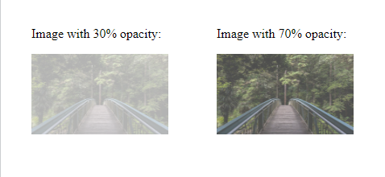
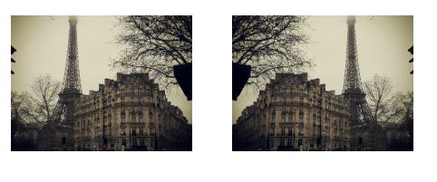
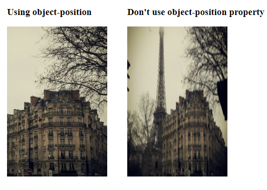
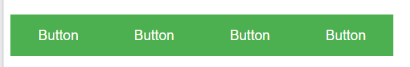

# 0. Content
1. CSS Tooltips
2. CSS Styling Image
3. CSS Image Reflections
4. CSS object-fit property
5. CSS object-position property
6. CSS Masking
7. CSS Buttons
8. CSS Pagination
9. CSS Multiple Columns
10. CSS User Interface
# 1. CSS Tooltips
- `Tooltip` là một thành phần giúp bạn chú thích thêm thông tin khi người dùng di chuột vào một đối tượng nào đó trong trang web.
## 1.1 Công cụ chú thích cơ bản
- Tạo một `tooltips` (công cụ chú giải) đơn giản sẽ xuất hiện khi người dùng di chuột vào một phần tử:

  VD:
  ```html
  <!-- CSS -->
  <style>
  /* Tooltip container */
  .tooltip {
    position: relative;
    display: inline-block;
    border-bottom: 1px dotted black; 
  }

  /* Tooltip text */
  .tooltip .tooltiptext {
    visibility: hidden;
    width: 120px;
    background-color: black;
    color: #fff;
    text-align: center;
    padding: 5px 0;
    border-radius: 6px;
  
    /* Position the tooltip text - see examples below! */
    position: absolute;
    z-index: 1;
  }

  /* Show the tooltip text when you mouse over the tooltip container */
  .tooltip:hover .tooltiptext {
    visibility: visible;
  }
  </style>

  <!-- HTML-->
  <div class="tooltip">Hover over me
    <span class="tooltiptext">Tooltip text</span>
  </div>
  ```


**Giải thích**: Chia làm 2 phần HTML và CSS

- Về HTML:
    - Sử dụng một phần tử chứa (vd như thẻ `<div>`) và đặt tên class cho thẻ `<div>` này là `class="tooltip"`. 
    - Sử dụng một phần tử nội tuyến (vd như `<span>`) để chứa đoạn văn bản chú thích, đặt tên class cho thẻ `<span>` này là `class="tooltiptext"`.
    - Khi di chuột vào thẻ `<div>` thì phần văn bản chú thích sẽ được hiển thị ra.
- Về CSS:
    - `Class tooltip` sử dụng thuộc tính `position:relative`, giá trị cần thiết để thiết lập ví trí của văn bản chú giải (`position:absolute`).
    - `Class tooltip` chứa văn bản chú thích. Mặc định nó được ẩn đi, và sẽ được hiển thị khi di chuột vào phần `class tooltip (:hover)`. Chúng ta cũng có thể thêm 1 số định kiểu cơ bản cho nó: như `width`, `background-color`, `color`,...
    - Thuộc tính `border-radius` được sử dụng để bo góc cho văn bản chú thích

<p align = "center">

</p>

## 1.2. Xác định vị trí của công cụ chú thích 
- Dựa vào ví dụ trên để xác định các vị trí khác nhau cho `tooltip`
### 1.2.1 Tooltip đặt ở bên phải của phần di chuột 
- Thiết lập các thuộc tính sau cho phần tử class `tooltiptext`
  ```css
  .tooltip .tooltiptext {
    top: -5px;
    left: 105%;
  }
  ```
  - `top: -5px;` được sử dụng để đặt `tooltip` nằm ở giữa của phần tử chứa nó. Sử dụng giá trị 5 vì văn bản `tooltip` có `padding` trên và dưới là 5px.

<p align = "center">

</p>

### 1.2.2. Tooltip đặt ở bên trái của phần di chuột 
- Tương tự thiết lập thuộc tính `right:105%;` ta sẽ xác định được vị trí `tooltip` nằm bên trái
  ```css
  .tooltip .tooltiptext {
    top: -5px;
    right: 105%;
  }
  ```

  <p align = "center">
  
  </p>

### 1.2.3. Tooltip đặt ở phía trên của phần di chuột 
- Thiết lập các giá trị sau cho class `tooltiptext` để đặt vị trí `tooltip` ở phía bên trên của phần di chuột 
  ```css
  .tooltip .tooltiptext {
    bottom: 100%;
    left: 50%;
    margin-left: -60px;
  }
  ```
  - Sử dụng thuộc tính `margin-left` với giá trị -60px. Thao tác này nhằm căn giữa `tooltip` bên trên/bên dưới văn bản có thể di chuột. Nó được đặt bằng một nửa chiều rộng của `tooltip` (120/2 = 60).


<p align = "center">

</p>

### 1.2.4. Tooltip đặt ở phía dưới của phần di chuột 
- Thiết lập các giá trị sau cho class `tooltiptext` để đặt vị trí `tooltip` ở phía bên trên của phần di chuột 
  ```css
  .tooltip .tooltiptext {
    top: 100%;
    left: 50%;
    margin-left: -60px;
  }
  ```

  <p align = "center">
  
  </p>

## 1.3. Mũi tên tooltip
- Để tạo một mũi tên sẽ xuất hiện từ một phía cụ thể của `tooltip`, hãy thêm nội dung "trống" sau `tooltip`, với `pseudo-element` class `::after` cùng với thuộc tính nội dung. Bản thân mũi tên được tạo bằng các đường viền. 

  VD: Mũi tên ở bên dưới `tooltip`, tức là phần `tooltip` ở phía trên của phần có thể di chuột.
  - Thêm các thiết lập sau kết hợp với phần định vị các ví trí ở ví dụ phía trên ta sẽ có được một mũi tên ở phía dưới `tooltip`, hướng vào phần di chuột

  ```css
  .tooltip .tooltiptext::after {
    content: "";
    position: absolute;
    top: 100%; /* đặt vị trí mũi tên ở phía dưới tooltip*/
    left: 50%; /*căn mũi tên ở trung tâm*/
    border-width: 5px; /*chỉ định kích thước của mũi tên*/
    border-style: solid;
    border-color: black transparent transparent transparent;
    margin-left: -5px; /*thay đổi theo giá trị border-width*/
  }
  ```
  <p align = "center">
    
  </p>

## 1.4. Hoạt ảnh trong tooltips
- Sử dụng thuộc tính `transition` CSS cùng với thuộc tính `opacity` để chuyển văn bản `tooltip` từ hoàn toàn ẩn sang hiển thị rõ 100% trong một số giây được chỉ định.

  VD:
  ```html
  <style>
  .tooltip {
    position: relative;
    display: inline-block;
    border-bottom: 1px dotted black;
  }

  .tooltip .tooltiptext {
    visibility: hidden;
    width: 120px;
    background-color: black;
    color: #fff;
    text-align: center;
    border-radius: 6px;
    padding: 5px 0;
    position: absolute;
    z-index: 1;
    bottom: 100%;
    left: 50%;
    margin-left: -60px;
    
    /* Fade in tooltip - takes 1 second to go from 0% to 100% opac: */
    opacity: 0;
    transition: opacity 1s;
  }

  .tooltip:hover .tooltiptext {
    visibility: visible;
    opacity: 1;
  }
  </style>

  <div class="tooltip">Hover over me
    <span class="tooltiptext">Tooltip text</span>
  </div>
  ```
# 2. CSS Styling Image
## 2.1. Bo góc hình ảnh
- Sử dụng thuộc tính `border-radius` để tạo những hình ảnh được bo góc.

  VD:
  ```html
  <style>
    img {
    border-radius: 30%;
  }
  </style>
  
  ```
<p align = "center">
  
</p>

## 2.2. Thumbnail Image
- Một `thumbnail image` (hình ảnh thu nhỏ) là một hình ảnh nhỏ đại diện cho một hình ảnh lớn hơn, và thường được nhận ra với một đường viền bao quanh nó
- Sử dụng thuộc tính border để tạo 1 hình ảnh thu nhỏ

  VD:
  ```html
  <style>
  img {
    border: 1px solid #ddd; /* Gray border */
    border-radius: 4px;  /* Rounded border */
    padding: 5px; /* Some padding */
    width: 150px; /* Set a small width */
  }

  /* Add a hover effect (blue shadow) */
  img:hover {
    box-shadow: 0 0 2px 1px rgba(0, 140, 186, 0.5);
  }
  </style>
  <body>

  <a target="_blank" href="img_forest.jpg">
    
  </a>
  </body>
  ```
<p align = "center">
  
</p>

## 2.3. Đặt một hình ảnh ở trung tâm
VD: 
  ```html
  <style>
  .center {
    display: block;
    margin-left: auto;
    margin-right: auto;
    width: 50%;
  }
  </style>
  
  ```
*Lưu ý:* Hình ảnh không thể được đặt ở vị trí trung tâm nếu như nó được thiết lập chiều rộng là 100% (full-width)
<p align = "center">
  
</p>

## 2.4. Responsive Image
- Hình ảnh linh hoạt là hình ảnh sẽ tự động thay đổi kích thước để phù hợp với kích thước của màn hình trình duyệt.

  VD:
  ```html
  <meta name="viewport" content="width=device-width, initial-scale=1">
  <style>
  .responsive {
    width: 100%;
    height: auto;
  }
  </style>
  </head>
  
  ```
- Nếu muốn giảm tỷ lệ kích thước của một hình ảnh, những không bao giờ được tăng tỷ lệ kích thước của một hình ảnh lớn hơn kích thước ban đầu của nó thì sử dụng thuộc tính `max-width: 100%` thay cho `width: 100%`.

  VD:
  ```html
  <meta name="viewport" content="width=device-width, initial-scale=1">
  <style>
  .responsive {
    max-width: 100%;
    height: auto;
  }
  </style>
  </head>
  
  ```
- Khi kích thước màn hình nhỏ hơn kích thước ảnh, hình ảnh sẽ thu nhỏ tỷ lệ bằng chiều rộng của màn hình
<p align = "center">
  
</p>

- Tăng kích thước màn hình cho đến khi lớn hơn kích thước ảnh, hình ảnh sẽ tăng kích thước đến khi bằng kích thước ban đầu của nó rồi dừng lại không tăng thêm để bằng chiều rộng của màn hình
<p align = "center">
  
</p>

## 2.5. Polaroid Images/Cards
  VD
  ```html
  <style>
  body {margin:25px;}

  div.polaroid {
    width: 80%;
    background-color: white;
    box-shadow: 0 4px 8px 0 rgba(0, 0, 0, 0.2), 0 6px 20px 0 rgba(0, 0, 0, 0.19);
    margin-bottom: 25px;
  }

  div.container {
    text-align: center;
    padding: 10px 20px;
  }
  </style>
  <div class="polaroid">
    
    <div class="container">
    <p>Cinque Terre</p>
    </div>
  </div>
  ```
<p align = "center">
  
</p>

## 2.6. Transparent Image
- Sử dụng thuộc tính `opacity` để làm cho hình ảnh có độ mờ.
 Thuộc tính này nhận các giá trị từ `0.0-1.0`

  VD:
  ```html
  <style>
  div {
  float: left;
  margin: 30px;
  }
  .img1 {
    opacity: 0.3;
  }
  .img2 {
    opacity: 0.7;
  }
  </style>
  <div>
    <p>Image with 30% opacity:</p>
    
  </div>
  <div>
    <p>Image with 70% opacity:</p>
    
  </div>
  ```
<p align = "center">
  
</p>

## 2.7. Image Filters
- Thuộc tính `filter` của CSS được sử dụng để thêm những hiệu ứng hình ảnh (giống như làm mờ hay độ bão hòa) cho một phần tử

  VD:
  ```html
  <style>
  body {
    background-color:white;
  }
  img {
    width: 33%;
    height: auto;
    float: left; 
    max-width: 235px;
  }

  .blur {filter: blur(4px);}
  .brightness {filter: brightness(250%);}
  .contrast {filter: contrast(180%);}
  .grayscale {filter: grayscale(100%);}
  .huerotate {filter: hue-rotate(180deg);}
  .invert {filter: invert(100%);}
  </style>
  
  
  
  
  
  
  ```
<p align = "center">
  
</p>

## 2.8.Image Hover Overlay

- Tạo một hiệu ứng che phủ hình ảnh khi di chuột vào một phần tử

  VD: Khi di chuột vào ảnh, ảnh sẽ mờ đi vào bị che phủ bởi một khối văn bản
  ```html
  <style>
  .container {
    position: relative;
    width: 50%;
  }

  .image {
    opacity: 1;
    display: block;
    width: 100%;
    height: auto;
    transition: .5s ease;
    backface-visibility: hidden;
  }

  .middle {
    transition: .5s ease;
    opacity: 0;
    position: absolute;
    top: 50%;
    left: 50%;
    transform: translate(-50%, -50%);
    -ms-transform: translate(-50%, -50%)
  }

  .container:hover .image {
    opacity: 0.3;
  }

  .container:hover .middle {
    opacity: 1;
  }

  .text {
    background-color: #4CAF50;
    color: white;
    font-size: 16px;
    padding: 16px 32px;
  }
  </style>
  <h2>Fade in a Box</h2>

  <div class="container">
    
    <div class="middle">
      <div class="text">John Doe</div>
    </div>
  </div>
  ```
<p align = "center">
  
</p>

- Có thêm tham khảo một số hiệu ứng che phủ hình ảnh khác tại [Image Hover Overlay](https://www.w3schools.com/css/css3_images.asp)

## 2.9. Flip an Image
- Để `đảo/lật ngược` một hình ảnh khi di chuột vào, chúng ta sử dụng thuộc tính `transform: scale()`

VD:
- Lật ngược hình ảnh theo phương ngang (trục X):
  ```html
  <style>
  .imgX:hover {
    transform: scaleX(-1);
  }
  img {
  margin: 20px;
  }
  </style>
  

  <!--Hình ảnh lật khi di chuột-->
   
  ```
<p align = "center">
  
</p>

- Lật ngược hình ảnh theo trục Y:
  ```html
  <style>
  .imgY:hover {
    transform: scaleY(-1);
  }
  img {
  margin: 20px;
  }
  </style>
  
  <br>
  <!--Hình ảnh lật khi di chuột-->
   
  ```
<p align = "center">
  
</p>

# 3. CSS Image Reflections
## 3.1. Image reflections
- Thuộc tính `box-reflect` được sử dụng để tạo sự phản chiếu của một hình ảnh.
- Thuộc tính `box-reflect` có các giá trị sau: `below`, `above`, `left`, hoặc `right`.

VD:
- Tạo phản chiếu sang bên phải của hình ảnh:

  ```html
  <style>
  img {
    -webkit-box-reflect: right;
  }
  </style>
  <p>Show the reflection to the right of the image:</p>
  
  ```
  <p align = "center">
  
  </p>

## 3.2. Reflection Offset
- Để chỉ định một `khoảng cách giữa hình ảnh và sự phản chiếu` của nó, ta `thêm 1 giá trị khoảng cách` vào thuộc tính `box-refect`:

  VD:
  ```html
  <style>
  img {
    -webkit-box-reflect: right 50px;
  }
  </style>
  <p>Show the reflection to the right of the image:</p>
  
  ```
<p align = "center">

</p>

## 3.3. Reflection with gradient
- Để tạo một hiệu ứng chuyển đổi cho phần phản chiều của một hình ảnh, bằng cách thêm hàm `linear-gradient(direction, color1, color2,...)`

  VD:
  ```html
  <style>
  img {
    -webkit-box-reflect: right 0px linear-gradient(to right, rgba(0,0,0,0.0), rgba(0,0,0,0.4));
  }
  </style>
  
  ```
<p align = "center">

</p>

# 4. CSS object-fit property
## 4.1. Thuộc tính object-fit
- Thuộc tính `object-fit` được sử dụng để định nghĩa một hình ảnh hoặc video nên được đặt lại kích thước như thế nào để phù hợp với phần chứa nó.
- Thuộc tính này yêu cầu nội dung để lấp đầy phần chứa bằng nhiều cách khác nhau, ví dụ như giữ nguyên tỷ lệ khung hình đó hoặc kéo dãn và chiếm một khoảng không gian nhiều nhất có thể.
- Thuộc tính `object-fit` có các giá trị sau:
  - `fill`: (mặc định)-hình ảnh được đặt lại kích thước để lấp đầy kích thước được chỉ định. Nếu cần thiết, hình ảnh sẽ được kéo dãn hoặc co lại để cho phù hợp.
  - `contain`: Hình ảnh giữ nguyên tỷ lệ, những nó được đặt lại kích thước để phù hợp với kích thước được chỉ định.
  - `cover`: Hình ảnh giữ nguyên tỷ lệ và lấp đầy kích thước được chỉ định. Hình ảnh sẽ được cắt bớt để cho phù hợp.
  - `none`: Hình ảnh không được đặt lại kích thước
  - `scale-down`: Hình ảnh được thu nhỏ lại thành phiên bản nhỏ nhất của `none` và `contain`.

VD: 
- `object-fit: cover;`
  ```html
  <style>
  div{
    float: left;
    margin: 20px;
  }
  .img1 {
    width: 200px;
    height: 300px;
    object-fit: cover;
  }
  </style>

  <div>
    <h3>Using object-fit: cover</h3>
    
  </div>

  <div>
    <h3>Don't use object-fit property</h3>
    
  </div>
  ```
  <p align = "center">
  
  </p>

- `object-fit: fill;`
  ```html
  <style>
  div{
    float: left;
    margin: 20px;
  }
  .img1 {
    width: 200px;
    height: 300px;
    object-fit: fill;
  }
  </style>

  <div>
    <h3>Using object-fit: fill</h3>
    
  </div>

  <div>
    <h3>Don't use object-fit property</h3>
    
  </div>
  ```
  <p align = "center">
  
  </p>

- `object-fit: contain;`
  ```html
  <style>
  div{
    float: left;
    margin: 20px;
  }
  .img1 {
    width: 200px;
    height: 300px;
    object-fit: contain;
  }
  </style>

  <div>
    <h3>Using object-fit: contain</h3>
    
  </div>

  <div>
    <h3>Don't use object-fit property</h3>
    
  </div>
  ```
  <p align = "center">
  
  </p>

- `object-fit: none;`
  ```html
  <style>
  div{
    float: left;
    margin: 20px;
  }
  .img1 {
    width: 200px;
    height: 300px;
    object-fit: none;
  }
  </style>

  <div>
    <h3>Using object-fit: none</h3>
    
  </div>

  <div>
    <h3>Don't use object-fit property</h3>
    
  </div>
  ```
  <p align = "center">
  
  </p>
- `object-fit: scale-down;`
  ```html
  <style>
  div{
    float: left;
    margin: 20px;
  }
  .img1 {
    width: 200px;
    height: 300px;
    object-fit: scale-down;
  }
  </style>

  <div>
    <h3>Using object-fit: scale-down</h3>
    
  </div>

  <div>
    <h3>Don't use object-fit property</h3>
    
  </div>
  ```
  <p align = "center">
  
  </p>

# 5. CSS object-position property
- Thuộc tính `object-position` được sử dụng để chỉ định một hình ảnh hay video được đặt ở vị trí nào trong phần tử chứa nó.
- Giả sử rằng một phần của hình ảnh được hiển thị mà không phải vị trí như chúng ta muốn. Xác định vị trí hình ảnh mong muốn, chúng ta sẽ sử dụng thuộc tính `object-position`.
- Nó có 2 giá trị: một trục là `trên-dưới` và 2 là `trái-phải`. Những con số này có thể được để là `phần trăm (%), pixel(px), đơn vị đo lường, có thể là giá trị âm` hoặc cũng có thể là các giá trị như `center`, `top`, `right`, `bottom`,...

  VD:
  ```html
  <style>
    div{
      float: left;
      margin: 20px;
    }
    .img1 {
      width: 200px;
      height: 300px;
      object-fit: cover;
      object-position: 80% 100%;
    }
  </style>

  <div>
    <h3>Using object-position</h3>
    
  </div>

  <div>
    <h3>Don't use object-position property</h3>
    
  </div>
  ```
  <p align = "center">
  
  </p>

# 6. CSS Masking
- Sử dụng CSS masking tạo một lớp mặt nạ để đặt lên trên một phần tử để ẩn đi một phần hoặc toàn bộ các thành phần của phần tử đó.
## 6.1. Thuộc tính mask-image
- Thuộc tính `mask-image` định nghĩa một hình ảnh được sử dụng như một lớp mặt nạ cho một phần tử .
- Hình ảnh lớp mặt nạ có thể là một hình ảnh PNG, SVG, gradient,...
### 6.1.1. Sử dụng hình ảnh như lớp mặt nạ
- Để sử dụng một hình ảnh PNG hoặc SVG như một lớp mặt nạ, sử dụng một giá trị `url()` để chuyển hình ảnh vào lớp mặt nạ
- Hình ảnh mặt nạ cần có một vùng trong suốt hoặc bán trong suốt. Màu đen hiển thị hoàn toàn trong suốt.  

VD:
- Chúng ta sử dụng hình ảnh dưới đây như là một hình ảnh mặt nạ - `w3logo.png`:
<p align = "center">

</p>

- Đây là một hình ảnh gốc ban đầu - `img_5terre.jpg`:

  <p align = "center">
  
  </p>
- Chương trình:
  ```html
  <style>
  .mask1 {
    -webkit-mask-image: url(w3logo.png);
    mask-image: url(w3logo.png);
    -webkit-mask-repeat: no-repeat;
    mask-repeat: no-repeat;    
  }
  </style>
    <h3>An image with a mask layer image:</h3>
    <div class="mask1">
    
  </div>
  ```
<p align = "center">

</p>

### 6.1.2. Sử dụng gradiens như lớp mặt nạ
- CSS `linear` và `radial gradients` cũng có thể được sử dụng như những hình ảnh mặt nạ
- Cú pháp:
  ```css
  selector {
    /* Linear-gradient*/
    mask-image: linear-gradient(direction, color, transparent);

    /* radial-gradient*/
    mask-image: radial-gradient(shape, color, transparent);
  }
  ```

VD: 
- `Linear gradient` như một lớp mặt nạ
  ```html
  <style>
  .mask1 {
    -webkit-mask-image: linear-gradient(to bottom, rgba(0, 0, 0, 0), rgba(0, 0, 0, 1));
    mask-image: linear-gradient(to bottom, rgba(0, 0, 0, 0), rgba(0, 0, 0, 1));
  }
  </style>
  <h3>A linear gradient as a mask layer:</h3>
  <div class="mask1">
  
  </div>
  ```
<p align = "center">

</p>

- `Radial gradient` như một lớp mặt nạ

  ```html
  <style>
  .mask2 {
    -webkit-mask-image: radial-gradient(circle, black 30%, rgba(0, 0, 0, 0.5) 30%);
    mask-image: radial-gradient(circle, black 30%, rgba(0, 0, 0, 0.5) 30%);
  }
  </style>
  <h3>A radial gradient as a mask layer (a circle):</h3>
  <div class="mask2">
  
  </div>
  ```

<p align = "center">

</p>

### 6.1.3. Sử dụng SVG như một lớp mặt nạ
- Phần tử SVG `<mask>` có thể được sử dụng bên trong đồ họa SVG để tạo hiệu ứng mặt nạ.

  VD:
  - Một `SVG mask layer` (formed as a triangle):

  ```html
  <h3>An SVG mask layer (được hiển thị như một tam giác):</h3>
  <svg width="600" height="400">
    <mask id="svgmask1">
      <polygon fill="#ffffff" points="200 0, 400 400, 0 400"></polygon>
    </mask>
    <image xmlns:xlink="http://www.w3.org/1999/xlink" xlink:href="img_5terre.jpg" mask="url(#svgmask1)"></image>
  </svg>
  ```
<p align = "center">

</p>

- Một `SVG mask layer` (được hiển thị như một hình tròn):
  ```html
  <svg width="600" height="400">
    <mask id="svgmask3">
      <circle fill="#ffffff" cx="75" cy="75" r="75"></circle>
      <circle fill="#ffffff" cx="80" cy="260" r="75"></circle>
      <circle fill="#ffffff" cx="270" cy="160" r="75"></circle>
      <circle fill="#ffffff" cx="470" cy="120" r="85"></circle>
    </mask>
    <image xmlns:xlink="http://www.w3.org/1999/xlink" xlink:href="img_5terre.jpg" mask="url(#svgmask3)"></image>
  </svg>
  ```

<p align = "center">

</p>

# 7. CSS Buttons
## 7.1 Basic Button Styling
- Có các cách để tạo một button đơn giản như ví dụ dưới đây

  ```html
  <style>
  .button {
    background-color: #4CAF50;
    border: 2px solid red;
    color: white;
    padding: 15px 32px;
    width: 50px;
    text-align: center;
    text-decoration: none;
    display: inline-block;
    font-size: 16px;
    margin: 4px 2px;
    border-radius: 4px;
    cursor: pointer;
  }
  </style>
  <button>Default Button</button>
  <a href="#" class="button">Link Button</a>
  <button class="button">Button</button>
  <input type="button" class="button" value="Input Button">
  ```
<p align = "center">

</p>

- Ở ví dụ trên, trong phần định kiểu style cho button chúng ta đã sử dụng các thuộc tính của CSS như:
  - `background-color`: để thay đổi màu nền cho một button.
  - `color`: để chỉ định màu chữ trong button.
  - `padding`: để thay đổi phần đệm (padding) của một button.
  - `border`: đễ xác định đường viền: độ dày, loại và màu đường viền.
  - `width`: xác định chiều rộng của button
  - `border-radius`: để bo góc cho đường viền .
  - `font-size`: để xác định kích thước phông chữ của một button.   
  ...

## 7.2. Một số định kiểu style khác cho button
### 7.2.1. Hoverable Buttons
- Sử dụng bộ chọn `:hover` để thay đổi định kiểu của một button khi mà chúng ta di chuột qua nó.
- Sử dụng thêm thuộc tính `transition-duration` để xác định tốc độ của hiệu ứng sau khi di chuột qua

  VD:
  ```html
  <style>
  .button {
    background-color: #4CAF50; /* Green */
    border: none;
    color: white;
    padding: 16px 32px;
    text-align: center;
    text-decoration: none;
    display: inline-block;
    font-size: 16px;
    margin: 4px 2px;
    transition-duration: 0.4s;
    cursor: pointer;
  }

  .button1 {
    background-color: white; 
    color: black; 
    border: 2px solid #4CAF50;
  }

  .button1:hover {
    background-color: #4CAF50;
    color: white;
  }
  </style>
  <h2>Hoverable Buttons</h2>
  <button class="button button1">Green</button>
  <button class="button button1">Green</button>
  ```
- Khi di chuột vào button bên trái, màu nền của button chuyển sang màu xanh lá, màu chữ chuyển sang màu trắng.

<p align = "center">

</p>

### 7.2.2. Shadow Buttons
- Sử dụng thuộc tính `box-shadow` để thêm những phần đổ bóng cho một button với cú pháp:

  ```css
  button {
    box-shadow: h-offset v-offset blur color;
  }
  ```
### 7.2.3. Disabled Buttons
- Sử dụng thuộc tính `opacity` để thêm độ trong suốt tới một button (giống như tạo ra một cái nút bị vô hiệu hóa).
- Chúng ta cũng có thể thêm thuộc tính `cursor: not-allowed;` để khi di chuột vào button sẽ có một `ký hiệu cấm` được hiển thị lên.  
VD: 
  ```css
  .disabled {
    opacity: 0.6;
    cursor: not-allowed;
  }
  ```

  VD: `Shawdow và Disabled Buttons`
  ```html
  <style>
  .button {
    background-color: #4CAF50; /* Green */
    border: none;
    color: white;
    padding: 16px 32px;
    text-align: center;
    text-decoration: none;
    display: inline-block;
    font-size: 16px;
    margin: 4px 2px;
    transition-duration: 0.4s;
    cursor: pointer;
  }

  .button1 {
    background-color: white; 
    color: black; 
    border: 2px solid #4CAF50;
    box-shadow: 5px 5px 3px gray, 3px 3px 3px rgba(125,125,125,0.6)
  }

  .button2 {
    opacity: 0.5;
    cursor: not-allowed;
  }

  </style>
  <h2>Shadow Buttons</h2>
  <button class="button button1">Button1</button>
  <h2>Disabled Buttons</h2>
  <button class="button button2">Button2</button>
  ```

<p align = "center">

</p>

### 7.2.4. Button groups
- Để tạo một nhóm các button, chúng ta bỏ thuộc tính `margin` đi và thêm một thuộc tình `float:left;` vào trong phần định kiểu của button

  VD:
  ```html
  <style>
  .btn-group .button {
    background-color: #4CAF50; /* Green */
    border: none;
    color: white;
    padding: 15px 32px;
    text-align: center;
    text-decoration: none;
    display: inline-block;
    font-size: 16px;
    cursor: pointer;
    float: left;
  }
  </style>
  <div class="btn-group">
    <button class="button">Button</button>
    <button class="button">Button</button>
    <button class="button">Button</button>
    <button class="button">Button</button>
  </div>
  ```
<p align = "center">

</p>

- Như ví dụ trên, nhóm button được tạo đặt theo hàng ngang, nếu chúng ta muốn có một nhóm các button đặt theo hàng dọc, thì chúng ta bỏ thuộc tính `float:left;` đi và thay bằng thuộc tính `display:block;`

<p align = "center">

</p>

### 7.2.5. Hoạt ảnh của button
- Ví dụ tạo một hiệu ứng nhấn khi click vào button

  ```html
  <style>
  .button {
    display: inline-block;
    padding: 15px 25px;
    font-size: 24px;
    cursor: pointer;
    text-align: center;
    text-decoration: none;
    outline: none;
    color: #fff;
    background-color: #4CAF50;
    border: none;
    border-radius: 15px;
    box-shadow: 0 9px #999;
  }

  .button:active {
    background-color: #3e8e41;
    box-shadow: 0 5px #666;
    transform: translateY(4px);
  }
  </style>
  <button class="button">Click Me</button>
  ```
- Sử dụng thuộc tính `transform: translateY(4px);` để khi button được click vào thì button sẽ dịch chuyển vị trí xuống dưới theo trục Y 1 khoảng để tạo hiệu ứng giống như nó được nhấn xuống.   
...

# 8. CSS Pagination
## 8.1. Simple Pagination
- Nếu một trang web có nhiều trang, chúng ta có thể thêm vào 1 phân trang đơn giản tới mỗi trang web như sau:
  ```html
  <style>
  .pagination {
    display: inline-block;
  }

  .pagination a {
    color: black;
    float: left;
    padding: 8px 16px;
    text-decoration: none;
  }
  </style>
  <div class="pagination">
    <a href="#">&laquo;</a>
    <a href="#">1</a>
    <a href="#">2</a>
    <a href="#">3</a>
    <a href="#">4</a>
    <a href="#">5</a>
    <a href="#">6</a>
    <a href="#">&raquo;</a>
  </div>
  ```
<p align = "center">

</p>

## 8.2. Active and Hoverable Pagination
- Định kiểu làm nổi bật trang web hiện tại với một class `.active`, và sử dụng bộ chọn `:hover` để thay đổi kiểu cho liên kết mỗi trang khi người dùng di chuột qua nó.  
VD:
  ```html
  <style>
  .pagination {
    display: inline-block;
  }

  .pagination a {
    color: black;
    float: left;
    padding: 8px 16px;
    text-decoration: none;
  }

  /*Định kiểu cho trang web hiện tại: màu nền xanh, chữ màu trắng, bo góc */
  .pagination a.active {
    background-color: #4CAF50;
    color: white;
    border-radius: 5px;
  }

  /*Định kiểu cho những liên kết trang khác với màu nền xám, bo góc khi di chuột qua nó*/
  .pagination a:hover:not(.active) {
    background-color: #ddd;
    border-radius: 5px;
  }
  </style>
  <div class="pagination">
    <a href="#">&laquo;</a>
    <a href="#">1</a>
    <a href="#" class="active">2</a>
    <a href="#">3</a>
    <a href="#">4</a>
    <a href="#">5</a>
    <a href="#">6</a>
    <a href="#">&raquo;</a>
  </div>
  ```

  <p align = "center">
  
  </p>

## 8.3. Rounded Borders
- Ở ví dụ bên trên, chúng ta đã thực hiện tạo đường viền và bo góc cho tất cả các liên kết trang. Ví dụ sau đây chúng ta chỉ tạo bo góc cho liên kết đầu tiên và cuối cùng của danh sách phân trang bằng cách sử dụng bộ chọn `:first-child` và `:last-child`

  ```html
  <style>
  .pagination {
    display: inline-block;
  }

  .pagination a {
    color: black;
    float: left;
    padding: 8px 16px;
    text-decoration: none;
    border: 1px solid #ddd;
  }

  .pagination a.active {
    background-color: #4CAF50;
    color: white;
    border: 1px solid #4CAF50;
  }

  .pagination a:hover:not(.active) {
    background-color: #ddd;
  }

  .pagination a:first-child {
    border-top-left-radius: 5px;
    border-bottom-left-radius: 5px;
  }

  .pagination a:last-child {
    border-top-right-radius: 5px;
    border-bottom-right-radius: 5px;
  }
  </style>
  <div class="pagination">
    <a href="#">&laquo;</a>
    <a href="#">1</a>
    <a class="active" href="#">2</a>
    <a href="#">3</a>
    <a href="#">4</a>
    <a href="#">5</a>
    <a href="#">6</a>
    <a href="#">&raquo;</a>
  </div>
  ```
  <p align = "center">
  
  </p>

## 8.4. Một số định kiểu khác cho phân trang
- Tạo khoảng cách giữa các liên kết trong trang: sử dụng thuộc tính `margin`
- Thay đổi kích thước phân trang: sử dụng thuộc tính `font-size`
- Căn giữa cho phân trang: sử dụng thuộc tính `text-align: center;`

  VD:
  ```html
  <style>
  .center {
    text-align: center;
  }
  .pagination {
    display: inline-block;
  }

  .pagination a {
    color: black;
    float: left;
    font-size: 30px;
    margin: 0 5px;
    padding: 8px 16px;
    text-decoration: none;
    border: 1px solid #ddd;
  }

  .pagination a.active {
    background-color: #4CAF50;
    color: white;
    border: 1px solid #4CAF50;
  }

  .pagination a:hover:not(.active) {background-color: #ddd;}

  .pagination a:first-child {
    border-top-left-radius: 5px;
    border-bottom-left-radius: 5px;
  }

  .pagination a:last-child {
    border-top-right-radius: 5px;
    border-bottom-right-radius: 5px;
  }
  </style>
  <div class="center">
    <div class="pagination">
      <a href="#">&laquo;</a>
      <a href="#">1</a>
      <a class="active" href="#">2</a>
      <a href="#">3</a>
      <a href="#">4</a>
      <a href="#">5</a>
      <a href="#">6</a>
      <a href="#">&raquo;</a>
    </div>
  </div>
  ```
  <p align = "center">
  
  </p>

# 9. CSS Multiple Columns
- Bố cục nhiều cột trong CSS cho phép xác định số lượng cột của văn bản một cách dễ dàng - giống như trên những tờ báo/tạp chí
- Những thuộc tính của CSS `multi-column`:
  - `column-count`: định nghĩa một phần tử có thể được chia thành bao nhiêu cột
  - `column-gap`: định nghĩa khoảng cách giữa các cột
  - `column-rule-style`: định nghĩa kiểu style phân tách giữa các cột (có thể là `solid, dotted, double`,...)
  - `column-rule-width`: định nghĩa độ dày của đường phân tách giữa các cột.
  - `column-rule-color`: định nghĩa màu sắc của đường phân tách.
  - `column-rule`: là thuộc tính viết gọn cho các thuộc tính theo thứ tự `column-rule-width`, `column-rule-style`, `column-rule-color`.
  - `column-span`: định nghĩa một phần tử sẽ phân chia nội dung trải dài qua bao nhiêu cột.
  - `column-width`: định nghĩa chiều rộng được khuyến cáo, tối ưu cho các cột.

  VD:
  ```html
    <style> 
    .newspaper {
      column-count: 3;
      column-gap: 40px;
      column-rule: 3px dashed lightblue;
    }

    h2 {
      column-span: all;
    }

    p {
      column-width: 150px;
    }
    </style>

    <div class="newspaper">
    <h2>Lorem Ipsum Dolor Sit Amet</h2>
    Lorem ipsum dolor sit amet, consectetuer adipiscing elit, sed diam nonummy nibh euismod tincidunt ut laoreet dolore magna aliquam erat volutpat. Ut wisi enim ad minim veniam, quis nostrud exerci tation ullamcorper suscipit lobortis nisl ut aliquip ex ea commodo consequat. Duis autem vel eum iriure dolor in hendrerit in vulputate velit esse molestie consequat, vel illum dolore eu feugiat nulla facilisis at vero eros et accumsan et iusto odio dignissim qui blandit praesent luptatum zzril delenit augue duis dolore te feugait nulla facilisi. Nam liber tempor cum soluta nobis eleifend option congue nihil imperdiet doming id quod mazim placerat facer possim assum.
    </div>
    <h3>Column-width property</h3>
    <p>Lorem ipsum dolor sit amet, consectetuer adipiscing elit, sed diam nonummy nibh euismod tincidunt ut laoreet dolore magna aliquam erat volutpat. Ut wisi enim ad minim veniam, quis nostrud exerci tation ullamcorper suscipit lobortis nisl ut aliquip ex ea commodo consequat. Duis autem vel eum iriure dolor in hendrerit in vulputate velit esse molestie consequat, vel illum dolore eu feugiat nulla facilisis at vero eros et accumsan et iusto odio dignissim qui blandit praesent luptatum zzril delenit augue duis dolore te feugait nulla facilisi. Nam liber tempor cum soluta nobis eleifend option congue nihil imperdiet doming id quod mazim placerat facer possim assum.</p>
    ```

  <p align = "center">
  
  </p>

# 10. CSS User Interface
## 10.1. CSS Resizing
- Sử dụng thuộc tính `resize` để định nghĩa một phần tử có thể được người dùng thay đổi kích thước như thế nào.
- Để thay đổi kích thước phần tử trên cửa sổ trình duyệt, chúng ta đặt con trỏ chuột vào góc dưới cùng bên phải của một phần tử để thực hiện.  

VD:
- Người dùng `chỉ có thể thay đổi được chiều rộng` của một phần tử sử dụng thuộc tính `resize: horizontal;`. Khi đặt con trỏ chuột vào góc dưới cùng bên phải, con trỏ chuột chuyển sang mũi tên nằm ngang. 
  ```html
  <style> 
  div {
    border: 2px solid;
    padding: 20px; 
    width: 300px;
    resize: horizontal; 
    overflow: auto;
  }
  </style>
  <h1>The resize Property</h1>

  <div>
    <p>Let the user resize only the width of this div element.</p>
    <p>To resize: Click and drag the bottom right corner of this div element.</p>
  </div>
  ```

- Người dùng `chỉ có thể thay đổi được chiều cao` của một phần tử sử dụng thuộc tính `resize: vertical;`. Khi đặt con trỏ chuột vào góc dưới cùng bên phải, con trỏ chuột chuyển sang mũi tên nằm dọc. 
  ```html
  <style> 
  div {
    border: 2px solid;
    padding: 20px; 
    width: 300px;
    resize: vertical; 
    overflow: auto;
  }
  </style>
  <h1>The resize Property</h1>

  <div>
    <p>Let the user resize only the height of this div element.</p>
    <p>To resize: Click and drag the bottom right corner of this div element.</p>
  </div>
  ```
- Người dùng `có thể thay đổi được cả chiều rộng và chiều cao` của một phần tử sử dụng thuộc tính `resize: both;`. Khi đặt con trỏ chuột vào góc dưới cùng bên phải, con trỏ chuột chuyển sang mũi tên nằm chéo. 
  ```html
  <style> 
  div {
    border: 2px solid;
    padding: 20px; 
    width: 300px;
    resize: both; 
    overflow: auto;
  }
  </style>
  <h1>The resize Property</h1>

  <div>
    
    <p>To resize: Click and drag the bottom right corner of this div element.</p>
  </div>
  ```
## 10.2. CSS outline Offset
- Thuộc tính `outline-offset` định nghĩa 1 khoảng cách giữa một đường bao ngoài (`outline`) và đường viền (`border`) của một phần tử.  
VD:
  ```html
  <style> 
  div.ex1 {
    margin: 20px;
    border: 1px solid black;
    outline: 4px solid red;
    outline-offset: 15px;
  }  
  </style>
  <h1>The outline-offset Property</h1>

  <div class="ex1">This div has a 4 pixels solid red outline 15 pixels outside the border edge.</div>
  ```
<p align = "center">
  
  </p>

# Summary
- Qua bài học này, chúng ta đã biết cách tạo ra những chú thích cho các phần tử, xác định các vị trí phần tử, cách phân trang, tạo bố cục nhiều cột cho các trang web...