# 0. Content
1. CSS Variables - The var() function
2. CSS Box Sizing
3. CSS Media Queries
4. CSS Responsive
5. CSS Flexbox
# 1. CSS Variables - The var() function
## 1.1. Hàm `var()`
### 1.1.1. Định nghĩa
- Hàm `var()` được sử dụng để chèn giá trị cho một biến CSS
- Chúng ta có thẻ tạo các biến với phạm vi toàn cục hoặc cục bộ, thay đổi những giá trị với JavaScript và thay đổi những giá trị dựa vào `media queries`.
- Một cách tốt để sử dụng các biến CSS là khi nói đến màu sắc trong thiết kế trang web của chúng ta. Thay vì sao chéo và dán những loại màu giống nhau lặp đi lặp lại, thì chúng ta có thể đặt nó trong các biến.
### 1.1.2. Cú pháp của hàm `var()`
- Cú pháp:
    ```css
    selector {
        property: var(--name, value);
    }
    ```
- Trong đó:
    - `name`: `(bắt buộc)` - đây là tên biến (`phải bắt đầu với hai dấu gạch ngang`).
    - `value`: giá trị dự phòng (sẽ được sử dụng nếu như biến không được tìm thấy) `(giá trị này có thể có hoặc không)`

### 1.1.3. Cách hoạt động của hàm `var()`
- Đầu tiên, các biến CSS có thể có một phạm vi toàn cục hoặc cục bộ.
- Biến toàn cục có thể được truy cập/sử dụng trên toàn bộ tài liệu, trong khi biến cục bộ có thể được sử dụng bên trong bộ chọn mà nó được khai báo.
- Để tạo một biến với phạm vi toàn cục, thì khai báo nó ở bên trong bộ chọn `:root`. Bộ chọn `:root`  khớp với phần tử gốc của tài liệu.
- Để tạo biến với phạm vi cục bộ, khai báo nó bên trong bộ chọn mà sẽ sử dụng nó.

    VD:
    ```html
    <style>
    :root {
    --blue: #1e90ff;
    --white: #ffffff; 
    }

    body {
    background-color: var(--blue);
    }

    h2 {
    border-bottom: 2px solid var(--blue);
    }

    .container {
    color: var(--blue);
    background-color: var(--white);
    padding: 15px;
    }

    button {
    background-color: var(--white);
    color: var(--blue);
    border: 1px solid var(--blue);
    padding: 5px;
    }
    </style>
    </head>
    <body>

    <h1>Using the var() Function</h1>

    <div class="container">
    <h2>Lorem Ipsum</h2>
    <p>Lorem ipsum dolor sit amet, consectetur adipiscing elit. Etiam semper diam at erat pulvinar, at pulvinar felis blandit.</p>
    <p>
        <button>Yes</button>
        <button>No</button>
    </p>
    </div>
    ```
<p align = "center">
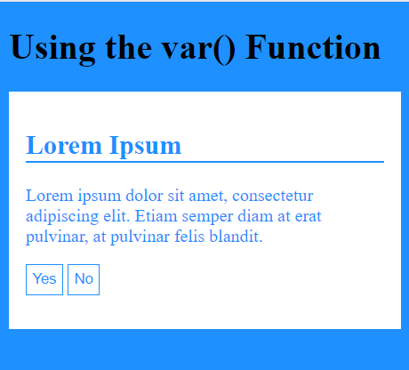
</p>

- Lợi ích của việc sử dụng hàm `var()`:
    - Làm cho mã code dễ đọc hơn.
    - Làm cho việc thay đổi giá trị màu dễ dàng hơn. Thay vì đi thay đổi giá trị của tất cả khai báo trong các bộ chọn thì giờ đây chỉ cần thay đổi mỗi giá trị ở biến.

## 1.2. CSS Overriding variables
### 1.2.1. Ghi đè biến toàn cục bằng biến cục bộ
- Ở ví dụ của phần trước, chúng ta sử dụng biến toàn cục `--blue` và `--white` cho toàn bộ tài liệu. Nhưng đôi khi chúng ta muốn các biến chỉ thay đổi ở một phần cụ thể nào đó trong trang. 
- Giả sử, chúng ta muốn phần tử button có một màu chữ xanh khác, thì chúng ta có thể tạo 1 biến màu khác hoặc khai báo lại biến `--blue` trong bộ chọn button. Thì lúc này, khi người dùng sử dụng `var(--blue)` bên trong bộ chọn button này, nó sẽ sử dụng giá trị biến cục bộ `--blue` được khai báo ở đây.

- Do đó, chúng ta thấy rằng biến cục bộ `--blue` sẽ ghi đè biến toàn cục `--blue` cho phần tử button.

    VD:
    ```html
    <style>
    :root {
    --blue: #1e90ff;
    --white: #ffffff;
    }

    body {
    background-color: var(--blue);
    }

    h2 {
    border-bottom: 2px solid var(--blue);
    }

    .container {
    color: var(--blue);
    background-color: var(--white);
    padding: 15px;
    }

    button {
    --blue: #0000ff; /* local variable will override global */
    background-color: var(--white);
    color: var(--blue);
    border: 1px solid var(--blue);
    padding: 5px;
    }
    </style>
    <h1>Override Global Variable With Local Variable</h1>

    <div class="container">
    <h2>Lorem Ipsum</h2>
    <p>Lorem ipsum dolor sit amet, consectetur adipiscing elit. Etiam semper diam at erat pulvinar, at pulvinar felis blandit.</p>
    <p>
        <button>Yes</button>
        <button>No</button>
    </p>
    </div>
    ```
<p align = "center">
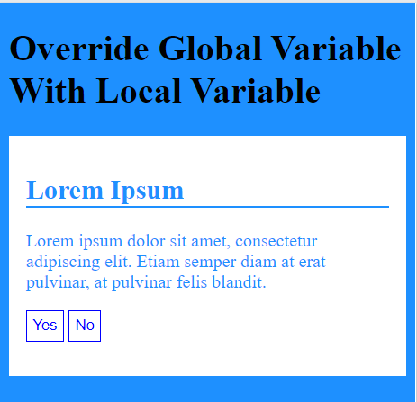
</p>

### 1.2.2. Tạo một biến cục bộ mới
- Nếu một biến chỉ được sử dụng ở một nơi duy nhất, chúng ta cũng có thể khai báo một biến cục bộ mới.  
    VD:
    ```html
    <style>
    :root {
    --blue: #1e90ff;
    --white: #ffffff; 
    }

    body {
    background-color: var(--blue);
    }

    h2 {
    border-bottom: 2px solid var(--blue);
    }

    .container {
    color: var(--blue);
    background-color: var(--white);
    padding: 15px;
    }

    button {
    --button-pink: #ff00ff; /* new local variable */
    background-color: var(--white);
    color: var(--button-blue);
    border: 1px solid var(--button-pink);
    padding: 5px;
    }
    </style>

    <h1>New Local Variable</h1>
    <div class="container">
    <h2>Lorem Ipsum</h2>
    <p>Lorem ipsum dolor sit amet, consectetur adipiscing elit. Etiam semper diam at erat pulvinar, at pulvinar felis blandit.</p>
    <p>
        <button>Yes</button>
        <button>No</button>
    </p>
    </div>
    ```

<p align = "center">
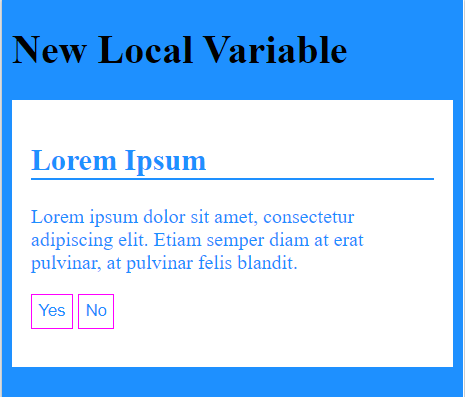
</p>

# 2. CSS Box Sizing
- Thuộc tính CSS `box-sizing` cho phép chúng ta bao gồm cả phần `padding` và đường viền vào trong chiều rộng và chiều cao của một phần tử
## 2.1. VD không sử dụng thuộc tính CSS box-sizing
- Mặc định, kích thước của một phần tử được tính theo công thức như sau:

    `width + padding + border = chiều rộng thực tế của một phần tử`

    `height + padding + border = chiều cao thực tế của một phần tử`

- Điều này có nghĩa là dù kích thước của một phần tử được thiết lập ban đầu là bao nhiêu thì khi hiển thị cũng sẽ thay đổi tùy thuộc vào kích thước của đường viền và `padding` được khai báo.

    VD:
    ```html
    <style> 
    .div1 {
    width: 300px;
    height: 100px;
    border: 1px solid blue;
    }

    .div2 {
    width: 300px;
    height: 100px;  
    padding: 50px;
    border: 1px solid red;
    }
    </style>
    <h1>Without box-sizing</h1>

    <div class="div1">This div is smaller (width is 300px and height is 100px).</div>
    <br>
    <div class="div2">This div is bigger (width is also 300px and height is 100px).</div>
    ```

<p align = "center">
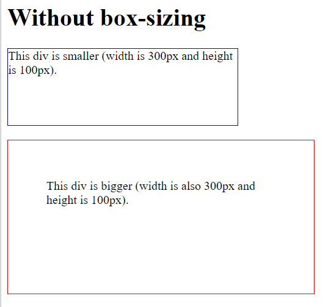
</p>

## 2.2. VD với thuộc tính box-sizing
- Nếu chúng ta khai báo thuộc tính `box-sizing: border-box;` cho một phần tử, thì phần `padding` và `border` đã được bao gồm trong kích thước của phần tử đó.
- Có nghĩa là khi chúng ta đã thiết lập một kích thước cho một phần tử, sau đó có khai báo phần `padding` và `border` bao nhiêu đi nữa thì khi hiển thị kích thước của phần tử vẫn không thay đổi.

    VD:
    ```html
    <style> 
    .div1 {
    width: 300px;
    height: 100px;
    border: 1px solid blue;
    box-sizing: border-box;
    }

    .div2 {
    width: 300px;
    height: 100px;  
    padding: 50px;
    border: 1px solid red;
    box-sizing: border-box;
    }
    </style>
    <h1>With box-sizing</h1>

    <div class="div1">Both divs are the same size now!</div>
    <br>
    <div class="div2">Hooray!</div>
    ```
<p align = "center">
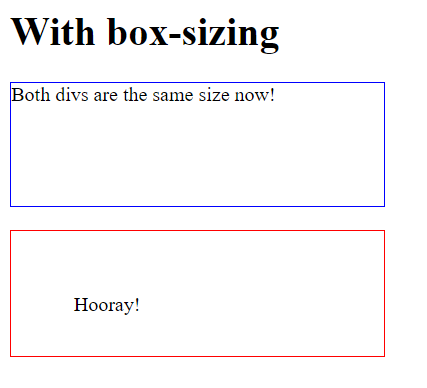
</p>

# 3. CSS Media Queries
## 3.1. CSS2 đã giới thiệu về Media Types
- Quy tắc `@media`, được giới thiệu trong CSS2, cho phép xác định các quy tắc kiểu style khác nhau cho các loại phương tiện khác nhau.

VD: chúng ta có thể có một bộ quy tắc kiểu cho màn hình máy tính, một cho máy in, một cho thiết bị cầm tay, một cho thiết bị kiểu tivi...
## 3.2. CSS3 đã giới thiệu về Media Queries
- `Truy vấn phương tiện (media queries)` trong CSS3 đã mở rộng ý tưởng về `loại phương tiện (media type)` trong CSS2: Thay vì tìm kiếm một loại thiết bị, chúng xem xét khả năng của thiết bị.
- Truy vấn phương tiện có thể được sử dụng để kiểm tra nhiều thứ, chẳng hạn như:
    - Chiều rộng và chiều cao của khung nhìn
    - Chiều rộng và chiều cao của thiết bị
    - Hướng (máy tính bảng/điện thoại ở chế độ ngang hay dọc?)
    - Nghị quyết
- Sử dụng truy vấn phương tiện là một kỹ thuật phổ biến để cung cấp để định kiểu phù hợp cho máy tính để bàn, máy tính xách tay, máy tính bảng và điện thoại di động.

## 3.3. Cú pháp media query
- Truy vấn phương tiện bao gồm một loại phương tiện và có thể chứa một hoặc nhiều biểu thức, các biểu thức này giải quyết đúng hoặc sai.  
Cú pháp:
    ```css
    @media not|only mediatype and (expressions) {
    CSS-Code;
    }
    ```
- Kết quả của truy vấn là đúng nếu như thỏa mãn các điều kiện sau:
    - Loại phương tiện được chỉ định trùng khớp với loại thiết bị mà tài liệu đang được hiển thị.
    - Tất cả các biểu thức trong truy vấn phương tiện đều đúng.

- Khi truy vấn phương tiện là đúng, bảng biểu định kiểu hoặc quy tắc kiểu tương ứng sẽ được áp dụng, tuân theo quy tắc xếp tầng thông thường.
- Chúng ta cũng có thể có các biểu định kiểu khác nhau cho các phương tiện khác nhau:
```html
<link rel="stylesheet" media="mediatype and|not|only (expressions)" href="print.css">
```
## 3.4. Các loại phương tiện trong CSS3
- Một số loại phương tiện trong CSS3 là:
    - `all`: sử dụng cho tất cả các thiết bị
    - `print`: sử dụng cho máy in
    - `screen`: sử dụng cho màn hình máy tính, máy tính bảng, điện thoại,..
    - `speech`: sử dụng cho màn hình đọc bằng âm thanh

## 3.5. Một số ví dụ sử dụng truy vấn phương tiện

- VD1: thay đổi màu nền thành màu xanh nhạt nếu chế độ xem rộng 480 pixel hoặc rộng hơn (nếu chế độ xem nhỏ hơn 480 pixel, màu nền sẽ có màu hồng):

    ```html
    <meta name="viewport" content="width=device-width, initial-scale=1.0">
    <style>
    body {
    background-color: pink;
    }

    @media screen and (min-width: 480px) {
    body {
        background-color: lightgreen;
    }
    }
    </style>
    <h1>Resize the browser window to see the effect!</h1>
    <p>The media query will only apply if the media type is screen and the viewport is 480px wide or wider.</p>
    ```
    - Khi màn hình có độ rộng nhỏ hơn 480px:
    <p align = "center">
    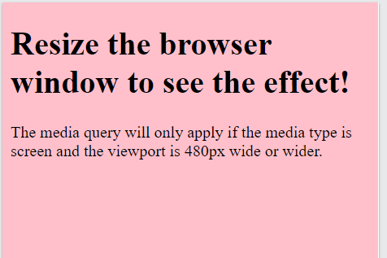
    </p>

    - Khi màn hình có độ rộng bằng hoặc lớn hơn 480px:
    <p align = "center">
    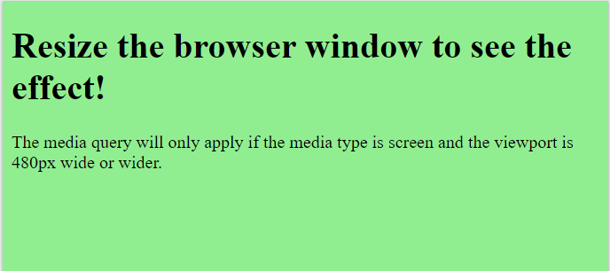
    </p>

- VD2: hiển thị menu sẽ nổi ở bên trái của trang nếu chế độ xem rộng 480 pixel hoặc rộng hơn (nếu chế độ xem nhỏ hơn 480 pixel, menu sẽ ở trên cùng của nội dung):

    ```html
    <meta name="viewport" content="width=device-width, initial-scale=1.0">
    <style>
    .wrapper {overflow: auto;}

    #main {margin-left: 4px;}

    #leftsidebar {
    float: none;
    width: auto;
    }

    #menulist {
    margin: 0;
    padding: 0;
    }

    .menuitem {
    background: #CDF0F6;
    border: 1px solid #d4d4d4;
    border-radius: 4px;
    list-style-type: none;
    margin: 4px;
    padding: 2px;
    }

    @media screen and (min-width: 480px) {
    #leftsidebar {
        width: 200px;
        float: left;
        }
    #main {
        margin-left: 216px;
        }
    }
    </style>
    <div class="wrapper">
    <div id="leftsidebar">
        <ul id="menulist">
        <li class="menuitem">Menu-item 1</li>
        <li class="menuitem">Menu-item 2</li>
        <li class="menuitem">Menu-item 3</li>
        <li class="menuitem">Menu-item 4</li>
        <li class="menuitem">Menu-item 5</li>
        </ul>
    </div>
    
    <div id="main">
        <h1>Resize the browser window to see the effect!</h1>
        <p>This example shows a menu that will float to the left of the page if the viewport is 480 pixels wide or wider. If the viewport is less than 480 pixels, the menu will be on top of the content.</p>
    </div>
    </div>
    ```

    - Khi màn hình có độ rộng nhỏ hơn 480px:

    <p align = "center">
    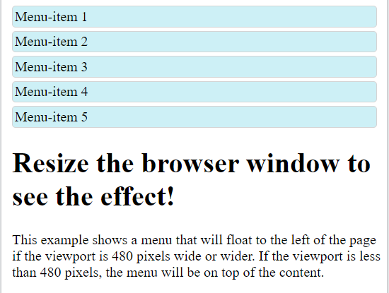
    </p>

    - Khi màn hình có độ rộng bằng hoặc lớn hơn 480px:

    <p align = "center">
    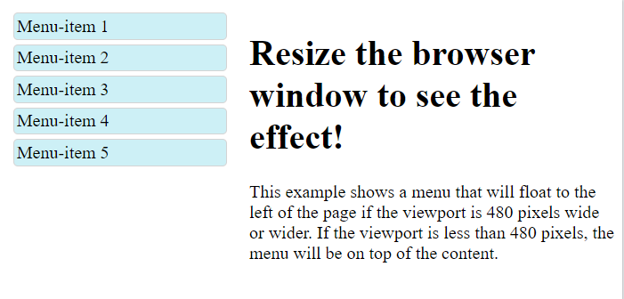
    </p>

- Chúng ta có thể tham khảo thêm 1 số ví dụ khác của truy vấn phương tiện tại [Media Queries Examples](https://www.w3schools.com/css/css3_mediaqueries_ex.asp)

# 4. CSS Responsive
## 4.1. Responsive Web Design - Introduction
- `Responsive Web Design (RWD - thiết kết web có tính linh hoạt)` làm cho trang web của chúng ta nhìn đẹp mắt trên tất cả các thiết bị.
- RWD `chỉ` sử dụng HTML và CSS, đây không phải là một chương trình hoặc Javascript.
- Các trang web không nên bỏ qua thông tin để phù hợp với các thiết bị nhỏ hơn, mà nên điều chỉnh nội dung của nó để phù hợp với bất kỳ thiết bị nào.

    VD: Bố cục của 1 trang web được điều chỉnh để hiển thị trên các thiết bị khác nhau:
<p align = "center">
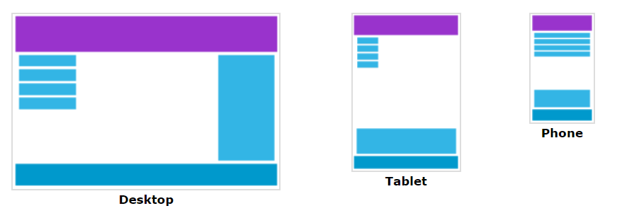
</p>

=> **Một trang web được gọi là RWD khi chúng ta tạo trang web sử dụng HTML và CSS để thay đổi kích thước, ẩn, thu nhỏ, phóng to hoặc di chuyển nội dung để làm cho nội dung trông đẹp mắt trên bất kỳ màn hình nào**.

## 4.2. Responsive Web Design - The Viewport
### 4.2.1. Khung nhìn là gì?
- Khung nhìn là khu vực hiển thị của người dùng trên trang web.
- Khung nhìn thay đổi theo thiết bị và sẽ nhỏ hơn trên điện thoại di động so với trên màn hình máy tính.
- Trước đây, trang web chỉ được thiết kế cho màn hình máy tính, các trang web thường có thiết kế và kích thước cố định.
- Tuy nhiên, sau này nhu cầu sử dụng các thiết bị như máy tính bảng và điện thoại nhiều hơn, các thiết bị này có kích thước màn hình nhỏ hơn máy tính nên việc hiện thị các trang web trên đây sẽ không được phù hợp. Để khắc phục điều này, các trình duyệt trên các thiết bị đó đã thu nhỏ toàn bộ trang web để vừa với màn hình.

### 4.2.2. Thiết lập khung nhìn
- HTML5 đã giới thiệu một phương pháp cho phép các lập trình viên web kiểm soát chế độ xem, thông qua thẻ `<meta>`
    ```html
    <meta name="viewport" content="width=device-width, initial-scale=1.0">
    ```
- Trong đó:
    - Phần `width=device-width` đặt chiều rộng của trang theo chiều rộng màn hình của thiết bị (sẽ thay đổi tùy theo thiết bị).
    - Phần `initial-scale=1.0` đặt mức thu phóng ban đầu khi trang được trình duyệt tải lần đầu tiên.

### 4.2.3. Kích thước nội dung cho khung hình
- Người dùng thường sử dụng thanh cuộn trang web theo chiều dọc trên tất cả các thiết bị để xem các nội dung.
- Người dùng chỉ sử dụng thanh cuộn ngang khi phóng to trang web lên, tuy nhiên điều này sẽ gây khó khăn khi muốn xem hết nội dung trên trang.

- Một số quy tắc trong việc xác định kích thước nội dung trong khung nhìn:
    - `KHÔNG sử dụng các phần tử có chiều rộng cố định lớn` - Ví dụ: nếu một hình ảnh được hiển thị ở chiều rộng rộng hơn khung nhìn, nó có thể khiến khung nhìn cuộn theo chiều ngang. Hãy nhớ điều chỉnh nội dung này để vừa với chiều rộng của khung nhìn.
    - `KHÔNG để nội dung dựa vào chiều rộng của khung nhìn cụ thể để hiển thị tốt` - Vì kích thước và chiều rộng của màn hình tính bằng pixel CSS rất khác nhau giữa các thiết bị, nên nội dung không nên dựa vào chiều rộng của khung nhìn cụ thể để hiển thị tốt.
    - `Sử dụng truy vấn phương tiện CSS` để áp dụng định kiểu style khác nhau cho các màn hình có kích thước khác nhau.

## 4.3. Respopsive Web Design - Grid-view
### 4.3.1. Định nghĩa
- Nhiều trang web dựa trên chế độ xem dạng lưới, có nghĩa là trang được chia thành các cột.
- Sử dụng chế độ xem dạng lưới rất hữu ích khi thiết kế trang web. Nó làm cho việc đặt các phần tử trên trang dễ dàng hơn.
- Chế độ xem dạng lưới linh hoạt thường có 12 cột và có tổng chiều rộng là 100%, đồng thời sẽ thu nhỏ và mở rộng khi bạn thay đổi kích thước cửa sổ trình duyệt.  
VD:
<p align = "center">
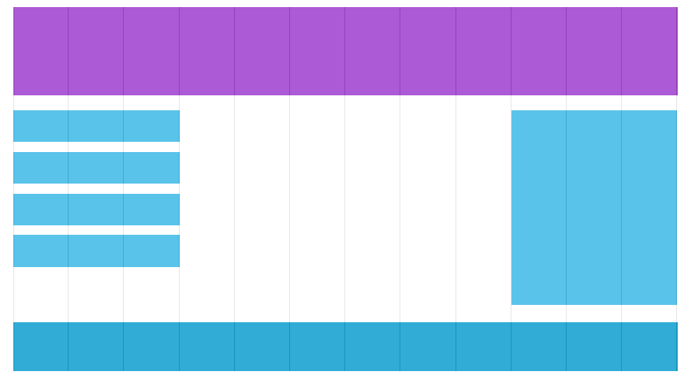
</p>

### 4.3.2. Xây dựng một chế độ xem dạng lưới linh hoạt

Xây dựng 1 chế độ xem dạng lưới theo các bước sau:

- Đầu tiên, đảm bảo rằng tất cả các phần tử HTML được khai báo thuộc tính `box-sizing: border-box;` như sau:
    ```css
    * {
        box-sizing: border-box;
    }
    ```
- Tính toán kích thước % của mỗi cột trên trang web: `100% / 12 cột = 8.33% / cột`
- Tiếp theo tạo một lớp cho mỗi cột trong số 12 cột đó, `class="col-"` và một số xác định số lượng cột mà phần đó sẽ kéo dài, tức là mỗi cột sẽ có chiều rộng là bao nhiêu (tương ứng với bao nhiêu cột):
VD:
    ```css
    .col-1 {width: 8.33%;} /*col-1 có kích thước chiều dài tương ứng với 1 cột*/
    .col-2 {width: 16.66%;} /*col-2 có kích thước chiều dài tương ứng với 2 cột*/
    .col-3 {width: 25%;} /*col-1 có kích thước chiều dài tương ứng với 4 cột*/
    .col-4 {width: 33.33%;}
    .col-5 {width: 41.66%;}
    .col-6 {width: 50%;}
    .col-7 {width: 58.33%;}
    .col-8 {width: 66.66%;}
    .col-9 {width: 75%;}
    .col-10 {width: 83.33%;}
    .col-11 {width: 91.66%;}
    .col-12 {width: 100%;}
    ```
- Tất cả các cột này phải nổi ở bên trái và có phần padding là 15px:
    ```css
    [class*="col-"] {
    float: left;
    padding: 15px;
    }
    ```
- Mỗi hàng phải được bao bọc trong một `<div>`. Số cột bên trong một hàng phải luôn bằng 12:

    ```html
    <div class="row">
    <div class="col-3">...</div> <!-- 25% -->
    <div class="col-9">...</div> <!-- 75% -->
    </div>
    ```
- Thêm một phong cách xóa luồng:
    ```css
    .row::after {
    content: "";
    clear: both;
    display: table;
    }
    ```
- Kết hợp thêm 1 số định kiểu style và màu sắc cho các phần tử được ví dụ sau:
    ```html
    <meta name="viewport" content="width=device-width, initial-scale=1.0">
    <style>
    * {
    box-sizing: border-box;
    }

    .row::after {
    content: "";
    clear: both;
    display: table;
    }

    [class*="col-"] {
    float: left;
    padding: 15px;
    }

    .col-1 {width: 8.33%;}
    .col-2 {width: 16.66%;}
    .col-3 {width: 25%;}
    .col-4 {width: 33.33%;}
    .col-5 {width: 41.66%;}
    .col-6 {width: 50%;}
    .col-7 {width: 58.33%;}
    .col-8 {width: 66.66%;}
    .col-9 {width: 75%;}
    .col-10 {width: 83.33%;}
    .col-11 {width: 91.66%;}
    .col-12 {width: 100%;}

    html {
    font-family: "Lucida Sans", sans-serif;
    }

    .header {
    background-color: #9933cc;
    color: #ffffff;
    padding: 15px;
    }

    .menu ul {
    list-style-type: none;
    margin: 0;
    padding: 0;
    }

    .menu li {
    padding: 8px;
    margin-bottom: 7px;
    background-color: #33b5e5;
    color: #ffffff;
    box-shadow: 0 1px 3px rgba(0,0,0,0.12), 0 1px 2px rgba(0,0,0,0.24);
    }

    .menu li:hover {
    background-color: #0099cc;
    }
    </style>
    <div class="header">
    <h1>Chania</h1>
    </div>

    <div class="row">
    <div class="col-3 menu">
        <ul>
        <li>The Flight</li>
        <li>The City</li>
        <li>The Island</li>
        <li>The Food</li>
        </ul>
    </div>

    <div class="col-9">
        <h1>The City</h1>
        <p>Chania is the capital of the Chania region on the island of Crete. The city can be divided in two parts, the old town and the modern city.</p>
        <p>Resize the browser window to see how the content respond to the resizing.</p>
    </div>
    </div>
    ```
<p align = "center">
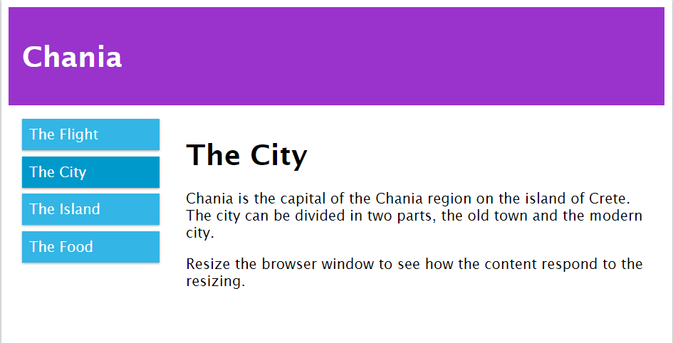
</p>

## 4.4. Responsive Web Design - Media Queries
### 4.4.1. Thêm một điểm dừng
- Ở ví dụ của phần trước, chúng ta đã tạo ra một chế độ xem dạng lưới linh hoạt cho trang web, tuy nhiên nó sẽ khác được đẹp mắt khi hiển thị trên màn hình có kích thước nhỏ.
- Do đó, chúng ta có thể sử dụng `media queries` để giải quyết điều này. 
- Chúng ta có thể thêm một điểm dừng trong đó các phần nhất định của thiết kế sẽ hoạt động khác nhau ở mỗi bên của điểm dừng.  
    VD: Chúng ta thêm điểm dừng tại 600px
    ```css
    @media only screen and (max-width: 600px) {
    [class*="col-"] {
        width: 100%;
    }
    }
    ```
    - Khi kích thước màn hình lớn hơn 600px, trình duyệt hiển thị như sau:
    <p align = "center">
    
    </p>

    - Còn khi kích thước màn hình nhỏ hơn bằng 600px
    <p align = "center">
    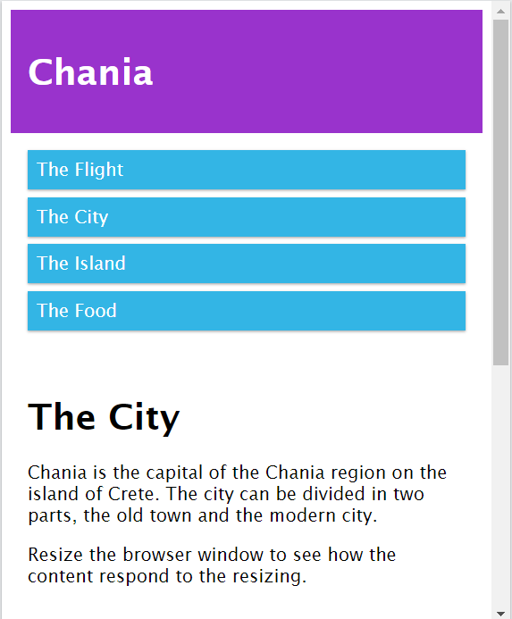
    </p>

**Lưu ý:** Nguyên tắc luôn thiết kế cho kích thước điện thoại đầu tiên.
### 4.4.2. Các loại điểm dừng của các thiết bị
- Có rất nhiều màn hình và thiết bị có chiều cao và chiều rộng khác nhau, vì vậy rất khó để tạo điểm dừng chính xác cho từng thiết bị. Để giữ cho mọi thứ đơn giản, chúng ta có thể chia thành năm nhóm sau:

    ```css
    /* Extra small devices (phones, 600px and down) */
    @media only screen and (max-width: 600px) {...}

    /* Small devices (portrait tablets and large phones, 600px and up) */
    @media only screen and (min-width: 600px) {...}

    /* Medium devices (landscape tablets, 768px and up) */
    @media only screen and (min-width: 768px) {...}

    /* Large devices (laptops/desktops, 992px and up) */
    @media only screen and (min-width: 992px) {...}

    /* Extra large devices (large laptops and desktops, 1200px and up) */
    @media only screen and (min-width: 1200px) {...}
    ```
### 4.4.3. Hướng: ngang/dọc
- `Media queries` cũng có thể được sử dụng để thay đổi bố cục của 1 trang web dựa vào hướng của trình duyệt/thiết bị
- Chúng ta có thể có một tập hợp các thuộc tính CSS sẽ chỉ áp dụng khi cửa sổ trình duyệt rộng hơn chiều cao của nó, được gọi là hướng `"nằm ngang" (landscape)`. Ngược lại sẽ là hướng `"nằm dọc" (portrait)`

    VD:
    ```html
    <meta name="viewport" content="width=device-width, initial-scale=1.0">
    <style>
    body {
    background-color: lightgreen;
    }

    @media only screen and (orientation: landscape) {
    body {
        background-color: lightblue;
    }
    }
    </style>
    <p>Resize the browser window. When the width of this document is larger than the height, the background color is "lightblue", otherwise it is "lightgreen".</p>
    ```
    - Kết quả theo hướng nằm ngang của trình duyệt, màu nền có màu xanh da trời
    <p align = "center">
    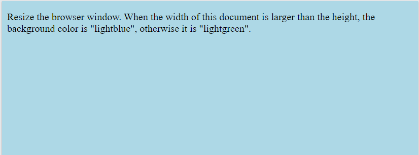
    </p>

    - Kết quả theo hướng nằm dọc của trình duyệt, màu nền có màu xanh lá
    <p align = "center">
    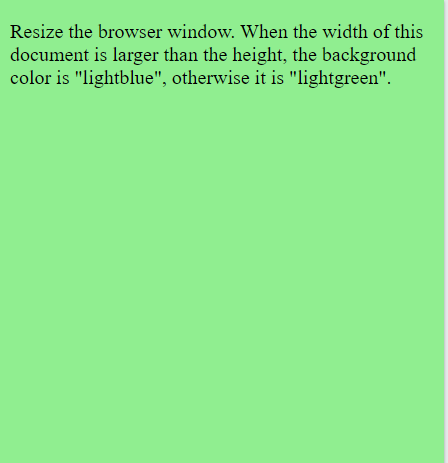
    </p>

### 4.4.4. Ẩn các phần tử với media queries
VD: Phần tử `<div>` có class="example" sẽ bị ẩn đi khi kích thước của trình duyệt nhỏ hơn 600px.
```css
@media screen and (max-width: 600px) {
  div.example {
    display: none;
  }
}
```

## 4.5. Responsive Web Design - Images
### 4.5.1. Sử dụng thuộc tính width, max-width
- Nếu thuộc tính `width` được thiết lập với một giá trị phần trăm và thuộc tính `height` được thiết lập là "auto" thì hình ảnh lúc này cũng sẽ có thể thay đổi tăng giảm kích thước một cách linh hoạt.  
VD:
    ```html
    <meta name="viewport" content="width=device-width, initial-scale=1.0">
    <style>
    img {
    width: 100%;
    height: auto;
    }
    </style>
    
    <p>Resize the browser window to see how the image will scale.</p>
    ```
- Ở ví dụ trên, hình ảnh có thể thay đổi thành kích thước lớn hơn kích thước ban đầu của nó. Một giải pháp tốt hơn là sử dụng thuộc tính `max-width` thay cho `width`. Lúc này, kích thước hình ảnh sẽ không bao giờ lớn hơn kích thước gốc ban đầu của nó cho dù chiều rộng của màn hình lớn hơn nó rất nhiều.
    ```css
    img {
    max-width: 100%;
    height: auto;
    }
    ```
<p align = "center">
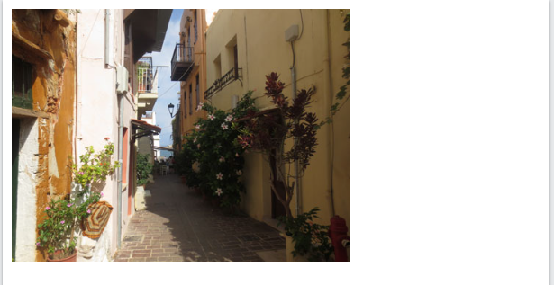
</p>

### 4.5.2. Background images
- Hình nền cũng có thể đáp ứng với thay đổi kích thước và tỷ lệ
- Sử dụng thuộc tính `background-size` để điều chỉnh kích thước hình nền, nó có các giá trị thiết lập như sau:
    - `background-size: contain;` - hình nền sẽ chia tỷ lệ và cố gắng khớp với vùng nội dung. Tuy nhiên, hình ảnh sẽ giữ nguyên tỷ lệ khung hình (mối quan hệ tỷ lệ giữa chiều rộng và chiều cao của hình ảnh).
    - `background-size: 100% 100%;` - hình nền sẽ kéo dài để bao phủ toàn bộ khu vực nội dung.
    - `background-size: cover;` - hình nền sẽ mở rộng để bao phủ toàn bộ khu vực nội dung. Lưu ý rằng giá trị "`cover`" giữ tỷ lệ khung hình và một số phần của hình nền có thể bị cắt bớt.

VD:
- `background-size: contain;`
    ```html
    <meta name="viewport" content="width=device-width, initial-scale=1.0">
    <style>
    div {
    width: 100%;
    height: 400px;
    background-image: url('img_flowers.jpg');
    background-repeat: no-repeat;
    background-size: contain;
    border: 1px solid red;
    }
    </style>
    <div></div>
    ```
<p align = "center">
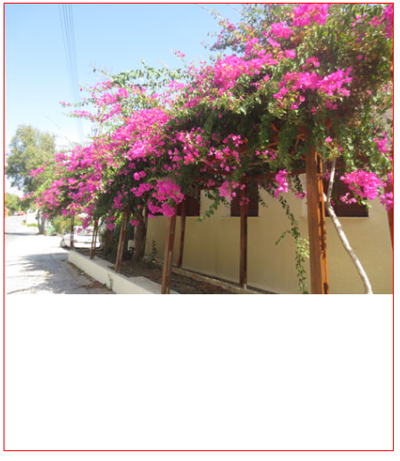
</p>

- `background-size: cover;`
    ```html
    <meta name="viewport" content="width=device-width, initial-scale=1.0">
    <style>
    div {
    width: 100%;
    height: 400px;
    background-image: url('img_flowers.jpg');
    background-repeat: no-repeat;
    background-size: cover;
    border: 1px solid red;
    }
    </style>
    <div></div>
    ```
<p align = "center">
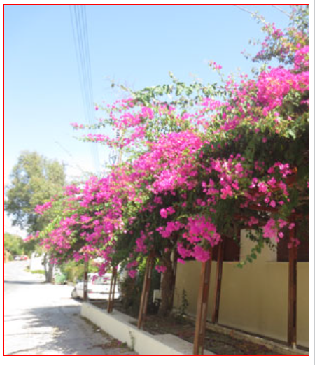
</p>

### 4.5.3. Các hình ảnh khác nhau cho các thiết bị khác nhau
- Một hình ảnh lớn có thể hoàn hảo trên màn hình máy tính lớn, nhưng lại vô dụng trên một thiết bị nhỏ. Do đó, chúng ta có thể sử dụng `media queries` để hiển thị các hình ảnh khác nhau trên các thiết bị khác nhau.

    VD:
    ```html
    <meta name="viewport" content="width=device-width, initial-scale=1.0">
    <style>
    /* For width smaller than 400px: */
    body {
    background-repeat: no-repeat;
    background-image: url('img_smallflower.jpg'); 
    }

    /* For width 400px and larger: */
    @media only screen and (min-width: 400px) {
    body { 
        background-image: url('img_flowers.jpg'); 
    }
    }
    </style>
    <p style="margin-top:360px;">Resize the browser width and the background image will change at 400px.</p>
    ```
    - Khi kích thước màn hình nhỏ hơn 400px:
    <p align = "center">
    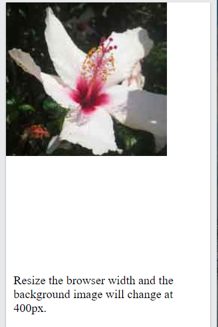
    </p>
    - Khi kích thước màn hình lớn hơn hoặc bằng 400px:
    
    <p align = "center">
    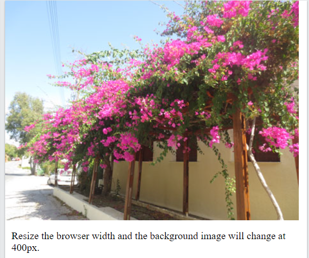
    </p>
### 4.5.4. Phần tử HTML `<picture>`
- Phần tử `<picture>` mang lại cho những lập trình web linh hoạt hơn trong việc xác định các nguồn ảnh.
- Cách sử dụng phổ biến nhất của phần tử `<picture>` sẽ dành cho các hình ảnh được sử dụng trong các thiết kế linh hoạt. Thay vì có một hình ảnh được phóng to hoặc thu nhỏ dựa trên chiều rộng của khung nhìn, nhiều hình ảnh có thể được thiết kế để lấp đầy khung nhìn của trình duyệt một cách độc đáo hơn.
- Phần tử `<picture>` hoạt động tương tự như phần tử `<video>` và `<audio>`. Chúng ta thiết lập các nguồn khác nhau và nguồn đầu tiên phù hợp với trình duyệt đang được sử dụng.
- Cú pháp:
    ```html
    <picture>
        <source srcset="image source" media="media query">
        <source srcset="image source">
        
    </picture>
    ```
    - Trong đó:
        - Thuộc tính `srcset` là bắt buộc, chỉ định nguồn ảnh
        - Thuộc tính `media` là tùy chọn, sử dụng 1 điều kiện `media query`
        - Luôn định nghĩa 1 phần tử `` cuối cùng để trình duyệt áp dụng trong trường hợp trình duyệt đang sử dụng không hỗ trợ phần tử `<picture>`

        VD:
        ```html
        <meta name="viewport" content="width=device-width, initial-scale=1.0">
        <picture>
        <source srcset="img_smallflower.jpg" media="(max-width: 400px)">
        <source srcset="img_flowers.jpg">
        
        </picture>

        <p>Resize the browser width and the background image will change at 400px.</p>
        ```
        - Khi kích thước màn hình nhỏ hơn hoặc bằng 400px:
        <p align = "center">
        
        </p>

        - Khi kích thước màn hình lớn hơn 400px:
        
        <p align = "center">
        
        </p>

## 4.6. Responsive Web Design - Videos
- Ví dụ thêm một video vào trang web
    ```html
    <head>
    <meta name="viewport" content="width=device-width, initial-scale=1.0">
    <style>
    video {
    width: 100%;
    height: auto;
    }
    </style>

    <video width="400" controls autoplay>
    <source src="mov_bbb.mp4" type="video/mp4">
    <source src="mov_bbb.ogg" type="video/ogg">
    Your browser does not support HTML5 video.
    </video>
    ```
<p align = "center">
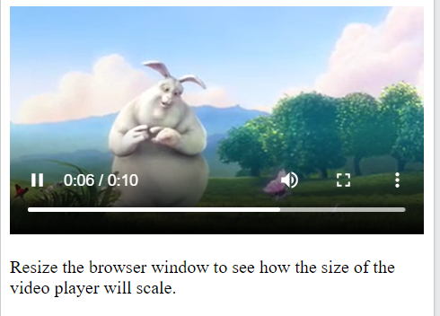
</p>

## 4.7. References
- Chúng ta có thể tham khảo một số mẫu thiết kế web linh hoạt tại [Responsive Web Design - Templates](https://www.w3schools.com/css/css_rwd_templates.asp)

# 5. CSS Flexbox
## 5.1. CSS Flexbox Layout Module
- Trước module bố cục flexbox, đã có 4 chế độ bố cục như:
    - `Khối (block)` cho các phần trong 1 trang web.
    - `Nội tuyến (inline)` cho văn bản.
    - `Bảng (table)` cho dữ liệu bảng 2 chiều.
    - `Vị trí`, cho vị trí rõ ràng của một phần tử

- Module bố cục `Flexbox` làm cho thiết kế cấu trúc bố cục trở nên linh hoạt hơn mà không sử dụng `float` hay xác định vị trí.

## 5.2 Flexbox Elements
- Để bắt đầu sử dụng mô hình `Flexbox`, trước tiên chúng ta phải định nghĩa một phần tử chứa flex (vd như thẻ `<div>`).

    VD:
    ```html
    <div class="flex-container">
    <div>1</div>
    <div>2</div>
    <div>3</div>  
    </div>
    ```
## 5.3. CSS Flex Container
### 5.3.1. Parent Element (Container)
- Ở ví dụ của phần trước, chúng ta đã tạo một thẻ `<div>` cha có `class="flex-container"` chứa ba danh mục flex 1, 2, 3. Khi hiển thị lên trình duyệt nó chỉ có dạng như sau:

<p align = "center">
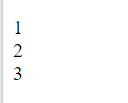
</p>

- Để cho phần tử chứa flex trở nên linh hoạt hơn, chúng ta phải thiết lập thuộc tính `display: flex;` cho phần tử chứa, và thêm 1 số định kiểu style khác cho các phần tử danh mục flex như ví dụ dưới đây:
    VD:
    ```html
    <style>
    .flex-container {
        display: flex;
        background-color: DodgerBlue;
    }

    .flex-container > div {
        background-color: #f1f1f1;
        margin: 10px;
        padding: 20px;
        font-size: 30px;
    }
    </style>
    <h1>Create a Flex Container</h1>
    <div class="flex-container">
        <div>1</div>
        <div>2</div>
        <div>3</div>  
    </div>
    ```
    <p align = "center">
    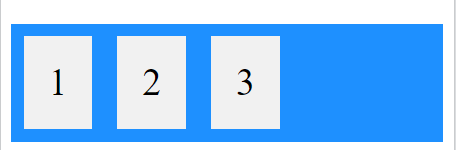
    </p>

### 5.3.2. Thuộc tính flex-direction
- Thuộc tính `flex-direction` xác định hướng mà bộ chứa muốn xếp chồng các mục flex.
- Thuộc tính `flex-direction` có các giá trị sau:
    - `flex-direction: column;` - xếp các mục flex theo chiều dọc (từ trên xuống dưới)
    - `flex-direction: column-reverse;` - xếp các mục flex theo chiều dọc (từ dưới lên trên)
    - `flex-direction: row;` - xếp các mục flex theo chiều ngang (từ trái sang phải)
    - `flex-direction: row-reverse;` - xếp các mục flex theo chiều ngang (từ phải sang trái)

    VD:
    ```html
    <style>
    .flex-container1 {
        display: flex;
        flex-direction: column;
        background-color: DodgerBlue;
    }
    .flex-container2 {
        display: flex;
        flex-direction: column-reverse;
        background-color: DodgerBlue;
    }
    .flex-container3 {
        display: flex;
        flex-direction: row;
        background-color: DodgerBlue;
    }
    .flex-container4 {
        display: flex;
        flex-direction: row-reverse;
        background-color: DodgerBlue;
    }

    .flex-container > div {
        background-color: #f1f1f1;
        width: 100px;
        margin: 5px;
        text-align: center;
        line-height: 30px;
        font-size: 15px;
    }
    </style>

    <h3>The flex-direction: column;</h3>
    <div class=" flex-container flex-container1">
        <div>1</div>
        <div>2</div>
        <div>3</div>  
    </div>
    <h3>The flex-direction: column-reverse;</h3>
    <div class="flex-container flex-container2">
        <div>1</div>
        <div>2</div>
        <div>3</div>  
    </div>
    <h3>The flex-direction: row;</h3>
    <div class="flex-container flex-container3">
        <div>1</div>
        <div>2</div>
        <div>3</div>  
    </div>
    <h3>The flex-direction: row-reverse;</h3>
    <div class="flex-container flex-container4">
        <div>1</div>
        <div>2</div>
        <div>3</div>  
    </div>
    ```

<p align = "center">
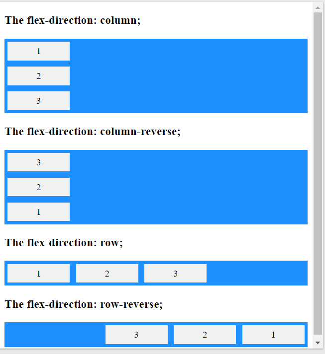
</p>

### 5.3.3. Thuộc tính flex-wrap
- Thuộc tính `flex-wrap` chỉ định xem các mục flex có nên xuống dòng hay không.
- Thuộc tính `flex-wrap` có các giá trị sau:
    - `flex-wrap: wrap;` - chỉ định các mục flex sẽ xuống dòng khi cần thiết.
    - `flex-wrap: nowrap;` - chỉ định các mục flex sẽ không ngắt xuống dòng. (mặc định)
    - `flex-wrap: wrap-reverse;` - chỉ định các mục flex sẽ xuống dòng khi cần thiết với thứ tự từ dưới lên.

    VD:
- `flex-wrap: wrap;`
    ```html
    <style>
    .flex-container {
        display: flex;
        flex-wrap: wrap;
        background-color: DodgerBlue;
    }

    .flex-container > div {
        background-color: #f1f1f1;
        width: 100px;
        margin: 10px;
        text-align: center;
        line-height: 75px;
        font-size: 30px;
    }
    </style>
    <p>The "flex-wrap: wrap;"</p>

    <div class="flex-container">
        <div>1</div>
        <div>2</div>
        <div>3</div>  
        <div>4</div>
        <div>5</div>
        <div>6</div>  
        <div>7</div>
        <div>8</div>
        <div>9</div>  
        <div>10</div>
        <div>11</div>
        <div>12</div>  
    </div>
    ```
    <p align = "center">
    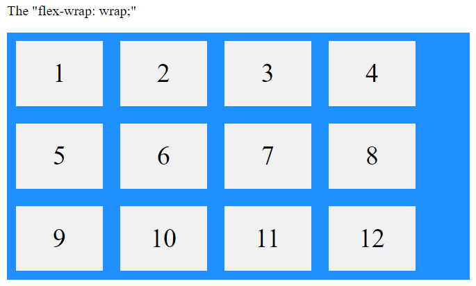
    </p>

- `flex-wrap: nowrap;`
    ```html
    <style>
    .flex-container {
        display: flex;
        flex-wrap: nowrap;
        background-color: DodgerBlue;
    }

    .flex-container > div {
        background-color: #f1f1f1;
        width: 100px;
        margin: 10px;
        text-align: center;
        line-height: 75px;
        font-size: 30px;
    }
    </style>
    <p>The "flex-wrap: nowrap;"</p>

    <div class="flex-container">
        <div>1</div>
        <div>2</div>
        <div>3</div>  
        <div>4</div>
        <div>5</div>
        <div>6</div>  
        <div>7</div>
        <div>8</div>
        <div>9</div>  
        <div>10</div>
        <div>11</div>
        <div>12</div>  
    </div>
    ```
    <p align = "center">
    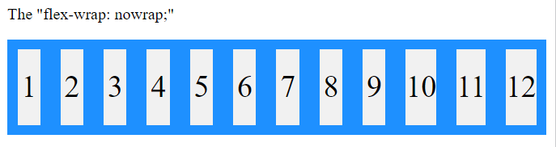
    </p>

- `flex-wrap: wrap-reverse;`
    ```html
    <style>
    .flex-container {
        display: flex;
        flex-wrap: wrap-reverse;
        background-color: DodgerBlue;
    }

    .flex-container > div {
        background-color: #f1f1f1;
        width: 100px;
        margin: 10px;
        text-align: center;
        line-height: 75px;
        font-size: 30px;
    }
    </style>
    <p>The "flex-wrap: wrap-reverse;"</p>

    <div class="flex-container">
        <div>1</div>
        <div>2</div>
        <div>3</div>  
        <div>4</div>
        <div>5</div>
        <div>6</div>  
        <div>7</div>
        <div>8</div>
        <div>9</div>  
        <div>10</div>
        <div>11</div>
        <div>12</div>  
    </div>
    ```
    <p align = "center">
    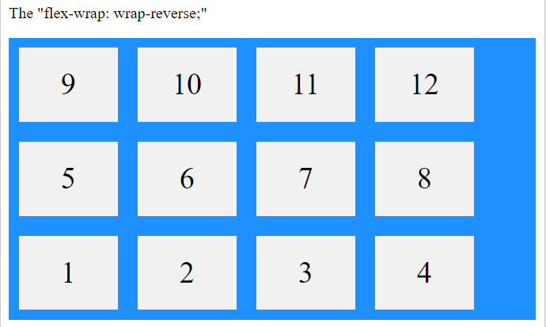
    </p>

### 5.3.4. Thuộc tính flex-flow
- Thuộc tính `flex-flow` là thuộc tính viết gọn cho thiết lập thuộc tính `flex-direction` và `flex-wrap`.  
VD:
    ```css
    .flex-container {
    display: flex;
    flex-flow: row wrap; /* các mục flex xếp theo hướng nằm ngang và xuống dòng khi cần thiết*/
    background-color: DodgerBlue;
    }
    ```
### 5.3.5. Thuộc tính justify-content
- Thuộc tính `justify-content` được sử dụng để căn chỉnh vị trí cho các mục flex (theo chiều ngang của phần tử chứa)
- Thuộc tính `justify-content` có các giá trị như:
    - `justify-content: flex-start` - (mặc định),căn các mục flex về phía bên trái của phần tử chứa.
    - `justify-content: flex-end` - căn các mục flex về phía bên phải của phần tử chứa.
    - `justify-content: center` - căn các mục flex ở giữa của phần tử chứa
    - `justify-content: space-between` - giá trị này giúp cho khoảng cách giữa các mục flex luôn bằng nhau, tuy nhiên mục flex đầu tiên luôn nằm sát phía bên trái, mục flex cuối cùng luôn nằm sát phía bên phải của phần tử chứa..
    - `justify-content: space-around` - giá trị này giúp cho khoảng cách giữa các mục flex luôn bằng nhau, tuy nhiên Khoảng trống trước mục đầu tiên và sau mục cuối cùng bằng một nửa khoảng trống giữa mỗi cặp mục liền kề.

    VD:
    ```html
    <style>
    .flex-container1 {
        display: flex;
        justify-content: flex-start;
        background-color: DodgerBlue;
    }
    .flex-container2 {
        display: flex;
        justify-content: flex-end;
        background-color: DodgerBlue;
    }
    .flex-container3 {
        display: flex;
        justify-content: center;
        background-color: DodgerBlue;
    }
    .flex-container4 {
        display: flex;
        justify-content: space-around;
        background-color: DodgerBlue;
    }
    .flex-container5 {
        display: flex;
        justify-content: space-between;
        background-color: DodgerBlue;
    }

    .flex-container > div {
        background-color: #f1f1f1;
        width: 100px;
        margin: 10px;
        text-align: center;
        line-height: 30px;
        font-size: 20px;
    }
    </style>
    <h3>justify-content: flex-start;</h3>
    <div class="flex-container flex-container1">
        <div>1</div>
        <div>2</div>
        <div>3</div>  
    </div>
    <h3>justify-content: flex-end;</h3>
    <div class="flex-container flex-container2">
        <div>1</div>
        <div>2</div>
        <div>3</div>  
    </div>
    <h3>justify-content: center;</h3>
    <div class="flex-container flex-container3">
        <div>1</div>
        <div>2</div>
        <div>3</div>  
    </div>
    <h3>justify-content: space-around;</h3>
    <div class="flex-container flex-container4">
        <div>1</div>
        <div>2</div>
        <div>3</div>  
    </div>
    <h3>justify-content: space-between;</h3>
    <div class="flex-container flex-container5">
        <div>1</div>
        <div>2</div>
        <div>3</div>  
    </div>
    ```
    <p align = "center">
    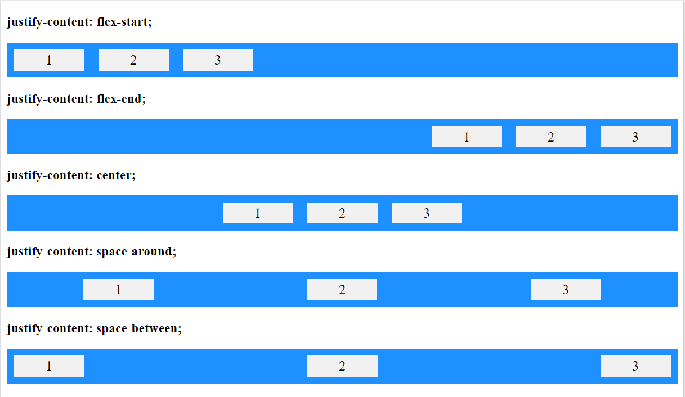
    </p>

### 5.3.6. Thuộc tính align-items
- Thuộc tính `align-items` được sử dụng để căn chỉnh các mục flex theo chiều dọc (chiều cao của phần tử chứa).
- Thuộc tính `align-items` có các giá trị như:
    - `align-items: flex-start;` - căn chỉnh các mục flex ở phía trên của phần tử chứa.
    - `align-items: flex-end;` - căn chỉnh các mục flex ở phía dưới của phần tử chứa.
    - `align-items: center;` - căn chỉnh các mục flex ở giữa của phần tử chứa.
    - `align-items: stretch;` - kéo dài các mục flex để lấp đầy phần tử chứa (mặc định).
    - `align-items: baseline;` - căn chỉnh đường cơ sở của các mục flex.

    VD:
    ```html
    <style>
    .flex-container1 {
        display: flex;
        height: 80px;
        align-items: flex-start;
        background-color: DodgerBlue;
    }
    .flex-container2 {
        display: flex;
        height: 80px;
        align-items: flex-end;
        background-color: DodgerBlue;
    }
    .flex-container3 {
        display: flex;
        height: 80px;
        align-items: center;
        background-color: DodgerBlue;
    }
    .flex-container4 {
        display: flex;
        height: 80px;
        align-items: stretch;
        background-color: DodgerBlue;
    }

    .flex-container > div {
        background-color: #f1f1f1;
        width: 100px;
        margin: 10px;
        text-align: center;
        line-height: 30px;
        font-size: 20px;
    }
    </style>
    <h3>The align-items: flex-start;</h3>
    <div class="flex-container flex-container1">
        <div>1</div>
        <div>2</div>
        <div>3</div>  
    </div>
    <h3>The align-items: flex-end;</h3>
    <div class="flex-container flex-container2">
        <div>1</div>
        <div>2</div>
        <div>3</div>  
    </div>
    <h3>The align-items: center;</h3>
    <div class="flex-container flex-container3">
        <div>1</div>
        <div>2</div>
        <div>3</div>  
    </div>
    <h3>The align-items: stretch;</h3>
    <div class="flex-container flex-container4">
        <div>1</div>
        <div>2</div>
        <div>3</div>  
    </div>
    ```
    <p align = "center">
    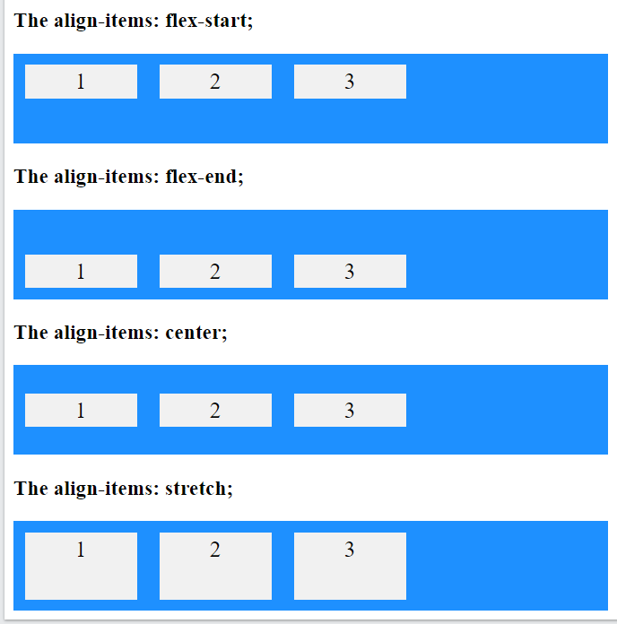
    </p>

### 5.3.7. Thuộc tính align-content
- Thuộc tính `align-content` được sử dụng để căn chỉnh các dòng flex
- Thuộc tính `align-content` có các giá trị như:
    - `align-content: space-between;` - hiển thị các dòng flex với khoảng cách bằng nhau giữa các dòng, tuy nhiên dòng flex đầu tiên nằm sát phía trên của phần tử chứa, dòng flex cuối cùng nằm sát phía dưới của phần tử chứa.
    - `align-content: space-between;` - hiển thị các dòng flex với khoảng cách bằng nhau giữa các dòng, Khoảng cách trước dòng đầu tiên và sau dòng cuối cùng bằng một nửa khoảng trống giữa mỗi cặp dòng liền kề.
    - `align-content: stretch;` - kéo dài các dòng flex theo chiều cao để lấp đầy phần tử chứa (mặc định).
    - `align-content: center;` - hiển thị các dòng flex ở giữa vùng chứa.
    - `align-content: flex-start;` - hiển thị các dòng flex ở phía trên của phần tử chứa.
    - `align-content: flex-end;` - hiển thị các dòng flex ở phía dưới của phần tử chứa.

VD:
- `align-content: flex-start;`
    ```html
    <style>
    .flex-container {
        display: flex;
        height: 600px;
        flex-wrap: wrap;
        align-content: flex-start;
        overflow: scroll;  
        background-color: DodgerBlue;
    }

    .flex-container > div {
        background-color: #f1f1f1;
        width: 100px;
        margin: 10px;
        text-align: center;
        line-height: 75px;
        font-size: 30px;
    }
    </style>

    <div class="flex-container">
        <div>1</div>
        <div>2</div>
        <div>3</div>  
        <div>4</div>
        <div>5</div>
        <div>6</div>  
        <div>7</div>
        <div>8</div>
        <div>9</div>  
        <div>10</div>
        <div>11</div>
        <div>12</div>  
    </div>
    ```
    <p align = "center">
    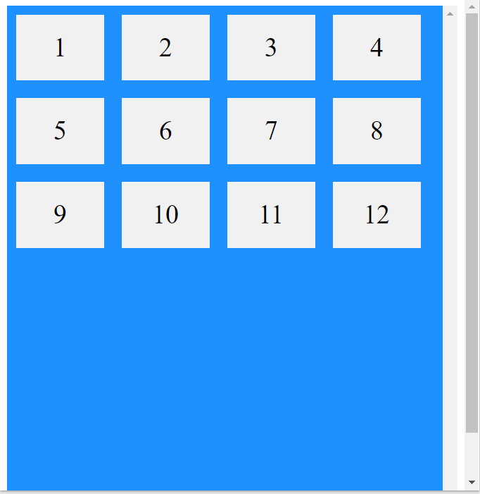
    </p>

- `align-content: space-around;`
    ```html
    <style>
    .flex-container {
        display: flex;
        height: 600px;
        flex-wrap: wrap;
        align-content: space-around;
        overflow: scroll;  
        background-color: DodgerBlue;
    }

    .flex-container > div {
        background-color: #f1f1f1;
        width: 100px;
        margin: 10px;
        text-align: center;
        line-height: 75px;
        font-size: 30px;
    }
    </style>

    <div class="flex-container">
        <div>1</div>
        <div>2</div>
        <div>3</div>  
        <div>4</div>
        <div>5</div>
        <div>6</div>  
        <div>7</div>
        <div>8</div>
        <div>9</div>  
        <div>10</div>
        <div>11</div>
        <div>12</div>  
    </div>
    ```
    <p align = "center">
    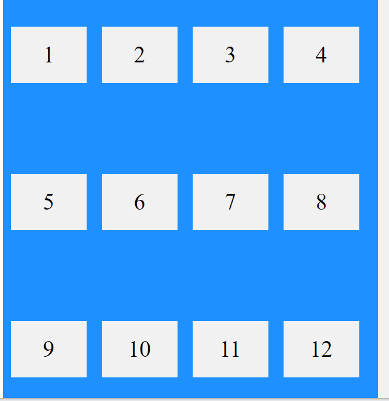
    </p>

*Lưu ý:* Sử dụng kết hợp cả `justify-content: center;` và `align-items: center;` để mục flex được căn chỉnh ở vị trí trung tâm 1 cách hoàn hảo nhất.

## 5.4. CSS Flex Items
### 5.4.1. Phần tử con (các mục flex)
- Các phần tử con trực tiếp của một phần tử chứa flex sẽ tự động trở thành các mục flex
### 5.4.2. Thuộc tính order
- Thuộc tính `order` chỉ định thứ tự hiển thị của các mục flex.
- Giá trị của thuộc tính `order` phải là một số, giá trị mặc định là 0.  
    VD:
    ```html
    <style>
    .flex-container {
        display: flex;
        align-items: stretch;
        background-color: #f1f1f1;
    }

    .flex-container>div {
        background-color: DodgerBlue;
        color: white;
        width: 100px;
        margin: 10px;
        text-align: center;
        line-height: 75px;
        font-size: 30px;
    }
    </style>
    <h1>The order Property</h1>
    <div class="flex-container">
        <div style="order: 3">1</div>
        <div style="order: 2">2</div>
        <div style="order: 4">3</div> 
        <div style="order: 1">4</div>
    </div>
    ```
<p align = "center">
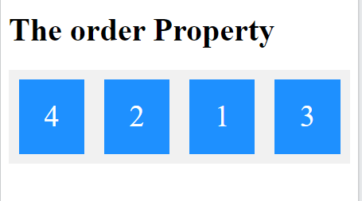
</p>

### 5.4.3. Thuộc tính flex-grow
- Thuộc tính `flex-grow` chỉ định một mục flex sẽ kéo dài như thế nào so với phần còn lại của các mục flex.
- Giá trị của thuộc tính phải là một con số, mặc định là 0  
    VD:
    ```html
    <style>
    .flex-container {
        display: flex;
        align-items: stretch;
        background-color: #f1f1f1;
    }

    .flex-container > div {
        background-color: DodgerBlue;
        color: white;
        margin: 10px;
        text-align: center;
        line-height: 75px;
        font-size: 30px;
    }
    </style>
    <h1>The flex-grow Property</h1>

    <div class="flex-container">
        <div style="flex-grow: 1">1</div>
        <div style="flex-grow: 1">2</div>
        <div style="flex-grow: 8">3</div>
    </div>
    ```
<p align = "center">
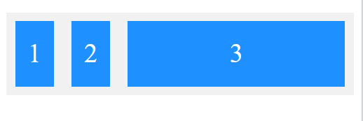
</p>

### 5.4.4. Thuộc tính flex-shrink
- Thuộc tính `flex-shrink` chỉ định một mục linh hoạt sẽ co lại bao nhiêu so với phần còn lại của các mục linh hoạt.
- Giá trị của thuộc tính phải là một số, giá trị mặc định là 1.  
    VD:
    ```html
    <style>
    .flex-container {
    display: flex;
    align-items: stretch;
    background-color: #f1f1f1;
    }

    .flex-container>div {
    background-color: DodgerBlue;
    color: white;
    width: 100px;
    margin: 10px;
    text-align: center;
    line-height: 75px;
    font-size: 30px;
    }
    </style>
    <h1>The flex-shrink Property</h1>
    <div class="flex-container">
        <div>1</div>
        <div>2</div>
        <div style="flex-shrink: 0">3</div>
        <div>4</div>
        <div>5</div>
        <div>6</div>
        <div>7</div>
        <div>8</div>
        <div>9</div>
        <div>10</div>
    </div>
    ```
<p align = "center">
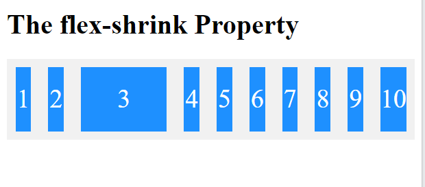
</p>

### 5.4.5. Thuộc tính flex-basis
- Thuộc tính `flex-basis` chỉ định độ dài ban đầu của một mục flex.  
    VD:
    ```html
    <style>
    .flex-container {
    display: flex;
    align-items: stretch;
    background-color: #f1f1f1;
    }

    .flex-container > div {
    background-color: DodgerBlue;
    color: white;
    width: 100px;
    margin: 10px;
    text-align: center;
    line-height: 75px;
    font-size: 30px;
    }
    </style>
    <h1>The flex-basis Property</h1>
    <div class="flex-container">
        <div>1</div>
        <div>2</div>
        <div style="flex-basis:200px">3</div>
        <div>4</div>
    </div>
    ```
<p align = "center">
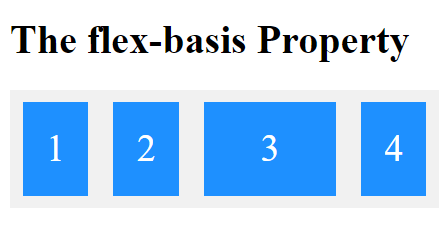
</p>

### 5.4.6. Thuộc tính flex
- Thuộc tính `flex` là thuộc tính viết gọn của các thuộc tính: `flex-grow`, `flex-shrink`, và `flex-basis`.  
VD:
    ```html
    <style>
    .flex-container {
        display: flex;
        align-items: stretch;
        background-color: #f1f1f1;
    }
    .flex-container>div {
        background-color: DodgerBlue;
        color: white;
        width: 100px;
        margin: 10px;
        text-align: center;
        line-height: 75px;
        font-size: 30px;
    }
    </style>
    <h1>The flex Property</h1>
    <div class="flex-container">
        <div>1</div>
        <div>2</div>
        <div style="flex: 0 0 200px">3</div>
        <div>4</div>
    </div>
    ```
<p align = "center">
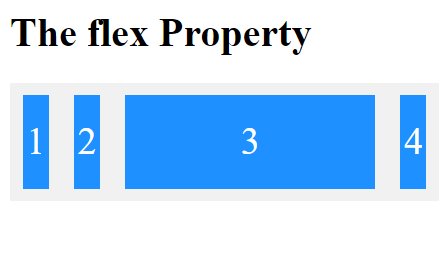
</p>

### 5.4.7. Thuộc tính align-self
- Thuộc tính `align-self` chỉ định căn chỉnh cho mục flex đã chọn bên trong vùng chứa flex.
- Thuộc tính `align-self` ghi đè căn chỉnh mặc định được thiết lập bởi thuộc tính `align-items` của vùng chứa.  
VD: mục flex thứ 3 đã được căn chỉnh thành `center`, thay vì được căn chỉnh mặc định `stretch` như các mục còn lại
    ```html
    <style>
    .flex-container {
        display: flex;
        height: 200px;
        background-color: #f1f1f1;
    }
    .flex-container > div {
        background-color: DodgerBlue;
        color: white;
        width: 100px;
        margin: 10px;
        text-align: center;
        line-height: 75px;
        font-size: 30px;
    }
    </style>
    <h1>The align-self Property</h1>
    <div class="flex-container">
        <div>1</div>
        <div>2</div>
        <div style="align-self: center">3</div>
        <div>4</div>
    </div>
    ```
<p align = "center">
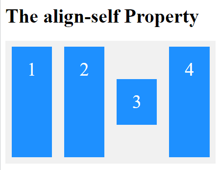
</p>

## 5.5. CSS Flex Responsive
- Chúng ta có thể sử dụng `media queries` để tạo những bố cục khác nhau cho các kích thước màn hình và thiết bị khác nhau.
- Ví dụ đơn giản với responsive flexbox, khi chúng ta muốn tạo bố cục 2 cột cho các kích thước màn hình lớn, bố cục 1 cột cho các kích thước màn hình nhỏ (như điện thoại), chúng ta có thể thay đổi thuộc tính `flex-direction` từ giá trị `row` sang `column` tại điểm dừng được chỉ định trong `media queries`.

    VD:
    ```html
    <style>
    * {
    box-sizing: border-box;
    }

    .flex-container {
        display: flex;
        flex-direction: row;
        font-size: 30px;
        text-align: center;
    }

    .flex-item-left {
        background-color: #f1f1f1;
        padding: 10px;
        flex: 50%;
    }

    .flex-item-right {
        background-color: dodgerblue;
        padding: 10px;
        flex: 50%;
    }

    /* Responsive layout - makes a one column-layout instead of two-column layout */
    @media (max-width: 500px) {
    .flex-container {
        flex-direction: column;
    }
    }
    </style>
    </head>
    <body>

    <h1>Responsive Flexbox</h1>
    <div class="flex-container">
        <div class="flex-item-left">1</div>
        <div class="flex-item-right">2</div>
    </div>
    ```
    - Khi kích thước màn hình lớn hơn 500px
    <p align = "center">
    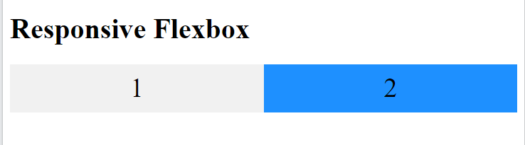
    </p>

    - Khi kích thước màn hình nhỏ hơn hoặc bằng 500px
    <p align = "center">
    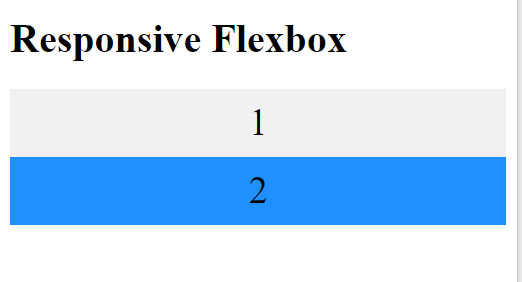
    </p>

- Một cách khác là thay đổi phần trăm thuộc tính `flex` của các mục flex để tạo các bố cục khác nhau cho các kích thước màn hình khác nhau. Lưu ý rằng chúng ta cũng phải bao gồm `flex-wrap: wrap;` trên bộ chứa flex để ví dụ này hoạt động:  
    VD:
    ```css
    .flex-container {
    display: flex;
    flex-wrap: wrap;
    }

    .flex-item-left {
    flex: 50%;
    }

    .flex-item-right {
    flex: 50%;
    }

    /* Responsive layout - makes a one column layout instead of a two-column layout */
    @media (max-width: 500px) {
    .flex-item-right, .flex-item-left {
        flex: 100%;
    }
    }
    ```
- Chúng ta có thể tham khảo thêm các ví dụ về responsive flex tại [Flexbox responsive](https://www.w3schools.com/css/css3_flexbox_responsive.asp)

# Summary
- Trong bài học này, chúng ta đã biết cách sử dụng hàm var(), media queries trong CSS, biết cách tạo một trang web linh hoạt, thay đổi các bố cục hiển thị trên các thiết bị, kích thước cửa sổ trình duyệt khác nhau; và học được thêm về 1 cách tạo bố cục nữa trên trang web là flexbox...

<h1 style="text-align:center;"> Kết thúc phần CSS<h1>